# 100 Omarchy day themes

[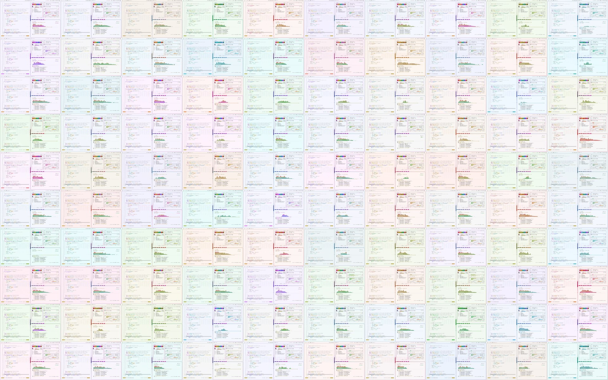](https://bjarneo.github.io/100-themes-day)

This repo has 100 light themes for [Omarchy](https://omarchy.org). They are the day versions of the [100 dark themes](https://github.com/bjarneo/100-themes). Each theme has a 16-color ANSI palette, a background with the Omarchy wordmark, and a background drawn for its colors.

- Gallery: [bjarneo.github.io/100-themes-day](https://bjarneo.github.io/100-themes-day)
- Promo video: [`assets/promo.mp4`](assets/promo.mp4)
- Themes: 100 folders at the root of this repo, one folder for each theme.

Every folder name ends in `-day`. You can install the day and the night version of a theme at the same time.

## Install

`install.sh` copies themes into `~/.config/omarchy/themes`. Each theme becomes a normal Omarchy theme folder.

### Install one theme without a clone

The script downloads only the themes that you name:

```bash
curl -fsSL https://bjarneo.github.io/100-themes-day/install.sh | bash -s -- synthwave-day --set
```

`--set` applies the theme after the install. Name more than one theme to install more than one:

```bash
curl -fsSL https://bjarneo.github.io/100-themes-day/install.sh | bash -s -- synthwave-day hacker-day neon-tokyo-day
```

### Install from a clone

```bash
git clone --depth 1 https://github.com/bjarneo/100-themes-day ~/.local/share/100-themes-day
cd ~/.local/share/100-themes-day
./install.sh --all
omarchy theme set synthwave-day
```

The full repo is about 290 MB because it has 200 backgrounds at 6K, 6144×3456.

### Apply with Aether

[Aether](https://github.com/omacom/aether) can apply a theme straight from the [gallery](https://bjarneo.github.io/100-themes-day). Open a theme and select 1 of these buttons:

| Button | Result |
| --- | --- |
| Apply with Aether | Aether loads the palette and the background, then applies them through its own theme |
| Install as Omarchy theme | Aether adds the theme to `~/.config/omarchy/themes` and activates it. This stops if a theme with the same name exists. |
| Open in editor | Aether opens the palette in its editor. Nothing changes until you select Apply. |

Aether shows a preview and asks before it changes anything. The link uses the background that you select in the gallery. The native background is the default. Aether reads `mode = "light"` from `colors.toml` and switches to light mode.

GitHub does not render `aether://` links, so use the gallery or build a link yourself:

```text
aether://apply?colors=https://bjarneo.github.io/100-themes-day/synthwave-day/colors.toml&wallpaper=https://bjarneo.github.io/100-themes-day/synthwave-day/backgrounds/1-sunset-grid.jpg
```

Add `&as_omarchy_theme=synthwave-day` to install the theme, or `&edit=true` to open the editor.

### Options

| Command | Result |
| --- | --- |
| `install.sh synthwave-day hacker-day` | Installs the named themes |
| `install.sh --all` | Installs all 100 day themes |
| `install.sh --list` | Lists the theme names |
| `install.sh synthwave-day --set` | Installs the theme, then applies it |
| `install.sh --update` | Installs again every theme that the script installed |
| `install.sh --remove synthwave-day` | Removes a theme that the script installed |
| `install.sh --link synthwave-day` | Links to the clone instead of copying. Run `git pull` in the clone to update. |
| `install.sh --force synthwave-day` | Replaces a theme with the same name that the script did not install |

The script writes a `.100-themes-day` marker file in each theme that it copies. `--update` and `--remove` use this file, so they never change a theme that you made or a theme from the night repo.

`omarchy theme install <url>` does not work with this repo. That command expects one theme at the root of a repo.

## Switch themes and backgrounds

```bash
omarchy theme set neon-tokyo-day   # apply a theme
omarchy theme bg next              # show the next background of the current theme
omarchy theme current              # show the name of the current theme
```

Omarchy starts with the first background in alphabetical order. That is `0-omarchy-wordmark.jpg`. Run `omarchy theme bg next` to show the native background. Omarchy remembers the last background for each theme.

## What is in a theme folder

The folders use the same layout as other Omarchy Quattro themes:

```text
synthwave-day/
├── colors.toml                     # the palette that Omarchy reads
├── icons.theme                     # the Yaru icon theme for the accent color
├── preview.png                     # a screenshot of workspace 7 with the theme applied
└── backgrounds/
    ├── 0-omarchy-wordmark.jpg      # the Omarchy wordmark in the theme colors
    └── 1-sunset-grid.jpg           # the native background for the theme colors
```

Omarchy generates the configs for Hyprland, the terminals, Neovim, btop, VS Code and other apps from `colors.toml`. Each file sets `mode = "light"`, so Omarchy also switches GTK and other apps to light mode.

### `colors.toml`

Every theme sets all keys that Omarchy reads, so no key falls back to a derived value. The keys follow the stock light themes, such as Catppuccin Latte.

| Key | Source |
| --- | --- |
| `background` | A near-white color with a light tint of the theme hue |
| `foreground` | A dark color with the same hue |
| `red`, `green`, `yellow`, `blue`, `magenta`, `cyan` | ANSI colors 1 to 6 |
| `bright_red` to `bright_magenta` | ANSI colors 9 to 14. They are 0.07 darker than the normal colors, so bold text keeps its contrast. |
| `lighter_background` | ANSI color 0, a surface that is a little darker than the background |
| `muted` | ANSI color 8, a light gray. Terminals use it as bright black. |
| `light_foreground` | ANSI color 7 |
| `bright_foreground` | ANSI color 15, the darkest text color |
| `accent` | ANSI color 5 |
| `selection` | The background mixed with 22% of the accent |
| `dark_background`, `darker_background` | The background with 0.035 and 0.075 less OKLCH lightness |
| `dark_foreground` | A mid gray for comments and dim text |
| `orange` | The OKLCH midpoint between red and yellow |
| `brown` | Orange mixed with 40% black |
| `hyprland_active_border` | A 45° gradient from cyan to magenta |
| `hyprland_inactive_border` | `muted` at 67% opacity |

## How the palettes work

The palettes come from the same Neon ANSI Palette design as the night themes. The design has dark palettes only. For each design palette, `tools/palettes.mjs` keeps these values:

- The hue of the background.
- The 6 hues for red, green, yellow, blue, magenta and cyan, with the same seeded offsets.
- The chroma value and the lightness set: neon, pastel, mono or soft.

The script then uses OKLCH lightness values for a light background:

| Set | red | green | yellow | blue | magenta | cyan |
| --- | --- | --- | --- | --- | --- | --- |
| neon | 0.55 | 0.56 | 0.64 | 0.50 | 0.55 | 0.56 |
| pastel | 0.58 | 0.60 | 0.66 | 0.55 | 0.58 | 0.60 |
| mono | 0.50 | 0.55 | 0.63 | 0.50 | 0.53 | 0.56 |
| soft | 0.56 | 0.57 | 0.64 | 0.53 | 0.56 | 0.57 |

The background is at lightness 0.975, or 0.965 for the pastel and soft sets. Colors outside sRGB lose chroma until they fit.

Against the background, yellow has a contrast ratio of at least 2.7:1, with a median of 3.1:1. All other ANSI colors have at least 3.3:1. For comparison, the yellow of Catppuccin Latte has about 2.5:1.

## Backgrounds

Each theme has 2 backgrounds at 6K, 6144×3456. The important content stays near the center, so the images also fill 16:10 and 21:9 screens.

- `0-omarchy-wordmark.jpg` shows the Omarchy wordmark with a cyan to magenta gradient from the palette. The 6 normal and 6 bright ANSI colors are below it.
- `1-<motif>.jpg` is drawn only with colors from the palette. Each motif is the day version of the night motif.

| Motif | Themes |
| --- | --- |
| sunset grid | [Synthwave Day](#synthwave-day), [Neon Wave Day](#neon-wave-day), [Vaporwave Day](#vaporwave-day), [Outrun Day](#outrun-day), [Retrowave Day](#retrowave-day), [Dusk Day](#dusk-day), [Miami Night Day](#miami-night-day), [Racing Day](#racing-day) |
| code rain | [Hacker Day](#hacker-day), [Stealth Day](#stealth-day), [Mainframe Day](#mainframe-day), [Terminal Green Day](#terminal-green-day), [Terminal Blue Day](#terminal-blue-day) |
| clouds | [Ultraviolet Day](#ultraviolet-day), [Midnight Day](#midnight-day), [Nebula Day](#nebula-day), [Galaxy Day](#galaxy-day), [Supernova Day](#supernova-day), [Deep Space Day](#deep-space-day) |
| lake | [Glacier Day](#glacier-day), [Chillwave Day](#chillwave-day), [Shoegaze Day](#shoegaze-day), [Ambient Day](#ambient-day), [Dawn Day](#dawn-day), [Aurora Day](#aurora-day), [Tundra Day](#tundra-day) |
| skyline | [Cyberpunk Day](#cyberpunk-day), [Noir Rain Day](#noir-rain-day), [Grime Day](#grime-day), [Industrial Day](#industrial-day), [Neon Tokyo Day](#neon-tokyo-day), [Neon Vegas Day](#neon-vegas-day), [Hong Kong Rain Day](#hong-kong-rain-day) |
| equalizer | [Phonk Day](#phonk-day), [Drum & Bass Day](#drum--bass-day), [Dubstep Day](#dubstep-day), [Techno Day](#techno-day), [House Day](#house-day), [Acid House Day](#acid-house-day), [Trap Day](#trap-day), [Punk Day](#punk-day), [Metal Day](#metal-day) |
| waveform | [Lofi Day](#lofi-day), [Darkwave Day](#darkwave-day), [Trance Day](#trance-day), [Goth Day](#goth-day), [Grunge Day](#grunge-day), [Jazz Club Day](#jazz-club-day), [Blues Day](#blues-day), [Funk Day](#funk-day), [Soul Day](#soul-day), [Reggae Day](#reggae-day) |
| light spots | [Sakura Day](#sakura-day), [Dreampop Day](#dreampop-day), [Candy Day](#candy-day), [Bubblegum Day](#bubblegum-day), [Lemonade Day](#lemonade-day), [Mint Day](#mint-day), [Grape Day](#grape-day), [Watermelon Day](#watermelon-day), [Espresso Day](#espresso-day), [Matcha Day](#matcha-day), [Cotton Candy Day](#cotton-candy-day), [Polaroid Day](#polaroid-day) |
| shallows | [Abyss Day](#abyss-day), [Tropical Day](#tropical-day), [Bioluminescent Day](#bioluminescent-day), [Lagoon Day](#lagoon-day), [Coral Reef Day](#coral-reef-day), [Jellyfish Day](#jellyfish-day) |
| dunes | [Ember Day](#ember-day), [Solar Flare Day](#solar-flare-day), [Desert Day](#desert-day), [Volcano Day](#volcano-day), [Hazard Day](#hazard-day) |
| pixel art | [Arcade Day](#arcade-day), [Chiptune Day](#chiptune-day), [8-Bit Day](#8-bit-day), [Arcade Carpet Day](#arcade-carpet-day), [Pinball Day](#pinball-day) |
| VHS | [Amber CRT Day](#amber-crt-day), [Glitchcore Day](#glitchcore-day), [VHS Day](#vhs-day), [Cathode Day](#cathode-day) |
| contours | [Toxic Day](#toxic-day), [Jungle Day](#jungle-day), [Rainforest Day](#rainforest-day), [Swamp Day](#swamp-day), [Mushroom Day](#mushroom-day), [Firefly Day](#firefly-day), [Poison Day](#poison-day), [Radioactive Day](#radioactive-day) |
| neon tubes | [Hyperpop Day](#hyperpop-day), [Disco Day](#disco-day), [Plasma Arc Day](#plasma-arc-day), [Laser Tag Day](#laser-tag-day), [Berlin Club Day](#berlin-club-day) |
| planet | [Black Hole Day](#black-hole-day), [Mars Day](#mars-day), [Blood Moon Day](#blood-moon-day) |

## Regenerate the themes

The `tools/` folder has every script that made this repo. You need Node.js 22 or later, `chromium`, `magick` and `ffmpeg`.

| Command | Result |
| --- | --- |
| `node tools/build.mjs` | Writes `colors.toml`, `icons.theme` and `assets/themes.js` |
| `node tools/render.mjs [theme...]` | Renders the backgrounds at 6144×3456 with headless Chromium. Set `SIZE=3840x2160` for another 16:9 size. |
| `tools/capture.sh [theme...]` | Applies each theme, takes a screenshot of workspace 7, and writes `preview.png` |
| `node tools/promo.mjs <song.mp3>` | Renders `assets/promo.mp4` with one theme per beat |
| `node tools/readme.mjs` | Writes this README |

`tools/capture.sh` changes your desktop while it runs. It switches to workspace 7 and applies each theme. When it stops, it applies your original theme again and removes the links that it added. If another workspace becomes active, the script stops before it takes a screenshot.

To change a palette, edit the table or the `LIGHT` values in `tools/palettes.mjs`. Then run the commands in the order of the table.

## All themes

| | | | | |
| --- | --- | --- | --- | --- |
| 001 [Synthwave Day](#synthwave-day) | 002 [Neon Wave Day](#neon-wave-day) | 003 [Lofi Day](#lofi-day) | 004 [Hacker Day](#hacker-day) | 005 [Ember Day](#ember-day) |
| 006 [Vaporwave Day](#vaporwave-day) | 007 [Cyberpunk Day](#cyberpunk-day) | 008 [Outrun Day](#outrun-day) | 009 [Toxic Day](#toxic-day) | 010 [Abyss Day](#abyss-day) |
| 011 [Ultraviolet Day](#ultraviolet-day) | 012 [Arcade Day](#arcade-day) | 013 [Noir Rain Day](#noir-rain-day) | 014 [Glacier Day](#glacier-day) | 015 [Tropical Day](#tropical-day) |
| 016 [Sakura Day](#sakura-day) | 017 [Amber CRT Day](#amber-crt-day) | 018 [Dreampop Day](#dreampop-day) | 019 [Solar Flare Day](#solar-flare-day) | 020 [Bioluminescent Day](#bioluminescent-day) |
| 021 [Darkwave Day](#darkwave-day) | 022 [Chillwave Day](#chillwave-day) | 023 [Retrowave Day](#retrowave-day) | 024 [Phonk Day](#phonk-day) | 025 [Drum & Bass Day](#drum--bass-day) |
| 026 [Dubstep Day](#dubstep-day) | 027 [Techno Day](#techno-day) | 028 [House Day](#house-day) | 029 [Trance Day](#trance-day) | 030 [Acid House Day](#acid-house-day) |
| 031 [Jungle Day](#jungle-day) | 032 [Grime Day](#grime-day) | 033 [Trap Day](#trap-day) | 034 [Hyperpop Day](#hyperpop-day) | 035 [Glitchcore Day](#glitchcore-day) |
| 036 [Chiptune Day](#chiptune-day) | 037 [8-Bit Day](#8-bit-day) | 038 [Industrial Day](#industrial-day) | 039 [Punk Day](#punk-day) | 040 [Metal Day](#metal-day) |
| 041 [Goth Day](#goth-day) | 042 [Grunge Day](#grunge-day) | 043 [Shoegaze Day](#shoegaze-day) | 044 [Jazz Club Day](#jazz-club-day) | 045 [Blues Day](#blues-day) |
| 046 [Disco Day](#disco-day) | 047 [Funk Day](#funk-day) | 048 [Soul Day](#soul-day) | 049 [Reggae Day](#reggae-day) | 050 [Ambient Day](#ambient-day) |
| 051 [Midnight Day](#midnight-day) | 052 [Dawn Day](#dawn-day) | 053 [Dusk Day](#dusk-day) | 054 [Aurora Day](#aurora-day) | 055 [Nebula Day](#nebula-day) |
| 056 [Galaxy Day](#galaxy-day) | 057 [Supernova Day](#supernova-day) | 058 [Black Hole Day](#black-hole-day) | 059 [Mars Day](#mars-day) | 060 [Deep Space Day](#deep-space-day) |
| 061 [Lagoon Day](#lagoon-day) | 062 [Coral Reef Day](#coral-reef-day) | 063 [Rainforest Day](#rainforest-day) | 064 [Desert Day](#desert-day) | 065 [Volcano Day](#volcano-day) |
| 066 [Tundra Day](#tundra-day) | 067 [Swamp Day](#swamp-day) | 068 [Mushroom Day](#mushroom-day) | 069 [Firefly Day](#firefly-day) | 070 [Jellyfish Day](#jellyfish-day) |
| 071 [Candy Day](#candy-day) | 072 [Bubblegum Day](#bubblegum-day) | 073 [Lemonade Day](#lemonade-day) | 074 [Mint Day](#mint-day) | 075 [Grape Day](#grape-day) |
| 076 [Watermelon Day](#watermelon-day) | 077 [Espresso Day](#espresso-day) | 078 [Matcha Day](#matcha-day) | 079 [Cotton Candy Day](#cotton-candy-day) | 080 [Blood Moon Day](#blood-moon-day) |
| 081 [Poison Day](#poison-day) | 082 [Hazard Day](#hazard-day) | 083 [Radioactive Day](#radioactive-day) | 084 [Plasma Arc Day](#plasma-arc-day) | 085 [Laser Tag Day](#laser-tag-day) |
| 086 [Stealth Day](#stealth-day) | 087 [Mainframe Day](#mainframe-day) | 088 [Terminal Green Day](#terminal-green-day) | 089 [Terminal Blue Day](#terminal-blue-day) | 090 [Neon Tokyo Day](#neon-tokyo-day) |
| 091 [Neon Vegas Day](#neon-vegas-day) | 092 [Miami Night Day](#miami-night-day) | 093 [Hong Kong Rain Day](#hong-kong-rain-day) | 094 [Berlin Club Day](#berlin-club-day) | 095 [Arcade Carpet Day](#arcade-carpet-day) |
| 096 [Pinball Day](#pinball-day) | 097 [Racing Day](#racing-day) | 098 [VHS Day](#vhs-day) | 099 [Polaroid Day](#polaroid-day) | 100 [Cathode Day](#cathode-day) |

### Synthwave Day

[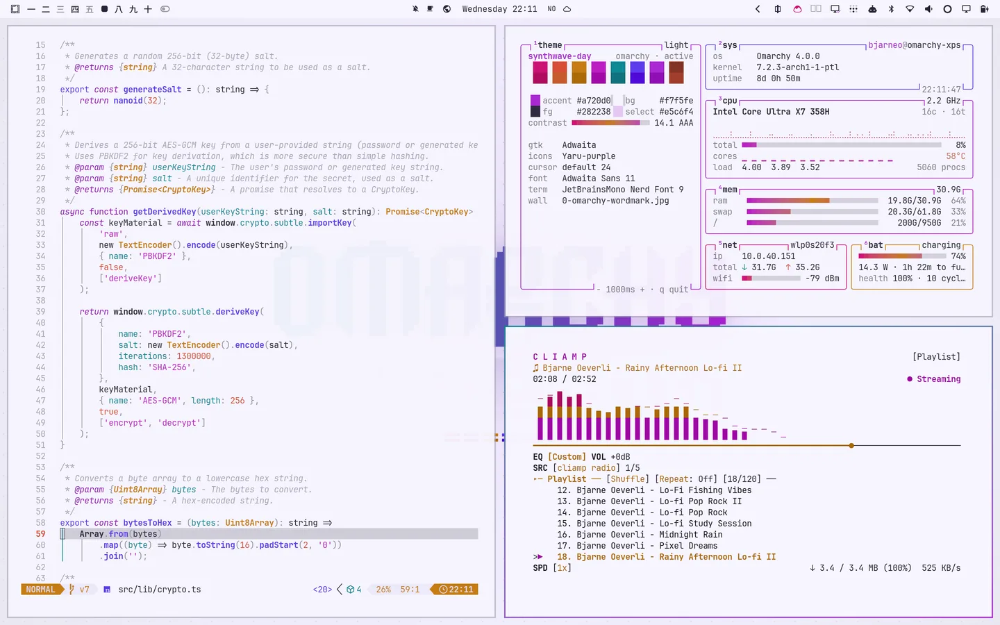](synthwave-day/preview.png)

`001` · Folder: [`synthwave-day/`](synthwave-day/) · [Open in the gallery](https://bjarneo.github.io/100-themes-day/#synthwave-day) · Night version: [Synthwave](https://bjarneo.github.io/100-themes/#synthwave)

Synthwave Day has a light violet background and a violet accent. The ANSI colors are saturated. The native background shows a morning sun over a perspective grid.

| Key | Value |
| --- | --- |
| `background` | `#f7f5fe` |
| `foreground` | `#282238` |
| `accent` | `#a720d0` |
| `selection` | `#e5c6f4` |
| Icon theme | `Yaru-purple` |
| Backgrounds | [`0-omarchy-wordmark.jpg`](synthwave-day/backgrounds/0-omarchy-wordmark.jpg), [`1-sunset-grid.jpg`](synthwave-day/backgrounds/1-sunset-grid.jpg) |

<details>
<summary>All 16 ANSI colors</summary>

| # | Normal | # | Bright |
| --- | --- | --- | --- |
| 0 black | `#e4e0f5` | 8 bright black | `#a5a1b6` |
| 1 red | `#cc096f` | 9 bright red | `#aa055b` |
| 2 green | `#b915bf` | 10 bright green | `#9c00a2` |
| 3 yellow | `#c47809` | 11 bright yellow | `#a96500` |
| 4 blue | `#5835ea` | 12 bright blue | `#4900d5` |
| 5 magenta | `#a720d0` | 13 bright magenta | `#8d05b2` |
| 6 cyan | `#058490` | 14 bright cyan | `#066d78` |
| 7 white | `#494459` | 15 bright white | `#151120` |

</details>

```bash
curl -fsSL https://bjarneo.github.io/100-themes-day/install.sh | bash -s -- synthwave-day --set
```

### Neon Wave Day

[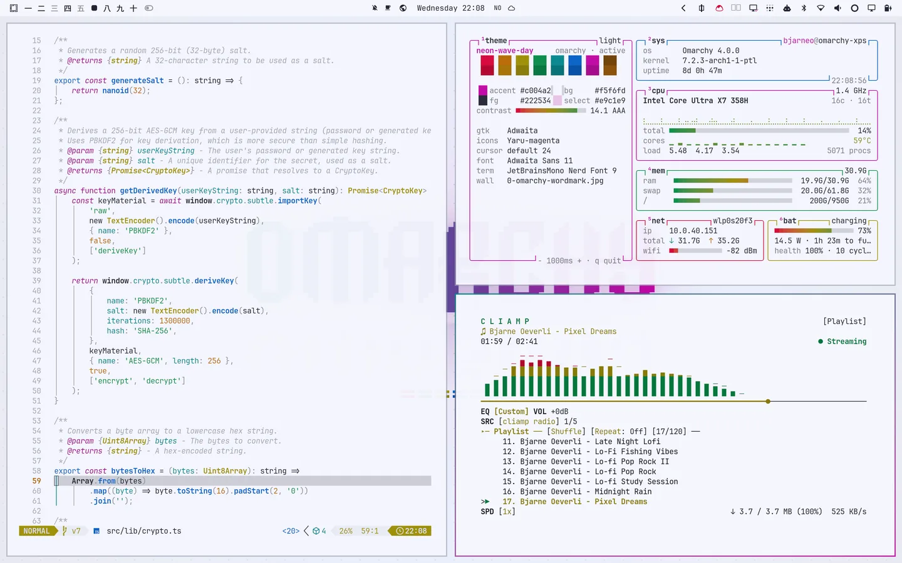](neon-wave-day/preview.png)

`002` · Folder: [`neon-wave-day/`](neon-wave-day/) · [Open in the gallery](https://bjarneo.github.io/100-themes-day/#neon-wave-day) · Night version: [Neon Wave](https://bjarneo.github.io/100-themes/#neon-wave)

Neon Wave Day has a light indigo background and a magenta accent. The ANSI colors use very high chroma. The native background shows a morning sun over a perspective grid.

| Key | Value |
| --- | --- |
| `background` | `#f5f6fd` |
| `foreground` | `#222534` |
| `accent` | `#c004a2` |
| `selection` | `#e9c1e9` |
| Icon theme | `Yaru-magenta` |
| Backgrounds | [`0-omarchy-wordmark.jpg`](neon-wave-day/backgrounds/0-omarchy-wordmark.jpg), [`1-sunset-grid.jpg`](neon-wave-day/backgrounds/1-sunset-grid.jpg) |

<details>
<summary>All 16 ANSI colors</summary>

| # | Normal | # | Bright |
| --- | --- | --- | --- |
| 0 black | `#dfe2ef` | 8 bright black | `#a0a4b5` |
| 1 red | `#d40335` | 9 bright red | `#b1002a` |
| 2 green | `#058c47` | 10 bright green | `#00743a` |
| 3 yellow | `#9c8e00` | 11 bright yellow | `#857903` |
| 4 blue | `#025fc4` | 12 bright blue | `#004ca2` |
| 5 magenta | `#c004a2` | 13 bright magenta | `#9f0486` |
| 6 cyan | `#01858b` | 14 bright cyan | `#006e74` |
| 7 white | `#434755` | 15 bright white | `#10131f` |

</details>

```bash
curl -fsSL https://bjarneo.github.io/100-themes-day/install.sh | bash -s -- neon-wave-day --set
```

### Lofi Day

[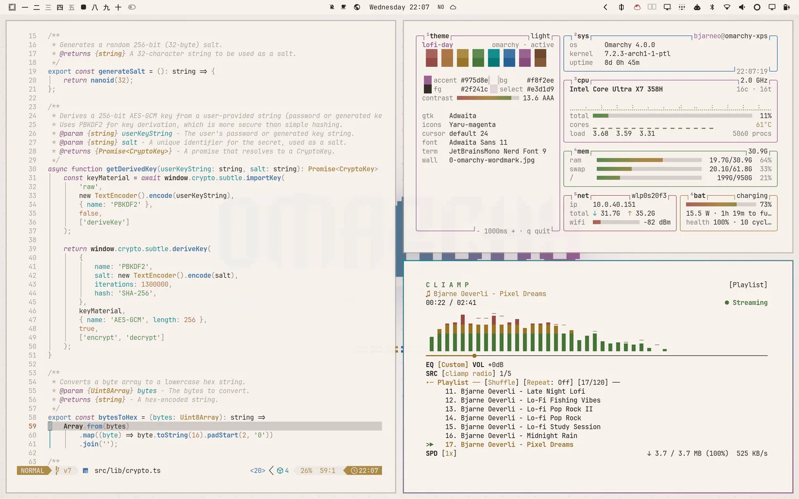](lofi-day/preview.png)

`003` · Folder: [`lofi-day/`](lofi-day/) · [Open in the gallery](https://bjarneo.github.io/100-themes-day/#lofi-day) · Night version: [Lofi](https://bjarneo.github.io/100-themes/#lofi)

Lofi Day has a light peach background and a magenta accent. The ANSI colors use low chroma for a muted look. The native background shows layered sound wave ribbons in ink.

| Key | Value |
| --- | --- |
| `background` | `#f8f2ee` |
| `foreground` | `#2f241c` |
| `accent` | `#975d8e` |
| `selection` | `#e3d1d9` |
| Icon theme | `Yaru-magenta` |
| Backgrounds | [`0-omarchy-wordmark.jpg`](lofi-day/backgrounds/0-omarchy-wordmark.jpg), [`1-waveform.jpg`](lofi-day/backgrounds/1-waveform.jpg) |

<details>
<summary>All 16 ANSI colors</summary>

| # | Normal | # | Bright |
| --- | --- | --- | --- |
| 0 black | `#e6ded8` | 8 bright black | `#aea298` |
| 1 red | `#a75c53` | 9 bright red | `#93463e` |
| 2 green | `#58854a` | 10 bright green | `#437133` |
| 3 yellow | `#ab863e` | 11 bright yellow | `#967020` |
| 4 blue | `#396fa3` | 12 bright blue | `#205b90` |
| 5 magenta | `#975d8e` | 13 bright magenta | `#83487a` |
| 6 cyan | `#0c888b` | 14 bright cyan | `#007274` |
| 7 white | `#50453d` | 15 bright white | `#1b120b` |

</details>

```bash
curl -fsSL https://bjarneo.github.io/100-themes-day/install.sh | bash -s -- lofi-day --set
```

### Hacker Day

[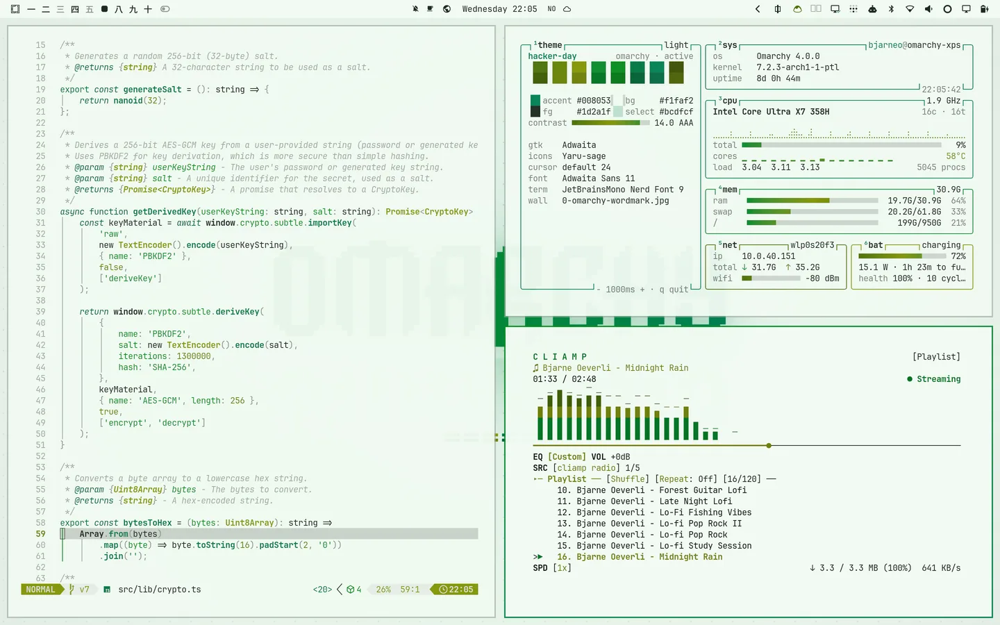](hacker-day/preview.png)

`004` · Folder: [`hacker-day/`](hacker-day/) · [Open in the gallery](https://bjarneo.github.io/100-themes-day/#hacker-day) · Night version: [Hacker](https://bjarneo.github.io/100-themes/#hacker)

Hacker Day has a light green background and a teal accent. The 6 ANSI hues stay close to green, so the palette reads as one color. The native background shows columns of code glyphs on paper.

| Key | Value |
| --- | --- |
| `background` | `#f1faf2` |
| `foreground` | `#1d2a1f` |
| `accent` | `#008053` |
| `selection` | `#bcdfcf` |
| Icon theme | `Yaru-sage` |
| Backgrounds | [`0-omarchy-wordmark.jpg`](hacker-day/backgrounds/0-omarchy-wordmark.jpg), [`1-code-rain.jpg`](hacker-day/backgrounds/1-code-rain.jpg) |

<details>
<summary>All 16 ANSI colors</summary>

| # | Normal | # | Bright |
| --- | --- | --- | --- |
| 0 black | `#dbe6dd` | 8 bright black | `#9aa99c` |
| 1 red | `#4b7107` | 9 bright red | `#3c5b04` |
| 2 green | `#09892c` | 10 bright green | `#007221` |
| 3 yellow | `#839403` | 11 bright yellow | `#6f7d08` |
| 4 blue | `#007742` | 12 bright blue | `#006034` |
| 5 magenta | `#008053` | 13 bright magenta | `#056944` |
| 6 cyan | `#058d1c` | 14 bright cyan | `#047516` |
| 7 white | `#3e4c41` | 15 bright white | `#0b170e` |

</details>

```bash
curl -fsSL https://bjarneo.github.io/100-themes-day/install.sh | bash -s -- hacker-day --set
```

### Ember Day

[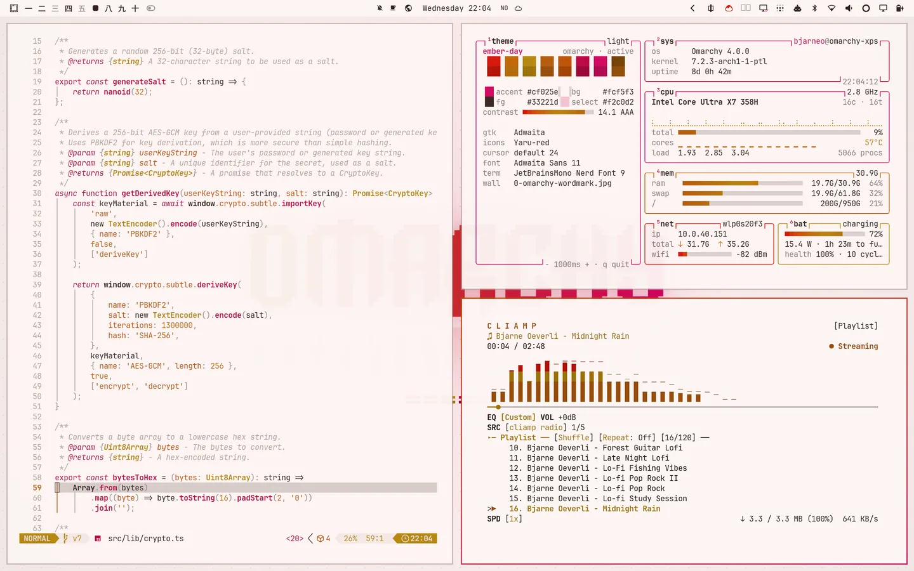](ember-day/preview.png)

`005` · Folder: [`ember-day/`](ember-day/) · [Open in the gallery](https://bjarneo.github.io/100-themes-day/#ember-day) · Night version: [Ember](https://bjarneo.github.io/100-themes/#ember)

Ember Day has a light rose background and a pink accent. The ANSI colors are saturated. The native background shows dunes at noon with drifting dust.

| Key | Value |
| --- | --- |
| `background` | `#fcf5f3` |
| `foreground` | `#33221d` |
| `accent` | `#cf025e` |
| `selection` | `#f2c0d2` |
| Icon theme | `Yaru-red` |
| Backgrounds | [`0-omarchy-wordmark.jpg`](ember-day/backgrounds/0-omarchy-wordmark.jpg), [`1-embers.jpg`](ember-day/backgrounds/1-embers.jpg) |

<details>
<summary>All 16 ANSI colors</summary>

| # | Normal | # | Bright |
| --- | --- | --- | --- |
| 0 black | `#eedfdb` | 8 bright black | `#b49f9a` |
| 1 red | `#d41102` | 9 bright red | `#b00e03` |
| 2 green | `#b25806` | 10 bright green | `#944907` |
| 3 yellow | `#b38308` | 11 bright yellow | `#996f05` |
| 4 blue | `#b90042` | 12 bright blue | `#960134` |
| 5 magenta | `#cf025e` | 13 bright magenta | `#ac034d` |
| 6 cyan | `#bd4d00` | 14 bright cyan | `#9e3f00` |
| 7 white | `#54433f` | 15 bright white | `#1e100c` |

</details>

```bash
curl -fsSL https://bjarneo.github.io/100-themes-day/install.sh | bash -s -- ember-day --set
```

### Vaporwave Day

[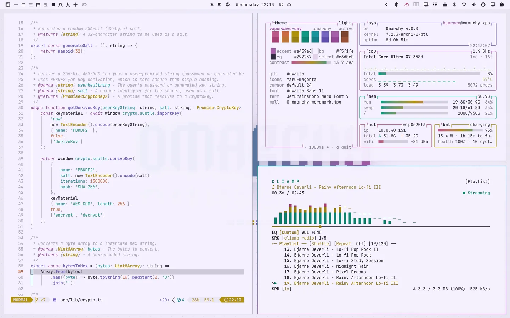](vaporwave-day/preview.png)

`006` · Folder: [`vaporwave-day/`](vaporwave-day/) · [Open in the gallery](https://bjarneo.github.io/100-themes-day/#vaporwave-day) · Night version: [Vaporwave](https://bjarneo.github.io/100-themes/#vaporwave)

Vaporwave Day has a light violet background and a magenta accent. The ANSI colors are soft with low chroma. The native background shows a morning sun over a perspective grid.

| Key | Value |
| --- | --- |
| `background` | `#f5f1fe` |
| `foreground` | `#292237` |
| `accent` | `#a459a6` |
| `selection` | `#e3d0eb` |
| Icon theme | `Yaru-magenta` |
| Backgrounds | [`0-omarchy-wordmark.jpg`](vaporwave-day/backgrounds/0-omarchy-wordmark.jpg), [`1-sunset-grid.jpg`](vaporwave-day/backgrounds/1-sunset-grid.jpg) |

<details>
<summary>All 16 ANSI colors</summary>

| # | Normal | # | Bright |
| --- | --- | --- | --- |
| 0 black | `#e2dcf0` | 8 bright black | `#a7a1b5` |
| 1 red | `#b75282` | 9 bright red | `#a23a6e` |
| 2 green | `#09957f` | 10 bright green | `#077e6a` |
| 3 yellow | `#af8f01` | 11 bright yellow | `#957b0f` |
| 4 blue | `#7061bd` | 12 bright blue | `#5d4aaa` |
| 5 magenta | `#a459a6` | 13 bright magenta | `#8f4292` |
| 6 cyan | `#0e919a` | 14 bright cyan | `#107a82` |
| 7 white | `#4a4458` | 15 bright white | `#16111f` |

</details>

```bash
curl -fsSL https://bjarneo.github.io/100-themes-day/install.sh | bash -s -- vaporwave-day --set
```

### Cyberpunk Day

[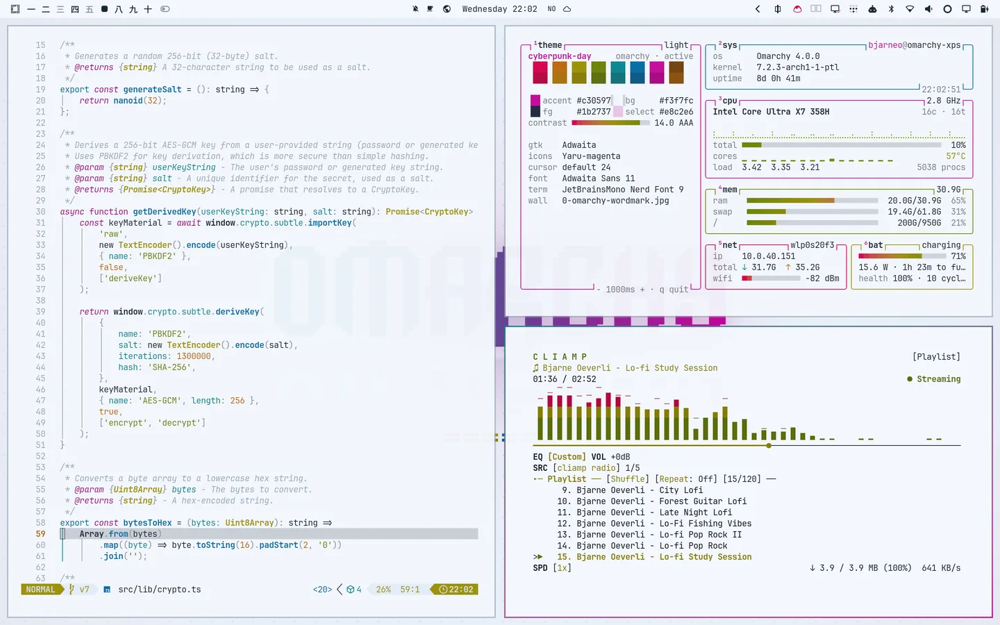](cyberpunk-day/preview.png)

`007` · Folder: [`cyberpunk-day/`](cyberpunk-day/) · [Open in the gallery](https://bjarneo.github.io/100-themes-day/#cyberpunk-day) · Night version: [Cyberpunk](https://bjarneo.github.io/100-themes/#cyberpunk)

Cyberpunk Day has a light blue background and a magenta accent. The ANSI colors use very high chroma. The native background shows a city skyline in daylight.

| Key | Value |
| --- | --- |
| `background` | `#f3f7fc` |
| `foreground` | `#1b2737` |
| `accent` | `#c30597` |
| `selection` | `#e8c2e6` |
| Icon theme | `Yaru-magenta` |
| Backgrounds | [`0-omarchy-wordmark.jpg`](cyberpunk-day/backgrounds/0-omarchy-wordmark.jpg), [`1-skyline.jpg`](cyberpunk-day/backgrounds/1-skyline.jpg) |

<details>
<summary>All 16 ANSI colors</summary>

| # | Normal | # | Bright |
| --- | --- | --- | --- |
| 0 black | `#d9e4f3` | 8 bright black | `#98a6b8` |
| 1 red | `#d20048` | 9 bright red | `#af043b` |
| 2 green | `#698000` | 10 bright green | `#576a07` |
| 3 yellow | `#9a8f01` | 11 bright yellow | `#847a01` |
| 4 blue | `#0069a1` | 12 bright blue | `#075582` |
| 5 magenta | `#c30597` | 13 bright magenta | `#a2047d` |
| 6 cyan | `#04848f` | 14 bright cyan | `#0f6d76` |
| 7 white | `#3d4958` | 15 bright white | `#0a1421` |

</details>

```bash
curl -fsSL https://bjarneo.github.io/100-themes-day/install.sh | bash -s -- cyberpunk-day --set
```

### Outrun Day

[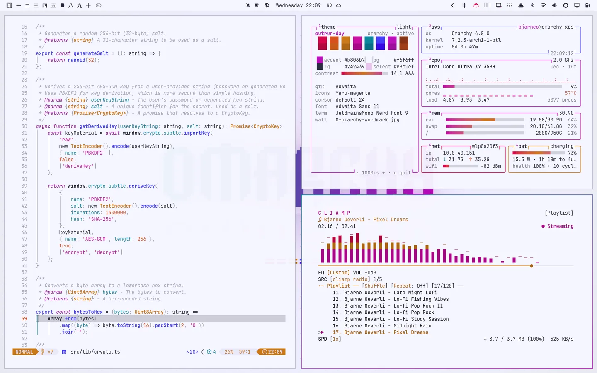](outrun-day/preview.png)

`008` · Folder: [`outrun-day/`](outrun-day/) · [Open in the gallery](https://bjarneo.github.io/100-themes-day/#outrun-day) · Night version: [Outrun](https://bjarneo.github.io/100-themes/#outrun)

Outrun Day has a light indigo background and a magenta accent. The ANSI colors use very high chroma. The native background shows a morning sun over a perspective grid.

| Key | Value |
| --- | --- |
| `background` | `#f6f6ff` |
| `foreground` | `#242439` |
| `accent` | `#b806b7` |
| `selection` | `#e8c1ef` |
| Icon theme | `Yaru-magenta` |
| Backgrounds | [`0-omarchy-wordmark.jpg`](outrun-day/backgrounds/0-omarchy-wordmark.jpg), [`1-sunset-grid.jpg`](outrun-day/backgrounds/1-sunset-grid.jpg) |

<details>
<summary>All 16 ANSI colors</summary>

| # | Normal | # | Bright |
| --- | --- | --- | --- |
| 0 black | `#e0e1f6` | 8 bright black | `#a2a2b7` |
| 1 red | `#d30043` | 9 bright red | `#b00036` |
| 2 green | `#c7069d` | 10 bright green | `#a70083` |
| 3 yellow | `#ca740e` | 11 bright yellow | `#ac620c` |
| 4 blue | `#3d38f8` | 12 bright blue | `#3100e4` |
| 5 magenta | `#b806b7` | 13 bright magenta | `#990498` |
| 6 cyan | `#02829b` | 14 bright cyan | `#006c81` |
| 7 white | `#45455a` | 15 bright white | `#121221` |

</details>

```bash
curl -fsSL https://bjarneo.github.io/100-themes-day/install.sh | bash -s -- outrun-day --set
```

### Toxic Day

[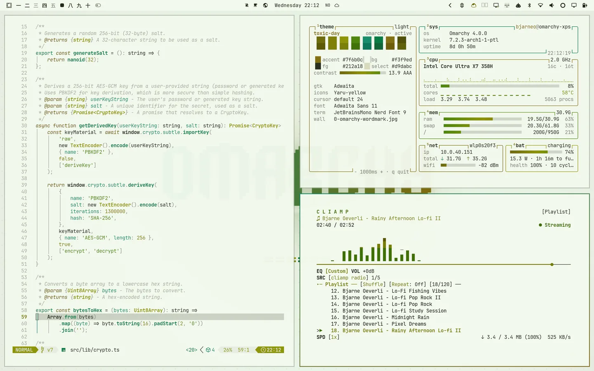](toxic-day/preview.png)

`009` · Folder: [`toxic-day/`](toxic-day/) · [Open in the gallery](https://bjarneo.github.io/100-themes-day/#toxic-day) · Night version: [Toxic](https://bjarneo.github.io/100-themes/#toxic)

Toxic Day has a light pale lime background and a yellow accent. The ANSI colors are saturated. The native background shows a topographic map on paper.

| Key | Value |
| --- | --- |
| `background` | `#f3f9ed` |
| `foreground` | `#212a18` |
| `accent` | `#7f6b0c` |
| `selection` | `#d9dabc` |
| Icon theme | `Yaru-yellow` |
| Backgrounds | [`0-omarchy-wordmark.jpg`](toxic-day/backgrounds/0-omarchy-wordmark.jpg), [`1-contours.jpg`](toxic-day/backgrounds/1-contours.jpg) |

<details>
<summary>All 16 ANSI colors</summary>

| # | Normal | # | Bright |
| --- | --- | --- | --- |
| 0 black | `#dee6d6` | 8 bright black | `#9ea995` |
| 1 red | `#6b6605` | 9 bright red | `#575200` |
| 2 green | `#498304` | 10 bright green | `#3b6d00` |
| 3 yellow | `#8b9100` | 11 bright yellow | `#767b04` |
| 4 blue | `#00773d` | 12 bright blue | `#076031` |
| 5 magenta | `#7f6b0c` | 13 bright magenta | `#685704` |
| 6 cyan | `#128967` | 14 bright cyan | `#077255` |
| 7 white | `#424b3a` | 15 bright white | `#0f1608` |

</details>

```bash
curl -fsSL https://bjarneo.github.io/100-themes-day/install.sh | bash -s -- toxic-day --set
```

### Abyss Day

[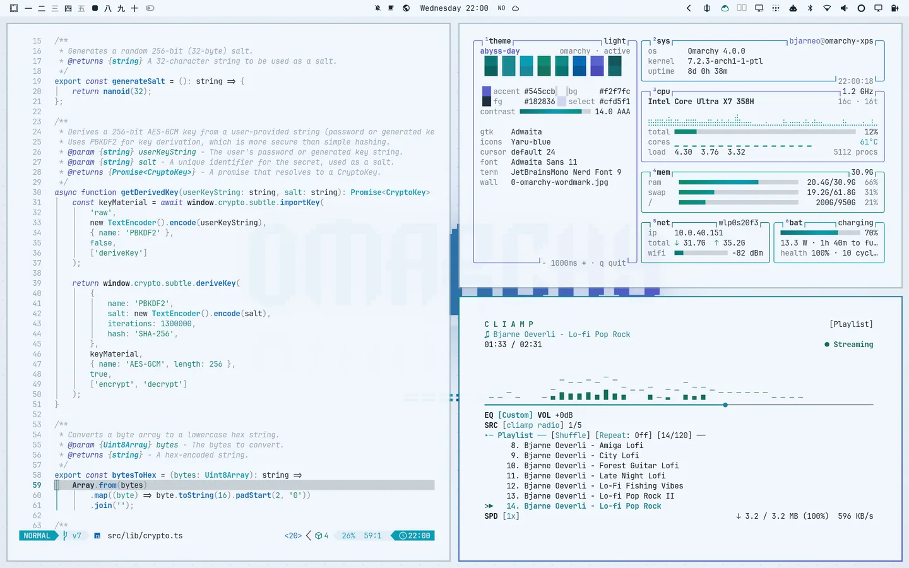](abyss-day/preview.png)

`010` · Folder: [`abyss-day/`](abyss-day/) · [Open in the gallery](https://bjarneo.github.io/100-themes-day/#abyss-day) · Night version: [Abyss](https://bjarneo.github.io/100-themes/#abyss)

Abyss Day has a light blue background and a indigo accent. The ANSI colors use medium chroma for a calmer look. The native background shows sunlit shallow water with caustics.

| Key | Value |
| --- | --- |
| `background` | `#f2f7fc` |
| `foreground` | `#182836` |
| `accent` | `#545ccb` |
| `selection` | `#cfd5f1` |
| Icon theme | `Yaru-blue` |
| Backgrounds | [`0-omarchy-wordmark.jpg`](abyss-day/backgrounds/0-omarchy-wordmark.jpg), [`1-depths.jpg`](abyss-day/backgrounds/1-depths.jpg) |

<details>
<summary>All 16 ANSI colors</summary>

| # | Normal | # | Bright |
| --- | --- | --- | --- |
| 0 black | `#d7e5f2` | 8 bright black | `#96a7b7` |
| 1 red | `#047270` | 9 bright red | `#015c5a` |
| 2 green | `#05856b` | 10 bright green | `#0f6d58` |
| 3 yellow | `#009ab0` | 11 bright yellow | `#138394` |
| 4 blue | `#0064b5` | 12 bright blue | `#005093` |
| 5 magenta | `#545ccb` | 13 bright magenta | `#4245b8` |
| 6 cyan | `#058684` | 14 bright cyan | `#016f6e` |
| 7 white | `#3a4a57` | 15 bright white | `#081520` |

</details>

```bash
curl -fsSL https://bjarneo.github.io/100-themes-day/install.sh | bash -s -- abyss-day --set
```

### Ultraviolet Day

[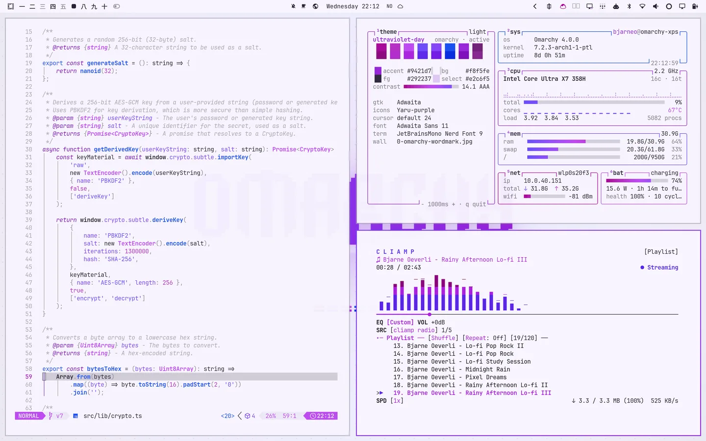](ultraviolet-day/preview.png)

`011` · Folder: [`ultraviolet-day/`](ultraviolet-day/) · [Open in the gallery](https://bjarneo.github.io/100-themes-day/#ultraviolet-day) · Night version: [Ultraviolet](https://bjarneo.github.io/100-themes/#ultraviolet)

Ultraviolet Day has a light violet background and a violet accent. The ANSI colors are saturated. The native background shows watercolor clouds on a light sky.

| Key | Value |
| --- | --- |
| `background` | `#f8f5fe` |
| `foreground` | `#292237` |
| `accent` | `#9421d7` |
| `selection` | `#e2c6f5` |
| Icon theme | `Yaru-purple` |
| Backgrounds | [`0-omarchy-wordmark.jpg`](ultraviolet-day/backgrounds/0-omarchy-wordmark.jpg), [`1-nebula.jpg`](ultraviolet-day/backgrounds/1-nebula.jpg) |

<details>
<summary>All 16 ANSI colors</summary>

| # | Normal | # | Bright |
| --- | --- | --- | --- |
| 0 black | `#e5dff4` | 8 bright black | `#a7a1b5` |
| 1 red | `#a70096` | 9 bright red | `#88007a` |
| 2 green | `#6847fa` | 10 bright green | `#5821e8` |
| 3 yellow | `#bd45f0` | 11 bright yellow | `#a91ddc` |
| 4 blue | `#124aee` | 12 bright blue | `#0027dc` |
| 5 magenta | `#9421d7` | 13 bright magenta | `#7c05b8` |
| 6 cyan | `#8040f6` | 14 bright cyan | `#6f15e3` |
| 7 white | `#4a4458` | 15 bright white | `#16111f` |

</details>

```bash
curl -fsSL https://bjarneo.github.io/100-themes-day/install.sh | bash -s -- ultraviolet-day --set
```

### Arcade Day

[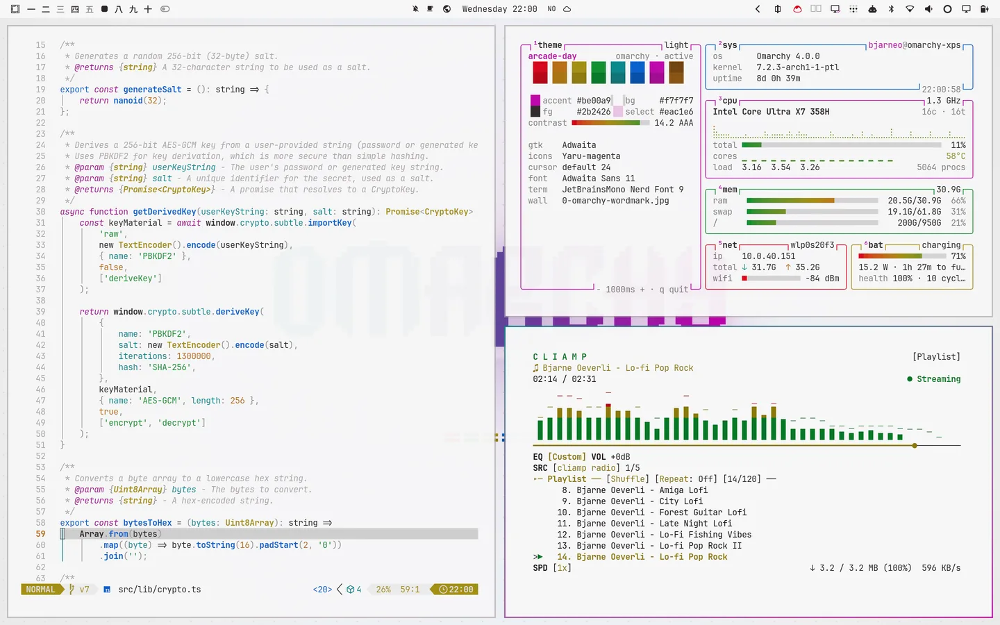](arcade-day/preview.png)

`012` · Folder: [`arcade-day/`](arcade-day/) · [Open in the gallery](https://bjarneo.github.io/100-themes-day/#arcade-day) · Night version: [Arcade](https://bjarneo.github.io/100-themes/#arcade)

Arcade Day has a neutral white background and a magenta accent. The ANSI colors use very high chroma. The native background shows a pixel art landscape at noon.

| Key | Value |
| --- | --- |
| `background` | `#f7f7f7` |
| `foreground` | `#2b2426` |
| `accent` | `#be00a9` |
| `selection` | `#eac1e6` |
| Icon theme | `Yaru-magenta` |
| Backgrounds | [`0-omarchy-wordmark.jpg`](arcade-day/backgrounds/0-omarchy-wordmark.jpg), [`1-pixels.jpg`](arcade-day/backgrounds/1-pixels.jpg) |

<details>
<summary>All 16 ANSI colors</summary>

| # | Normal | # | Bright |
| --- | --- | --- | --- |
| 0 black | `#e3e3e3` | 8 bright black | `#aaa2a4` |
| 1 red | `#d60015` | 9 bright red | `#b20010` |
| 2 green | `#0a8d2b` | 10 bright green | `#017521` |
| 3 yellow | `#a18c0b` | 11 bright yellow | `#8a7707` |
| 4 blue | `#015dca` | 12 bright blue | `#004aa5` |
| 5 magenta | `#be00a9` | 13 bright magenta | `#9d058c` |
| 6 cyan | `#01858a` | 14 bright cyan | `#0a6e72` |
| 7 white | `#4d4647` | 15 bright white | `#181214` |

</details>

```bash
curl -fsSL https://bjarneo.github.io/100-themes-day/install.sh | bash -s -- arcade-day --set
```

### Noir Rain Day

[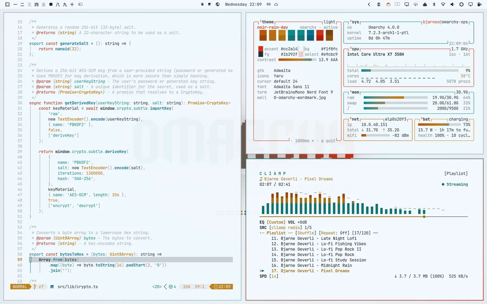](noir-rain-day/preview.png)

`013` · Folder: [`noir-rain-day/`](noir-rain-day/) · [Open in the gallery](https://bjarneo.github.io/100-themes-day/#noir-rain-day) · Night version: [Noir Rain](https://bjarneo.github.io/100-themes/#noir-rain)

Noir Rain Day has a light blue background and a red accent. The ANSI colors are saturated. The native background shows a city skyline in daylight.

| Key | Value |
| --- | --- |
| `background` | `#f1f8fc` |
| `foreground` | `#1b292f` |
| `accent` | `#cc2a14` |
| `selection` | `#e9cbc9` |
| Icon theme | `Yaru` |
| Backgrounds | [`0-omarchy-wordmark.jpg`](noir-rain-day/backgrounds/0-omarchy-wordmark.jpg), [`1-skyline.jpg`](noir-rain-day/backgrounds/1-skyline.jpg) |

<details>
<summary>All 16 ANSI colors</summary>

| # | Normal | # | Bright |
| --- | --- | --- | --- |
| 0 black | `#dbe5e9` | 8 bright black | `#99a7af` |
| 1 red | `#b44f00` | 9 bright red | `#964100` |
| 2 green | `#038586` | 10 bright green | `#0f6e6f` |
| 3 yellow | `#be7c0c` | 11 bright yellow | `#a36909` |
| 4 blue | `#006e8c` | 12 bright blue | `#055871` |
| 5 magenta | `#cc2a14` | 13 bright magenta | `#ae1801` |
| 6 cyan | `#028588` | 14 bright cyan | `#0e6e70` |
| 7 white | `#3d4a51` | 15 bright white | `#0a161b` |

</details>

```bash
curl -fsSL https://bjarneo.github.io/100-themes-day/install.sh | bash -s -- noir-rain-day --set
```

### Glacier Day

[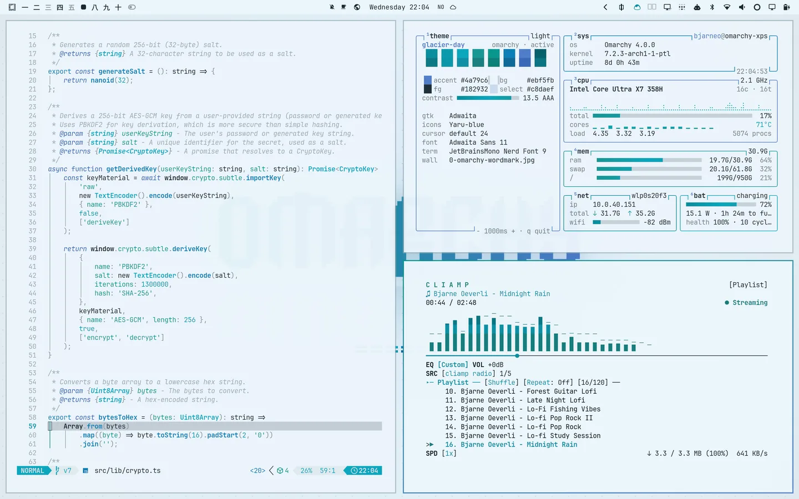](glacier-day/preview.png)

`014` · Folder: [`glacier-day/`](glacier-day/) · [Open in the gallery](https://bjarneo.github.io/100-themes-day/#glacier-day) · Night version: [Glacier](https://bjarneo.github.io/100-themes/#glacier)

Glacier Day has a light blue background and a blue accent. The ANSI colors are soft with low chroma. The native background shows light curtains over a calm mountain lake.

| Key | Value |
| --- | --- |
| `background` | `#ebf5fb` |
| `foreground` | `#182932` |
| `accent` | `#4a79c6` |
| `selection` | `#c8daef` |
| Icon theme | `Yaru-blue` |
| Backgrounds | [`0-omarchy-wordmark.jpg`](glacier-day/backgrounds/0-omarchy-wordmark.jpg), [`1-aurora.jpg`](glacier-day/backgrounds/1-aurora.jpg) |

<details>
<summary>All 16 ANSI colors</summary>

| # | Normal | # | Bright |
| --- | --- | --- | --- |
| 0 black | `#d5e2e9` | 8 bright black | `#95a8b1` |
| 1 red | `#008a99` | 9 bright red | `#057480` |
| 2 green | `#109391` | 10 bright green | `#137b7a` |
| 3 yellow | `#02a4bb` | 11 bright yellow | `#098da1` |
| 4 blue | `#007ab2` | 12 bright blue | `#066493` |
| 5 magenta | `#4a79c6` | 13 bright magenta | `#3364b3` |
| 6 cyan | `#00948b` | 14 bright cyan | `#057c75` |
| 7 white | `#3a4a53` | 15 bright white | `#07161d` |

</details>

```bash
curl -fsSL https://bjarneo.github.io/100-themes-day/install.sh | bash -s -- glacier-day --set
```

### Tropical Day

[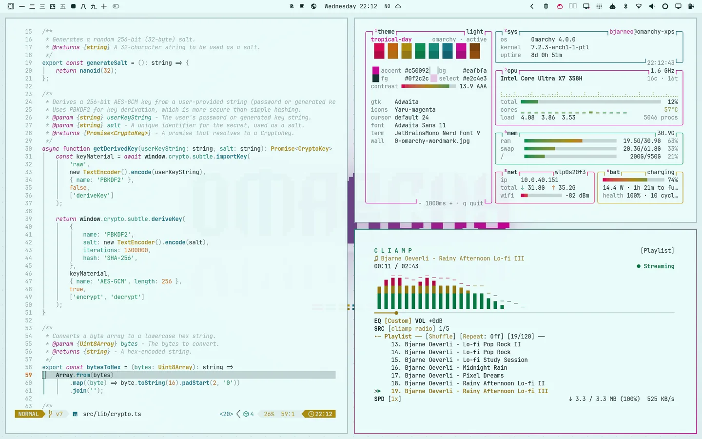](tropical-day/preview.png)

`015` · Folder: [`tropical-day/`](tropical-day/) · [Open in the gallery](https://bjarneo.github.io/100-themes-day/#tropical-day) · Night version: [Tropical](https://bjarneo.github.io/100-themes/#tropical)

Tropical Day has a light cyan background and a magenta accent. The ANSI colors are saturated. The native background shows sunlit shallow water with caustics.

| Key | Value |
| --- | --- |
| `background` | `#eafbfa` |
| `foreground` | `#0f2c2c` |
| `accent` | `#c50092` |
| `selection` | `#e2c4e3` |
| Icon theme | `Yaru-magenta` |
| Backgrounds | [`0-omarchy-wordmark.jpg`](tropical-day/backgrounds/0-omarchy-wordmark.jpg), [`1-depths.jpg`](tropical-day/backgrounds/1-depths.jpg) |

<details>
<summary>All 16 ANSI colors</summary>

| # | Normal | # | Bright |
| --- | --- | --- | --- |
| 0 black | `#d2e8e8` | 8 bright black | `#90abaa` |
| 1 red | `#d2004a` | 9 bright red | `#af003c` |
| 2 green | `#028b4d` | 10 bright green | `#01743f` |
| 3 yellow | `#a98804` | 11 bright yellow | `#8f740f` |
| 4 blue | `#0b6f80` | 12 bright blue | `#095a68` |
| 5 magenta | `#c50092` | 13 bright magenta | `#a30478` |
| 6 cyan | `#0d8775` | 14 bright cyan | `#097061` |
| 7 white | `#344d4d` | 15 bright white | `#021818` |

</details>

```bash
curl -fsSL https://bjarneo.github.io/100-themes-day/install.sh | bash -s -- tropical-day --set
```

### Sakura Day

[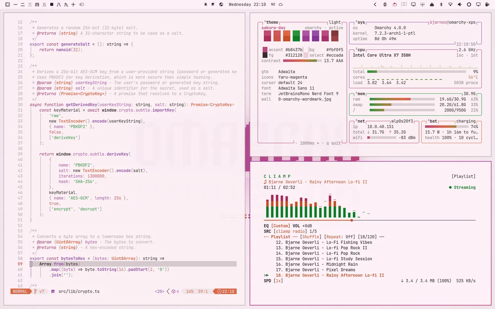](sakura-day/preview.png)

`016` · Folder: [`sakura-day/`](sakura-day/) · [Open in the gallery](https://bjarneo.github.io/100-themes-day/#sakura-day) · Night version: [Sakura](https://bjarneo.github.io/100-themes/#sakura)

Sakura Day has a light blush background and a pink accent. The ANSI colors use medium chroma for a calmer look. The native background shows pastel light spots with bokeh.

| Key | Value |
| --- | --- |
| `background` | `#fbf0f5` |
| `foreground` | `#312128` |
| `accent` | `#b8437b` |
| `selection` | `#eccada` |
| Icon theme | `Yaru-magenta` |
| Backgrounds | [`0-omarchy-wordmark.jpg`](sakura-day/backgrounds/0-omarchy-wordmark.jpg), [`1-blobs.jpg`](sakura-day/backgrounds/1-blobs.jpg) |

<details>
<summary>All 16 ANSI colors</summary>

| # | Normal | # | Bright |
| --- | --- | --- | --- |
| 0 black | `#e9dbe1` | 8 bright black | `#b29fa7` |
| 1 red | `#bd4266` | 9 bright red | `#a82552` |
| 2 green | `#238f34` | 10 bright green | `#077822` |
| 3 yellow | `#db623e` | 11 bright yellow | `#c64920` |
| 4 blue | `#9346a4` | 12 bright blue | `#7f2d91` |
| 5 magenta | `#b8437b` | 13 bright magenta | `#a32867` |
| 6 cyan | `#ab4da0` | 14 bright cyan | `#97348c` |
| 7 white | `#53424a` | 15 bright white | `#1c0f15` |

</details>

```bash
curl -fsSL https://bjarneo.github.io/100-themes-day/install.sh | bash -s -- sakura-day --set
```

### Amber CRT Day

[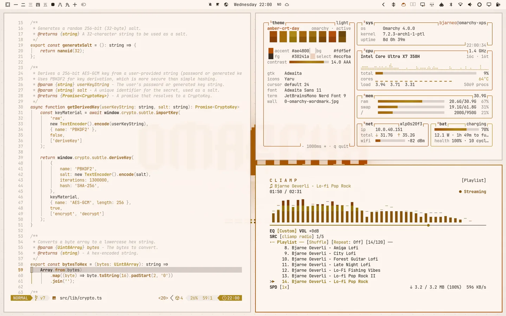](amber-crt-day/preview.png)

`017` · Folder: [`amber-crt-day/`](amber-crt-day/) · [Open in the gallery](https://bjarneo.github.io/100-themes-day/#amber-crt-day) · Night version: [Amber CRT](https://bjarneo.github.io/100-themes/#amber-crt)

Amber CRT Day has a light peach background and a orange accent. The 6 ANSI hues stay close to orange, so the palette reads as one color. The native background shows a faded VHS still with tracking noise.

| Key | Value |
| --- | --- |
| `background` | `#fdf5ef` |
| `foreground` | `#30241a` |
| `accent` | `#ae4800` |
| `selection` | `#eccfba` |
| Icon theme | `Yaru` |
| Backgrounds | [`0-omarchy-wordmark.jpg`](amber-crt-day/backgrounds/0-omarchy-wordmark.jpg), [`1-scanlines.jpg`](amber-crt-day/backgrounds/1-scanlines.jpg) |

<details>
<summary>All 16 ANSI colors</summary>

| # | Normal | # | Bright |
| --- | --- | --- | --- |
| 0 black | `#ebe1d9` | 8 bright black | `#b0a297` |
| 1 red | `#9b4800` | 9 bright red | `#7f3900` |
| 2 green | `#9f6104` | 10 bright green | `#845006` |
| 3 yellow | `#aa8310` | 11 bright yellow | `#916f04` |
| 4 blue | `#905200` | 12 bright blue | `#754100` |
| 5 magenta | `#ae4800` | 13 bright magenta | `#8f3b02` |
| 6 cyan | `#9a6a09` | 14 bright cyan | `#815700` |
| 7 white | `#51453c` | 15 bright white | `#1b1109` |

</details>

```bash
curl -fsSL https://bjarneo.github.io/100-themes-day/install.sh | bash -s -- amber-crt-day --set
```

### Dreampop Day

[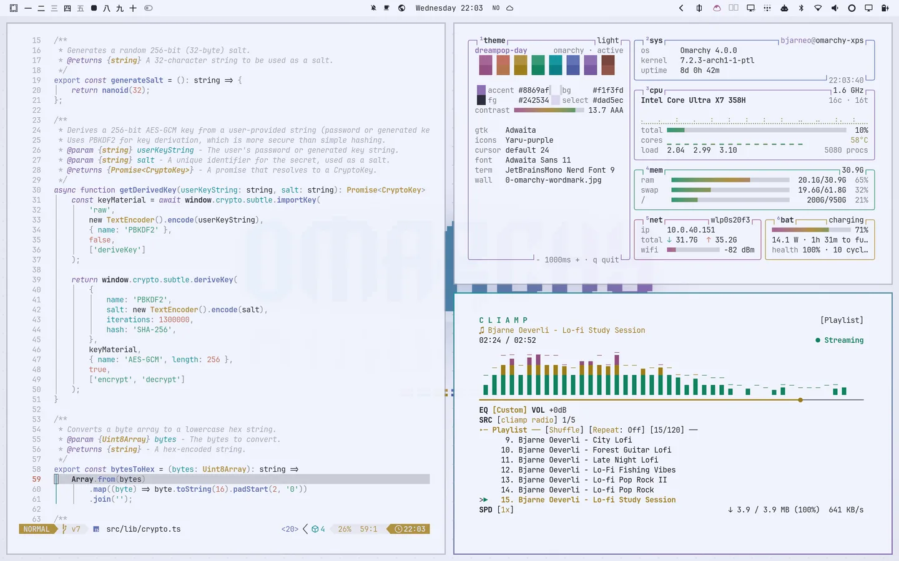](dreampop-day/preview.png)

`018` · Folder: [`dreampop-day/`](dreampop-day/) · [Open in the gallery](https://bjarneo.github.io/100-themes-day/#dreampop-day) · Night version: [Dreampop](https://bjarneo.github.io/100-themes/#dreampop)

Dreampop Day has a light indigo background and a violet accent. The ANSI colors are soft with low chroma. The native background shows pastel light spots with bokeh.

| Key | Value |
| --- | --- |
| `background` | `#f1f3fd` |
| `foreground` | `#242534` |
| `accent` | `#8869af` |
| `selection` | `#dad5ec` |
| Icon theme | `Yaru-purple` |
| Backgrounds | [`0-omarchy-wordmark.jpg`](dreampop-day/backgrounds/0-omarchy-wordmark.jpg), [`1-blobs.jpg`](dreampop-day/backgrounds/1-blobs.jpg) |

<details>
<summary>All 16 ANSI colors</summary>

| # | Normal | # | Bright |
| --- | --- | --- | --- |
| 0 black | `#dddfeb` | 8 bright black | `#a1a3b4` |
| 1 red | `#a35f92` | 9 bright red | `#8f497e` |
| 2 green | `#2f956e` | 10 bright green | `#0a7f5a` |
| 3 yellow | `#ad8e38` | 11 bright yellow | `#997912` |
| 4 blue | `#5c6cb2` | 12 bright blue | `#48579e` |
| 5 magenta | `#8869af` | 13 bright magenta | `#74539c` |
| 6 cyan | `#0d9299` | 14 bright cyan | `#007b82` |
| 7 white | `#454655` | 15 bright white | `#11131f` |

</details>

```bash
curl -fsSL https://bjarneo.github.io/100-themes-day/install.sh | bash -s -- dreampop-day --set
```

### Solar Flare Day

[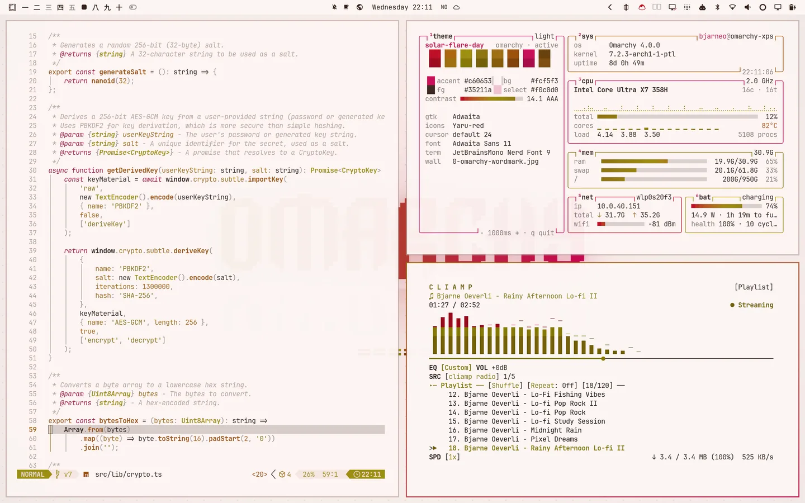](solar-flare-day/preview.png)

`019` · Folder: [`solar-flare-day/`](solar-flare-day/) · [Open in the gallery](https://bjarneo.github.io/100-themes-day/#solar-flare-day) · Night version: [Solar Flare](https://bjarneo.github.io/100-themes/#solar-flare)

Solar Flare Day has a light rose background and a pink accent. The ANSI colors are saturated. The native background shows dunes at noon with drifting dust.

| Key | Value |
| --- | --- |
| `background` | `#fcf5f3` |
| `foreground` | `#35211a` |
| `accent` | `#c60653` |
| `selection` | `#f0c0d0` |
| Icon theme | `Yaru-red` |
| Backgrounds | [`0-omarchy-wordmark.jpg`](solar-flare-day/backgrounds/0-omarchy-wordmark.jpg), [`1-embers.jpg`](solar-flare-day/backgrounds/1-embers.jpg) |

<details>
<summary>All 16 ANSI colors</summary>

| # | Normal | # | Bright |
| --- | --- | --- | --- |
| 0 black | `#f2ded7` | 8 bright black | `#b69f97` |
| 1 red | `#bb071e` | 9 bright red | `#980417` |
| 2 green | `#886f09` | 10 bright green | `#705c03` |
| 3 yellow | `#9a8b08` | 11 bright yellow | `#837601` |
| 4 blue | `#984b03` | 12 bright blue | `#7b3c03` |
| 5 magenta | `#c60653` | 13 bright magenta | `#a30443` |
| 6 cyan | `#9c690c` | 14 bright cyan | `#825604` |
| 7 white | `#56423c` | 15 bright white | `#1f0f09` |

</details>

```bash
curl -fsSL https://bjarneo.github.io/100-themes-day/install.sh | bash -s -- solar-flare-day --set
```

### Bioluminescent Day

[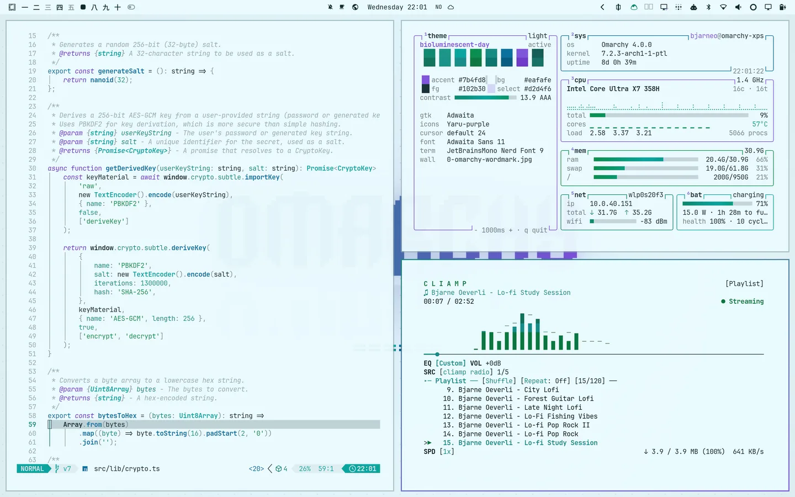](bioluminescent-day/preview.png)

`020` · Folder: [`bioluminescent-day/`](bioluminescent-day/) · [Open in the gallery](https://bjarneo.github.io/100-themes-day/#bioluminescent-day) · Night version: [Bioluminescent](https://bjarneo.github.io/100-themes/#bioluminescent)

Bioluminescent Day has a light cyan background and a violet accent. The ANSI colors are saturated. The native background shows sunlit shallow water with caustics.

| Key | Value |
| --- | --- |
| `background` | `#eafafe` |
| `foreground` | `#102b30` |
| `accent` | `#7b4fd8` |
| `selection` | `#d2d4f6` |
| Icon theme | `Yaru-purple` |
| Backgrounds | [`0-omarchy-wordmark.jpg`](bioluminescent-day/backgrounds/0-omarchy-wordmark.jpg), [`1-depths.jpg`](bioluminescent-day/backgrounds/1-depths.jpg) |

<details>
<summary>All 16 ANSI colors</summary>

| # | Normal | # | Bright |
| --- | --- | --- | --- |
| 0 black | `#d2e8ec` | 8 bright black | `#90aaaf` |
| 1 red | `#07856b` | 9 bright red | `#0b6e58` |
| 2 green | `#018c48` | 10 bright green | `#06743b` |
| 3 yellow | `#01a19c` | 11 bright yellow | `#118985` |
| 4 blue | `#016b9a` | 12 bright blue | `#00567d` |
| 5 magenta | `#7b4fd8` | 13 bright magenta | `#6933c5` |
| 6 cyan | `#0f867e` | 14 bright cyan | `#027069` |
| 7 white | `#354c51` | 15 bright white | `#02171b` |

</details>

```bash
curl -fsSL https://bjarneo.github.io/100-themes-day/install.sh | bash -s -- bioluminescent-day --set
```

### Darkwave Day

[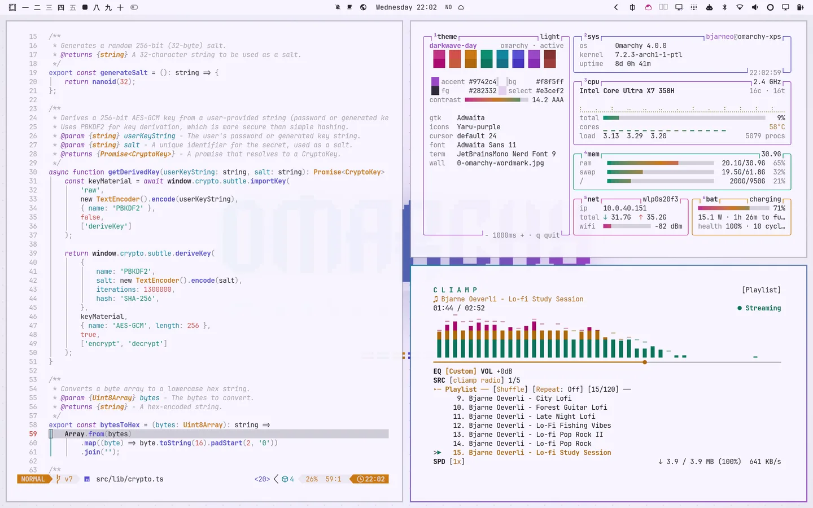](darkwave-day/preview.png)

`021` · Folder: [`darkwave-day/`](darkwave-day/) · [Open in the gallery](https://bjarneo.github.io/100-themes-day/#darkwave-day) · Night version: [Darkwave](https://bjarneo.github.io/100-themes/#darkwave)

Darkwave Day has a light violet background and a violet accent. The ANSI colors are saturated. The native background shows layered sound wave ribbons in ink.

| Key | Value |
| --- | --- |
| `background` | `#f8f5ff` |
| `foreground` | `#282332` |
| `accent` | `#9742c4` |
| `selection` | `#e3cef2` |
| Icon theme | `Yaru-purple` |
| Backgrounds | [`0-omarchy-wordmark.jpg`](darkwave-day/backgrounds/0-omarchy-wordmark.jpg), [`1-waveform.jpg`](darkwave-day/backgrounds/1-waveform.jpg) |

<details>
<summary>All 16 ANSI colors</summary>

| # | Normal | # | Bright |
| --- | --- | --- | --- |
| 0 black | `#e4e1ed` | 8 bright black | `#a7a1b2` |
| 1 red | `#bf2a81` | 9 bright red | `#a7006c` |
| 2 green | `#03896b` | 10 bright green | `#067158` |
| 3 yellow | `#c97409` | 11 bright yellow | `#ac6303` |
| 4 blue | `#514ad1` | 12 bright blue | `#402ebe` |
| 5 magenta | `#9742c4` | 13 bright magenta | `#8324b1` |
| 6 cyan | `#08829c` | 14 bright cyan | `#0e6b81` |
| 7 white | `#4a4553` | 15 bright white | `#15111d` |

</details>

```bash
curl -fsSL https://bjarneo.github.io/100-themes-day/install.sh | bash -s -- darkwave-day --set
```

### Chillwave Day

[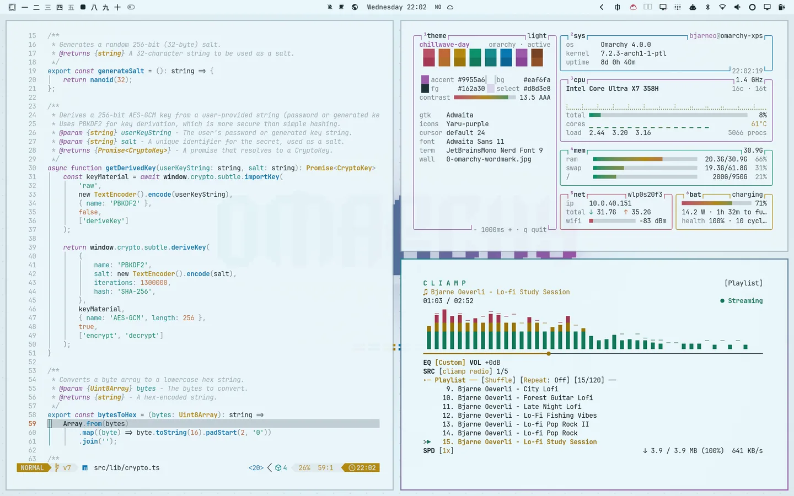](chillwave-day/preview.png)

`022` · Folder: [`chillwave-day/`](chillwave-day/) · [Open in the gallery](https://bjarneo.github.io/100-themes-day/#chillwave-day) · Night version: [Chillwave](https://bjarneo.github.io/100-themes/#chillwave)

Chillwave Day has a light cyan background and a magenta accent. The ANSI colors use medium chroma for a calmer look. The native background shows light curtains over a calm mountain lake.

| Key | Value |
| --- | --- |
| `background` | `#eaf6fa` |
| `foreground` | `#162a30` |
| `accent` | `#9955a6` |
| `selection` | `#d8d3e8` |
| Icon theme | `Yaru-purple` |
| Backgrounds | [`0-omarchy-wordmark.jpg`](chillwave-day/backgrounds/0-omarchy-wordmark.jpg), [`1-aurora.jpg`](chillwave-day/backgrounds/1-aurora.jpg) |

<details>
<summary>All 16 ANSI colors</summary>

| # | Normal | # | Bright |
| --- | --- | --- | --- |
| 0 black | `#d4e3e8` | 8 bright black | `#94a9b0` |
| 1 red | `#b74b60` | 9 bright red | `#a2324b` |
| 2 green | `#028d65` | 10 bright green | `#0d7554` |
| 3 yellow | `#b08505` | 11 bright yellow | `#977100` |
| 4 blue | `#0073ad` | 12 bright blue | `#025e8e` |
| 5 magenta | `#9955a6` | 13 bright magenta | `#843e92` |
| 6 cyan | `#0c888b` | 14 bright cyan | `#0e7174` |
| 7 white | `#394b51` | 15 bright white | `#06161c` |

</details>

```bash
curl -fsSL https://bjarneo.github.io/100-themes-day/install.sh | bash -s -- chillwave-day --set
```

### Retrowave Day

[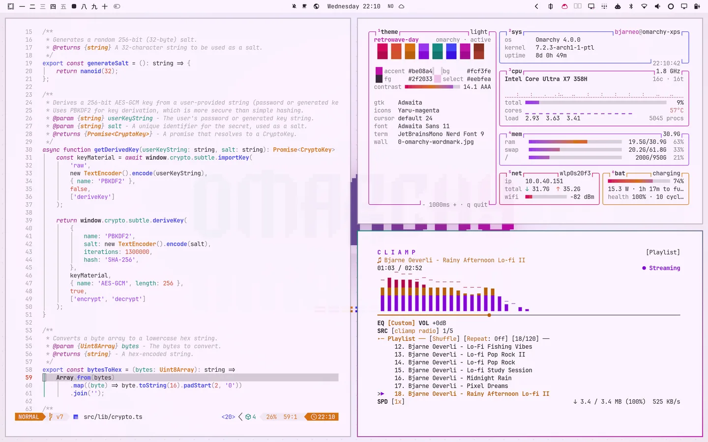](retrowave-day/preview.png)

`023` · Folder: [`retrowave-day/`](retrowave-day/) · [Open in the gallery](https://bjarneo.github.io/100-themes-day/#retrowave-day) · Night version: [Retrowave](https://bjarneo.github.io/100-themes/#retrowave)

Retrowave Day has a light pink background and a magenta accent. The ANSI colors are saturated. The native background shows a morning sun over a perspective grid.

| Key | Value |
| --- | --- |
| `background` | `#fcf3fe` |
| `foreground` | `#2f2033` |
| `accent` | `#be08a4` |
| `selection` | `#eebfea` |
| Icon theme | `Yaru-magenta` |
| Backgrounds | [`0-omarchy-wordmark.jpg`](retrowave-day/backgrounds/0-omarchy-wordmark.jpg), [`1-sunset-grid.jpg`](retrowave-day/backgrounds/1-sunset-grid.jpg) |

<details>
<summary>All 16 ANSI colors</summary>

| # | Normal | # | Bright |
| --- | --- | --- | --- |
| 0 black | `#ecddef` | 8 bright black | `#ad9fb1` |
| 1 red | `#d10056` | 9 bright red | `#ae0046` |
| 2 green | `#962fee` | 10 bright green | `#8100d4` |
| 3 yellow | `#d46b07` | 11 bright yellow | `#b65b04` |
| 4 blue | `#3f3cf3` | 12 bright blue | `#3306e1` |
| 5 magenta | `#be08a4` | 13 bright magenta | `#9f0089` |
| 6 cyan | `#0e867e` | 14 bright cyan | `#0a6f69` |
| 7 white | `#504254` | 15 bright white | `#1a0f1c` |

</details>

```bash
curl -fsSL https://bjarneo.github.io/100-themes-day/install.sh | bash -s -- retrowave-day --set
```

### Phonk Day

[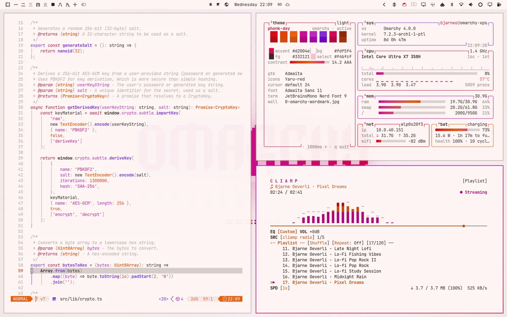](phonk-day/preview.png)

`024` · Folder: [`phonk-day/`](phonk-day/) · [Open in the gallery](https://bjarneo.github.io/100-themes-day/#phonk-day) · Night version: [Phonk](https://bjarneo.github.io/100-themes/#phonk)

Phonk Day has a light rose background and a pink accent. The ANSI colors are saturated. The native background shows an LED spectrum analyzer on a light panel.

| Key | Value |
| --- | --- |
| `background` | `#fdf5f4` |
| `foreground` | `#332121` |
| `accent` | `#d2004e` |
| `selection` | `#f4bfcf` |
| Icon theme | `Yaru-red` |
| Backgrounds | [`0-omarchy-wordmark.jpg`](phonk-day/backgrounds/0-omarchy-wordmark.jpg), [`1-equalizer.jpg`](phonk-day/backgrounds/1-equalizer.jpg) |

<details>
<summary>All 16 ANSI colors</summary>

| # | Normal | # | Bright |
| --- | --- | --- | --- |
| 0 black | `#efdfde` | 8 bright black | `#b49f9e` |
| 1 red | `#d60012` | 9 bright red | `#b2000c` |
| 2 green | `#cb038e` | 10 bright green | `#aa0076` |
| 3 yellow | `#e65904` | 11 bright yellow | `#c44c08` |
| 4 blue | `#7c25d4` | 12 bright blue | `#6700b8` |
| 5 magenta | `#d2004e` | 13 bright magenta | `#af0040` |
| 6 cyan | `#b81fb9` | 14 bright cyan | `#9e009f` |
| 7 white | `#554342` | 15 bright white | `#1e0f0f` |

</details>

```bash
curl -fsSL https://bjarneo.github.io/100-themes-day/install.sh | bash -s -- phonk-day --set
```

### Drum & Bass Day

[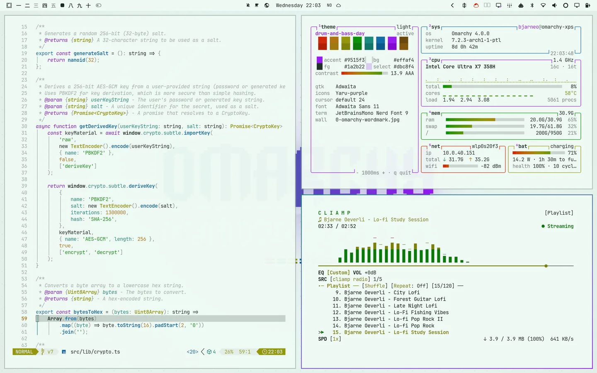](drum-and-bass-day/preview.png)

`025` · Folder: [`drum-and-bass-day/`](drum-and-bass-day/) · [Open in the gallery](https://bjarneo.github.io/100-themes-day/#drum-and-bass-day) · Night version: [Drum & Bass](https://bjarneo.github.io/100-themes/#drum-and-bass)

Drum & Bass Day has a light teal background and a violet accent. The ANSI colors use very high chroma. The native background shows an LED spectrum analyzer on a light panel.

| Key | Value |
| --- | --- |
| `background` | `#effaf4` |
| `foreground` | `#1a2b22` |
| `accent` | `#9515f3` |
| `selection` | `#dbc8f4` |
| Icon theme | `Yaru-purple` |
| Backgrounds | [`0-omarchy-wordmark.jpg`](drum-and-bass-day/backgrounds/0-omarchy-wordmark.jpg), [`1-equalizer.jpg`](drum-and-bass-day/backgrounds/1-equalizer.jpg) |

<details>
<summary>All 16 ANSI colors</summary>

| # | Normal | # | Bright |
| --- | --- | --- | --- |
| 0 black | `#dae7df` | 8 bright black | `#98aa9f` |
| 1 red | `#d02101` | 9 bright red | `#ad1900` |
| 2 green | `#028e01` | 10 bright green | `#067605` |
| 3 yellow | `#909303` | 11 bright yellow | `#7b7d05` |
| 4 blue | `#0a68a5` | 12 bright blue | `#035387` |
| 5 magenta | `#9515f3` | 13 bright magenta | `#7d00cf` |
| 6 cyan | `#13867b` | 14 bright cyan | `#0a7066` |
| 7 white | `#3c4c43` | 15 bright white | `#091710` |

</details>

```bash
curl -fsSL https://bjarneo.github.io/100-themes-day/install.sh | bash -s -- drum-and-bass-day --set
```

### Dubstep Day

[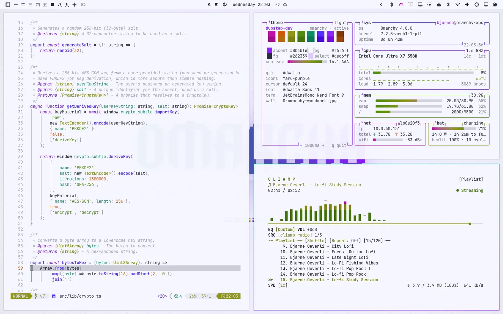](dubstep-day/preview.png)

`026` · Folder: [`dubstep-day/`](dubstep-day/) · [Open in the gallery](https://bjarneo.github.io/100-themes-day/#dubstep-day) · Night version: [Dubstep](https://bjarneo.github.io/100-themes/#dubstep)

Dubstep Day has a light indigo background and a violet accent. The ANSI colors use very high chroma. The native background shows an LED spectrum analyzer on a light panel.

| Key | Value |
| --- | --- |
| `background` | `#f6f6ff` |
| `foreground` | `#262339` |
| `accent` | `#8b1bfe` |
| `selection` | `#dec6ff` |
| Icon theme | `Yaru-purple` |
| Backgrounds | [`0-omarchy-wordmark.jpg`](dubstep-day/backgrounds/0-omarchy-wordmark.jpg), [`1-equalizer.jpg`](dubstep-day/backgrounds/1-equalizer.jpg) |

<details>
<summary>All 16 ANSI colors</summary>

| # | Normal | # | Bright |
| --- | --- | --- | --- |
| 0 black | `#e2e0f5` | 8 bright black | `#a4a2b7` |
| 1 red | `#bf06a3` | 9 bright red | `#9f0387` |
| 2 green | `#4a8700` | 10 bright green | `#3d7000` |
| 3 yellow | `#8d940d` | 11 bright yellow | `#787e08` |
| 4 blue | `#4f24ff` | 12 bright blue | `#4000db` |
| 5 magenta | `#8b1bfe` | 13 bright magenta | `#7501d9` |
| 6 cyan | `#038a60` | 14 bright cyan | `#02724f` |
| 7 white | `#47455a` | 15 bright white | `#141120` |

</details>

```bash
curl -fsSL https://bjarneo.github.io/100-themes-day/install.sh | bash -s -- dubstep-day --set
```

### Techno Day

[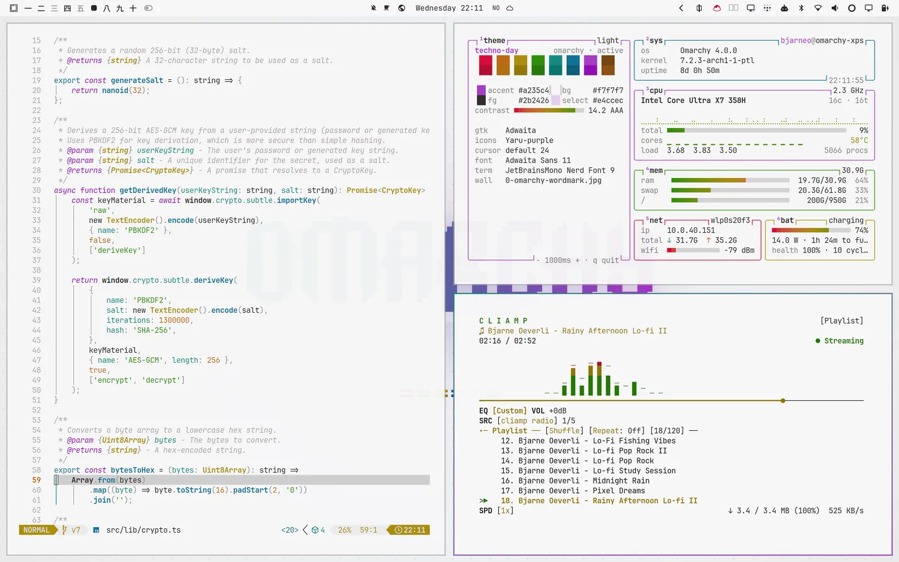](techno-day/preview.png)

`027` · Folder: [`techno-day/`](techno-day/) · [Open in the gallery](https://bjarneo.github.io/100-themes-day/#techno-day) · Night version: [Techno](https://bjarneo.github.io/100-themes/#techno)

Techno Day has a neutral white background and a violet accent. The ANSI colors are saturated. The native background shows an LED spectrum analyzer on a light panel.

| Key | Value |
| --- | --- |
| `background` | `#f7f7f7` |
| `foreground` | `#2b2426` |
| `accent` | `#a235c4` |
| `selection` | `#e4ccec` |
| Icon theme | `Yaru-purple` |
| Backgrounds | [`0-omarchy-wordmark.jpg`](techno-day/backgrounds/0-omarchy-wordmark.jpg), [`1-equalizer.jpg`](techno-day/backgrounds/1-equalizer.jpg) |

<details>
<summary>All 16 ANSI colors</summary>

| # | Normal | # | Bright |
| --- | --- | --- | --- |
| 0 black | `#e3e3e3` | 8 bright black | `#aaa2a4` |
| 1 red | `#d40432` | 9 bright red | `#b00529` |
| 2 green | `#298c01` | 10 bright green | `#227403` |
| 3 yellow | `#a88905` | 11 bright yellow | `#8f7402` |
| 4 blue | `#076c92` | 12 bright blue | `#055777` |
| 5 magenta | `#a235c4` | 13 bright magenta | `#8e06b1` |
| 6 cyan | `#0f867e` | 14 bright cyan | `#007068` |
| 7 white | `#4d4647` | 15 bright white | `#181214` |

</details>

```bash
curl -fsSL https://bjarneo.github.io/100-themes-day/install.sh | bash -s -- techno-day --set
```

### House Day

[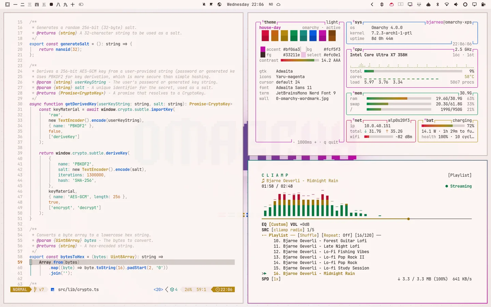](house-day/preview.png)

`028` · Folder: [`house-day/`](house-day/) · [Open in the gallery](https://bjarneo.github.io/100-themes-day/#house-day) · Night version: [House](https://bjarneo.github.io/100-themes/#house)

House Day has a light rose background and a magenta accent. The ANSI colors are saturated. The native background shows an LED spectrum analyzer on a light panel.

| Key | Value |
| --- | --- |
| `background` | `#fcf5f3` |
| `foreground` | `#33211e` |
| `accent` | `#bf06a3` |
| `selection` | `#efc0e1` |
| Icon theme | `Yaru-magenta` |
| Backgrounds | [`0-omarchy-wordmark.jpg`](house-day/backgrounds/0-omarchy-wordmark.jpg), [`1-equalizer.jpg`](house-day/backgrounds/1-equalizer.jpg) |

<details>
<summary>All 16 ANSI colors</summary>

| # | Normal | # | Bright |
| --- | --- | --- | --- |
| 0 black | `#eedfdc` | 8 bright black | `#b49f9b` |
| 1 red | `#d40432` | 9 bright red | `#b00328` |
| 2 green | `#008c48` | 10 bright green | `#00743b` |
| 3 yellow | `#b28307` | 11 bright yellow | `#987001` |
| 4 blue | `#0054dd` | 12 bright blue | `#0043b6` |
| 5 magenta | `#bf06a3` | 13 bright magenta | `#a00088` |
| 6 cyan | `#10867d` | 14 bright cyan | `#106f67` |
| 7 white | `#544340` | 15 bright white | `#1e0f0d` |

</details>

```bash
curl -fsSL https://bjarneo.github.io/100-themes-day/install.sh | bash -s -- house-day --set
```

### Trance Day

[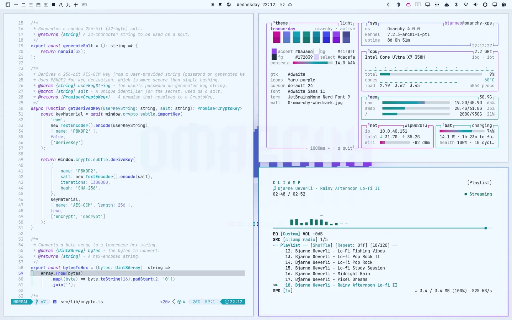](trance-day/preview.png)

`029` · Folder: [`trance-day/`](trance-day/) · [Open in the gallery](https://bjarneo.github.io/100-themes-day/#trance-day) · Night version: [Trance](https://bjarneo.github.io/100-themes/#trance)

Trance Day has a light blue background and a violet accent. The ANSI colors are saturated. The native background shows layered sound wave ribbons in ink.

| Key | Value |
| --- | --- |
| `background` | `#f1f8ff` |
| `foreground` | `#172839` |
| `accent` | `#8a3ae6` |
| `selection` | `#dacefa` |
| Icon theme | `Yaru-purple` |
| Backgrounds | [`0-omarchy-wordmark.jpg`](trance-day/backgrounds/0-omarchy-wordmark.jpg), [`1-waveform.jpg`](trance-day/backgrounds/1-waveform.jpg) |

<details>
<summary>All 16 ANSI colors</summary>

| # | Normal | # | Bright |
| --- | --- | --- | --- |
| 0 black | `#d5e5f6` | 8 bright black | `#97a7b7` |
| 1 red | `#c30496` | 9 bright red | `#a3007d` |
| 2 green | `#0f867e` | 10 bright green | `#0f6f68` |
| 3 yellow | `#089db2` | 11 bright yellow | `#0b8698` |
| 4 blue | `#3a45e8` | 12 bright blue | `#2c22d6` |
| 5 magenta | `#8a3ae6` | 13 bright magenta | `#770bd3` |
| 6 cyan | `#09829d` | 14 bright cyan | `#086b82` |
| 7 white | `#39495a` | 15 bright white | `#091521` |

</details>

```bash
curl -fsSL https://bjarneo.github.io/100-themes-day/install.sh | bash -s -- trance-day --set
```

### Acid House Day

[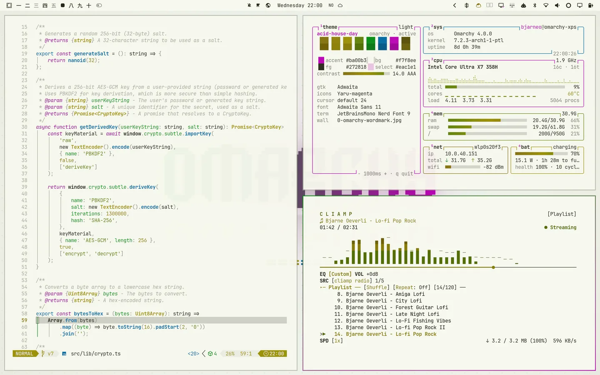](acid-house-day/preview.png)

`030` · Folder: [`acid-house-day/`](acid-house-day/) · [Open in the gallery](https://bjarneo.github.io/100-themes-day/#acid-house-day) · Night version: [Acid House](https://bjarneo.github.io/100-themes/#acid-house)

Acid House Day has a light cream background and a magenta accent. The ANSI colors use very high chroma. The native background shows an LED spectrum analyzer on a light panel.

| Key | Value |
| --- | --- |
| `background` | `#f7f8ee` |
| `foreground` | `#272818` |
| `accent` | `#ba00b3` |
| `selection` | `#eac1e1` |
| Icon theme | `Yaru-magenta` |
| Backgrounds | [`0-omarchy-wordmark.jpg`](acid-house-day/backgrounds/0-omarchy-wordmark.jpg), [`1-equalizer.jpg`](acid-house-day/backgrounds/1-equalizer.jpg) |

<details>
<summary>All 16 ANSI colors</summary>

| # | Normal | # | Bright |
| --- | --- | --- | --- |
| 0 black | `#e3e4d7` | 8 bright black | `#a5a695` |
| 1 red | `#83710c` | 9 bright red | `#6d5d00` |
| 2 green | `#608207` | 10 bright green | `#4f6c01` |
| 3 yellow | `#9b8f00` | 11 bright yellow | `#847a04` |
| 4 blue | `#0169a1` | 12 bright blue | `#005584` |
| 5 magenta | `#ba00b3` | 13 bright magenta | `#9b0095` |
| 6 cyan | `#028e12` | 14 bright cyan | `#087511` |
| 7 white | `#48493a` | 15 bright white | `#141507` |

</details>

```bash
curl -fsSL https://bjarneo.github.io/100-themes-day/install.sh | bash -s -- acid-house-day --set
```

### Jungle Day

[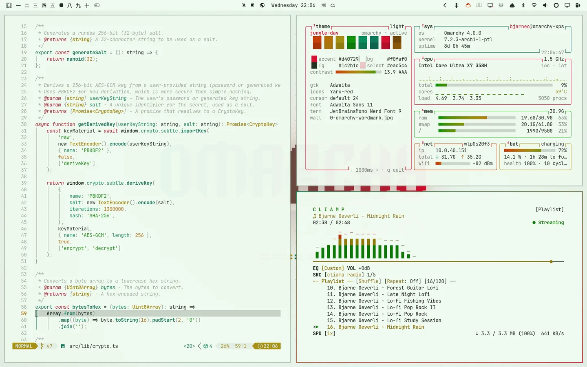](jungle-day/preview.png)

`031` · Folder: [`jungle-day/`](jungle-day/) · [Open in the gallery](https://bjarneo.github.io/100-themes-day/#jungle-day) · Night version: [Jungle](https://bjarneo.github.io/100-themes/#jungle)

Jungle Day has a light green background and a red accent. The ANSI colors are saturated. The native background shows a topographic map on paper.

| Key | Value |
| --- | --- |
| `background` | `#f0faf0` |
| `foreground` | `#1c2b1c` |
| `accent` | `#d40729` |
| `selection` | `#eac5c4` |
| Icon theme | `Yaru-red` |
| Backgrounds | [`0-omarchy-wordmark.jpg`](jungle-day/backgrounds/0-omarchy-wordmark.jpg), [`1-contours.jpg`](jungle-day/backgrounds/1-contours.jpg) |

<details>
<summary>All 16 ANSI colors</summary>

| # | Normal | # | Bright |
| --- | --- | --- | --- |
| 0 black | `#dae7da` | 8 bright black | `#99aa99` |
| 1 red | `#c53900` | 9 bright red | `#a42e00` |
| 2 green | `#098e00` | 10 bright green | `#077600` |
| 3 yellow | `#a38b09` | 11 bright yellow | `#8b7705` |
| 4 blue | `#077558` | 12 bright blue | `#045e46` |
| 5 magenta | `#d40729` | 13 bright magenta | `#b00721` |
| 6 cyan | `#008b57` | 14 bright cyan | `#087348` |
| 7 white | `#3e4c3e` | 15 bright white | `#0b170b` |

</details>

```bash
curl -fsSL https://bjarneo.github.io/100-themes-day/install.sh | bash -s -- jungle-day --set
```

### Grime Day

[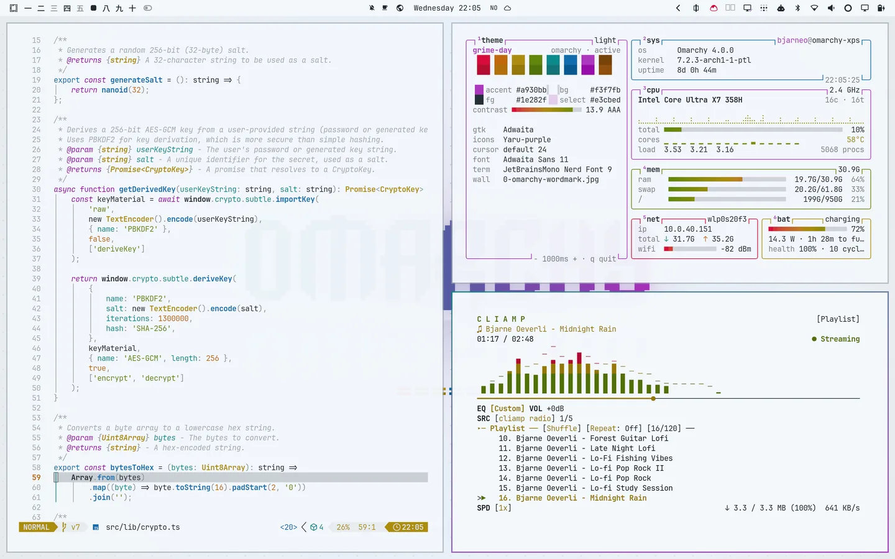](grime-day/preview.png)

`032` · Folder: [`grime-day/`](grime-day/) · [Open in the gallery](https://bjarneo.github.io/100-themes-day/#grime-day) · Night version: [Grime](https://bjarneo.github.io/100-themes/#grime)

Grime Day has a light blue background and a magenta accent. The ANSI colors are saturated. The native background shows a city skyline in daylight.

| Key | Value |
| --- | --- |
| `background` | `#f3f7fb` |
| `foreground` | `#1e282f` |
| `accent` | `#a930bb` |
| `selection` | `#e3cbed` |
| Icon theme | `Yaru-purple` |
| Backgrounds | [`0-omarchy-wordmark.jpg`](grime-day/backgrounds/0-omarchy-wordmark.jpg), [`1-skyline.jpg`](grime-day/backgrounds/1-skyline.jpg) |

<details>
<summary>All 16 ANSI colors</summary>

| # | Normal | # | Bright |
| --- | --- | --- | --- |
| 0 black | `#dee4e8` | 8 bright black | `#9ba6af` |
| 1 red | `#d40433` | 9 bright red | `#b00529` |
| 2 green | `#5c8301` | 10 bright green | `#4c6d03` |
| 3 yellow | `#aa8804` | 11 bright yellow | `#917402` |
| 4 blue | `#0867a9` | 12 bright blue | `#00538b` |
| 5 magenta | `#a930bb` | 13 bright magenta | `#9403a6` |
| 6 cyan | `#028587` | 14 bright cyan | `#0b6e70` |
| 7 white | `#3f4950` | 15 bright white | `#0d151b` |

</details>

```bash
curl -fsSL https://bjarneo.github.io/100-themes-day/install.sh | bash -s -- grime-day --set
```

### Trap Day

[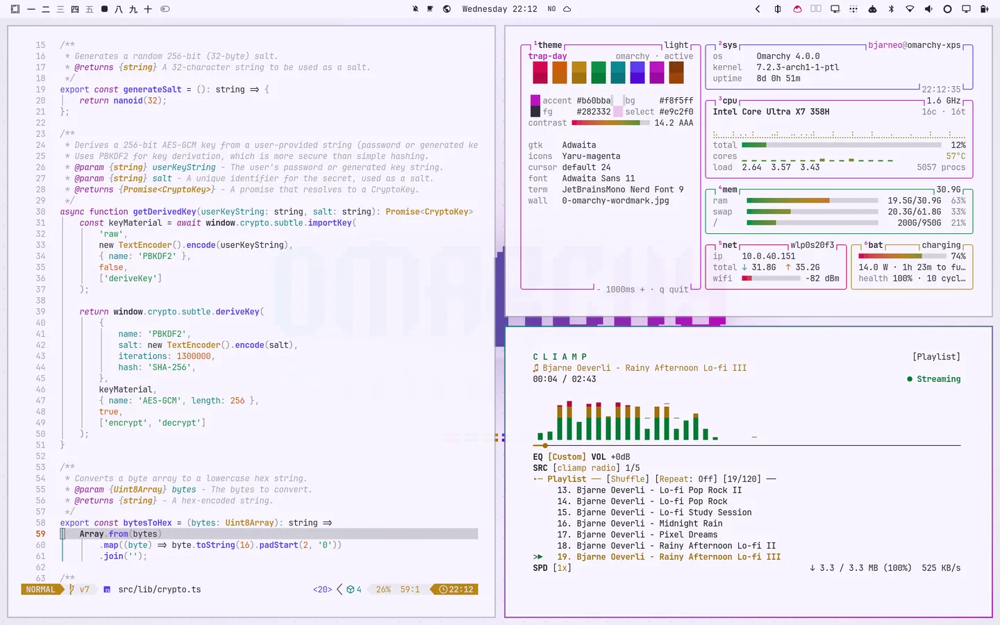](trap-day/preview.png)

`033` · Folder: [`trap-day/`](trap-day/) · [Open in the gallery](https://bjarneo.github.io/100-themes-day/#trap-day) · Night version: [Trap](https://bjarneo.github.io/100-themes/#trap)

Trap Day has a light violet background and a magenta accent. The ANSI colors are saturated. The native background shows an LED spectrum analyzer on a light panel.

| Key | Value |
| --- | --- |
| `background` | `#f8f5ff` |
| `foreground` | `#282332` |
| `accent` | `#b60bba` |
| `selection` | `#e9c2f0` |
| Icon theme | `Yaru-magenta` |
| Backgrounds | [`0-omarchy-wordmark.jpg`](trap-day/backgrounds/0-omarchy-wordmark.jpg), [`1-equalizer.jpg`](trap-day/backgrounds/1-equalizer.jpg) |

<details>
<summary>All 16 ANSI colors</summary>

| # | Normal | # | Bright |
| --- | --- | --- | --- |
| 0 black | `#e4e1ed` | 8 bright black | `#a7a1b2` |
| 1 red | `#d2004d` | 9 bright red | `#af003f` |
| 2 green | `#048c3d` | 10 bright green | `#007531` |
| 3 yellow | `#b7810f` | 11 bright yellow | `#9d6d05` |
| 4 blue | `#5935ea` | 12 bright blue | `#4a00d5` |
| 5 magenta | `#b60bba` | 13 bright magenta | `#98009c` |
| 6 cyan | `#02848d` | 14 bright cyan | `#046e75` |
| 7 white | `#4a4553` | 15 bright white | `#15111d` |

</details>

```bash
curl -fsSL https://bjarneo.github.io/100-themes-day/install.sh | bash -s -- trap-day --set
```

### Hyperpop Day

[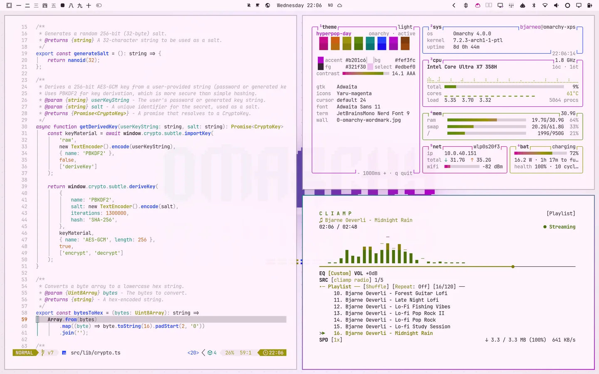](hyperpop-day/preview.png)

`034` · Folder: [`hyperpop-day/`](hyperpop-day/) · [Open in the gallery](https://bjarneo.github.io/100-themes-day/#hyperpop-day) · Night version: [Hyperpop](https://bjarneo.github.io/100-themes/#hyperpop)

Hyperpop Day has a light pink background and a magenta accent. The ANSI colors use very high chroma. The native background shows unlit neon tubes on a plaster wall.

| Key | Value |
| --- | --- |
| `background` | `#fef3fc` |
| `foreground` | `#321f30` |
| `accent` | `#b201c6` |
| `selection` | `#edbef0` |
| Icon theme | `Yaru-magenta` |
| Backgrounds | [`0-omarchy-wordmark.jpg`](hyperpop-day/backgrounds/0-omarchy-wordmark.jpg), [`1-tubes.jpg`](hyperpop-day/backgrounds/1-tubes.jpg) |

<details>
<summary>All 16 ANSI colors</summary>

| # | Normal | # | Bright |
| --- | --- | --- | --- |
| 0 black | `#efdcec` | 8 bright black | `#b09eae` |
| 1 red | `#c80187` | 9 bright red | `#a60270` |
| 2 green | `#568503` | 10 bright green | `#476e05` |
| 3 yellow | `#999003` | 11 bright yellow | `#837a03` |
| 4 blue | `#1c3cff` | 12 bright blue | `#1505eb` |
| 5 magenta | `#b201c6` | 13 bright magenta | `#9404a5` |
| 6 cyan | `#0a8681` | 14 bright cyan | `#006f6b` |
| 7 white | `#534151` | 15 bright white | `#1b0f1a` |

</details>

```bash
curl -fsSL https://bjarneo.github.io/100-themes-day/install.sh | bash -s -- hyperpop-day --set
```

### Glitchcore Day

[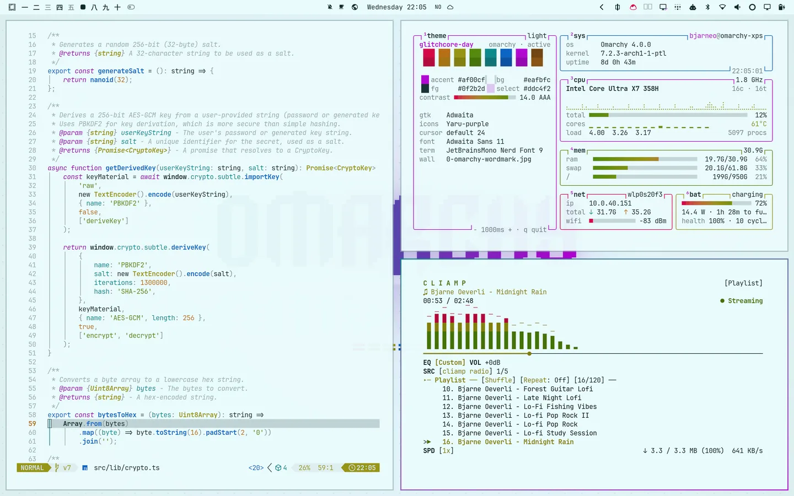](glitchcore-day/preview.png)

`035` · Folder: [`glitchcore-day/`](glitchcore-day/) · [Open in the gallery](https://bjarneo.github.io/100-themes-day/#glitchcore-day) · Night version: [Glitchcore](https://bjarneo.github.io/100-themes/#glitchcore)

Glitchcore Day has a light cyan background and a magenta accent. The ANSI colors use very high chroma. The native background shows a faded VHS still with tracking noise.

| Key | Value |
| --- | --- |
| `background` | `#eafbfc` |
| `foreground` | `#0f2b2d` |
| `accent` | `#af00cf` |
| `selection` | `#ddc4f2` |
| Icon theme | `Yaru-purple` |
| Backgrounds | [`0-omarchy-wordmark.jpg`](glitchcore-day/backgrounds/0-omarchy-wordmark.jpg), [`1-scanlines.jpg`](glitchcore-day/backgrounds/1-scanlines.jpg) |

<details>
<summary>All 16 ANSI colors</summary>

| # | Normal | # | Bright |
| --- | --- | --- | --- |
| 0 black | `#d2e8e9` | 8 bright black | `#90abac` |
| 1 red | `#d30040` | 9 bright red | `#af0234` |
| 2 green | `#4f8604` | 10 bright green | `#416f02` |
| 3 yellow | `#94910e` | 11 bright yellow | `#7f7c07` |
| 4 blue | `#0360c1` | 12 bright blue | `#024d9d` |
| 5 magenta | `#af00cf` | 13 bright magenta | `#9100ac` |
| 6 cyan | `#028588` | 14 bright cyan | `#0a6e70` |
| 7 white | `#344d4e` | 15 bright white | `#021819` |

</details>

```bash
curl -fsSL https://bjarneo.github.io/100-themes-day/install.sh | bash -s -- glitchcore-day --set
```

### Chiptune Day

[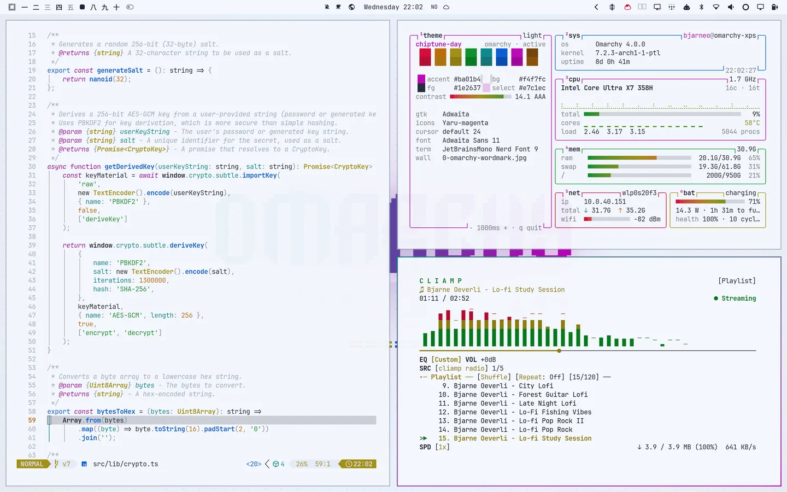](chiptune-day/preview.png)

`036` · Folder: [`chiptune-day/`](chiptune-day/) · [Open in the gallery](https://bjarneo.github.io/100-themes-day/#chiptune-day) · Night version: [Chiptune](https://bjarneo.github.io/100-themes/#chiptune)

Chiptune Day has a light blue background and a magenta accent. The ANSI colors use very high chroma. The native background shows a pixel art landscape at noon.

| Key | Value |
| --- | --- |
| `background` | `#f4f7fc` |
| `foreground` | `#1e2637` |
| `accent` | `#ba01b4` |
| `selection` | `#e7c1ec` |
| Icon theme | `Yaru-magenta` |
| Backgrounds | [`0-omarchy-wordmark.jpg`](chiptune-day/backgrounds/0-omarchy-wordmark.jpg), [`1-pixels.jpg`](chiptune-day/backgrounds/1-pixels.jpg) |

<details>
<summary>All 16 ANSI colors</summary>

| # | Normal | # | Bright |
| --- | --- | --- | --- |
| 0 black | `#dbe3f3` | 8 bright black | `#9ba5b8` |
| 1 red | `#d40333` | 9 bright red | `#b0072a` |
| 2 green | `#088d24` | 10 bright green | `#01751b` |
| 3 yellow | `#a08c0c` | 11 bright yellow | `#89780c` |
| 4 blue | `#0259d2` | 12 bright blue | `#0047ad` |
| 5 magenta | `#ba01b4` | 13 bright magenta | `#9b0096` |
| 6 cyan | `#018589` | 14 bright cyan | `#0e6e71` |
| 7 white | `#404858` | 15 bright white | `#0d1321` |

</details>

```bash
curl -fsSL https://bjarneo.github.io/100-themes-day/install.sh | bash -s -- chiptune-day --set
```

### 8-Bit Day

[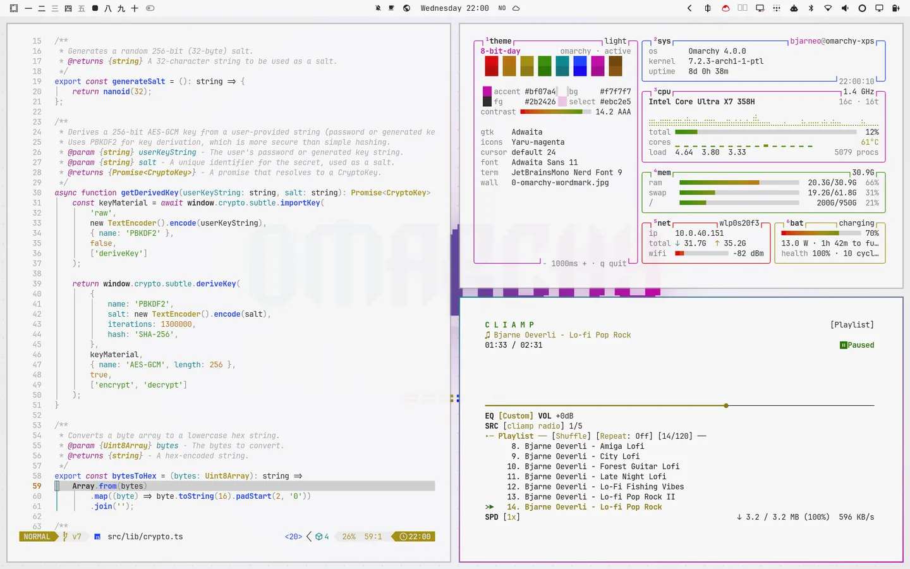](8-bit-day/preview.png)

`037` · Folder: [`8-bit-day/`](8-bit-day/) · [Open in the gallery](https://bjarneo.github.io/100-themes-day/#8-bit-day) · Night version: [8-Bit](https://bjarneo.github.io/100-themes/#8-bit)

8-Bit Day has a neutral white background and a magenta accent. The ANSI colors use very high chroma. The native background shows a pixel art landscape at noon.

| Key | Value |
| --- | --- |
| `background` | `#f7f7f7` |
| `foreground` | `#2b2426` |
| `accent` | `#bf07a4` |
| `selection` | `#ebc2e5` |
| Icon theme | `Yaru-magenta` |
| Backgrounds | [`0-omarchy-wordmark.jpg`](8-bit-day/backgrounds/0-omarchy-wordmark.jpg), [`1-pixels.jpg`](8-bit-day/backgrounds/1-pixels.jpg) |

<details>
<summary>All 16 ANSI colors</summary>

| # | Normal | # | Bright |
| --- | --- | --- | --- |
| 0 black | `#e3e3e3` | 8 bright black | `#aaa2a4` |
| 1 red | `#d60203` | 9 bright red | `#b20404` |
| 2 green | `#338b01` | 10 bright green | `#287300` |
| 3 yellow | `#a18c0b` | 11 bright yellow | `#89770b` |
| 4 blue | `#193dff` | 12 bright blue | `#1200ed` |
| 5 magenta | `#bf07a4` | 13 bright magenta | `#9f0488` |
| 6 cyan | `#04848f` | 14 bright cyan | `#0f6d76` |
| 7 white | `#4d4647` | 15 bright white | `#181214` |

</details>

```bash
curl -fsSL https://bjarneo.github.io/100-themes-day/install.sh | bash -s -- 8-bit-day --set
```

### Industrial Day

[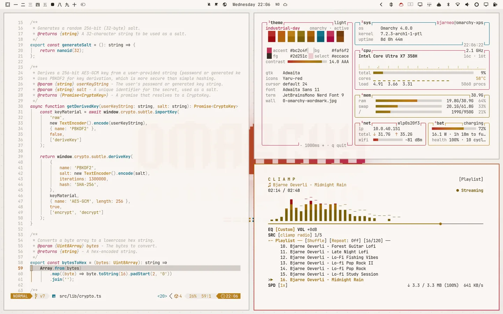](industrial-day/preview.png)

`038` · Folder: [`industrial-day/`](industrial-day/) · [Open in the gallery](https://bjarneo.github.io/100-themes-day/#industrial-day) · Night version: [Industrial](https://bjarneo.github.io/100-themes/#industrial)

Industrial Day has a light peach background and a pink accent. The ANSI colors use medium chroma for a calmer look. The native background shows a city skyline in daylight.

| Key | Value |
| --- | --- |
| `background` | `#faf6f2` |
| `foreground` | `#2d251c` |
| `accent` | `#bc2c4f` |
| `selection` | `#eccace` |
| Icon theme | `Yaru-red` |
| Backgrounds | [`0-omarchy-wordmark.jpg`](industrial-day/backgrounds/0-omarchy-wordmark.jpg), [`1-skyline.jpg`](industrial-day/backgrounds/1-skyline.jpg) |

<details>
<summary>All 16 ANSI colors</summary>

| # | Normal | # | Bright |
| --- | --- | --- | --- |
| 0 black | `#e7e2dd` | 8 bright black | `#aca399` |
| 1 red | `#b3241f` | 9 bright red | `#990309` |
| 2 green | `#8c6d08` | 10 bright green | `#755900` |
| 3 yellow | `#b77b0f` | 11 bright yellow | `#9d6800` |
| 4 blue | `#0a6e88` | 12 bright blue | `#01596f` |
| 5 magenta | `#bc2c4f` | 13 bright magenta | `#a5003b` |
| 6 cyan | `#a95f00` | 14 bright cyan | `#8d4e00` |
| 7 white | `#4e463e` | 15 bright white | `#19120b` |

</details>

```bash
curl -fsSL https://bjarneo.github.io/100-themes-day/install.sh | bash -s -- industrial-day --set
```

### Punk Day

[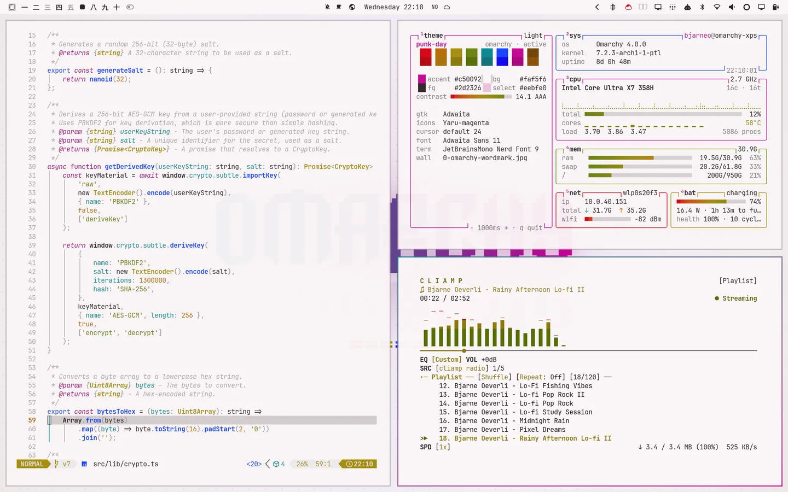](punk-day/preview.png)

`039` · Folder: [`punk-day/`](punk-day/) · [Open in the gallery](https://bjarneo.github.io/100-themes-day/#punk-day) · Night version: [Punk](https://bjarneo.github.io/100-themes/#punk)

Punk Day has a neutral white background and a magenta accent. The ANSI colors use very high chroma. The native background shows an LED spectrum analyzer on a light panel.

| Key | Value |
| --- | --- |
| `background` | `#faf5f6` |
| `foreground` | `#2d2326` |
| `accent` | `#c50092` |
| `selection` | `#eebfe0` |
| Icon theme | `Yaru-magenta` |
| Backgrounds | [`0-omarchy-wordmark.jpg`](punk-day/backgrounds/0-omarchy-wordmark.jpg), [`1-equalizer.jpg`](punk-day/backgrounds/1-equalizer.jpg) |

<details>
<summary>All 16 ANSI colors</summary>

| # | Normal | # | Bright |
| --- | --- | --- | --- |
| 0 black | `#e6e1e3` | 8 bright black | `#ada1a4` |
| 1 red | `#d60012` | 9 bright red | `#b2020e` |
| 2 green | `#668008` | 10 bright green | `#546b01` |
| 3 yellow | `#a38b08` | 11 bright yellow | `#8b7609` |
| 4 blue | `#133eff` | 12 bright blue | `#0c00ed` |
| 5 magenta | `#c50092` | 13 bright magenta | `#a40079` |
| 6 cyan | `#02848d` | 14 bright cyan | `#0e6d74` |
| 7 white | `#4f4447` | 15 bright white | `#1a1113` |

</details>

```bash
curl -fsSL https://bjarneo.github.io/100-themes-day/install.sh | bash -s -- punk-day --set
```

### Metal Day

[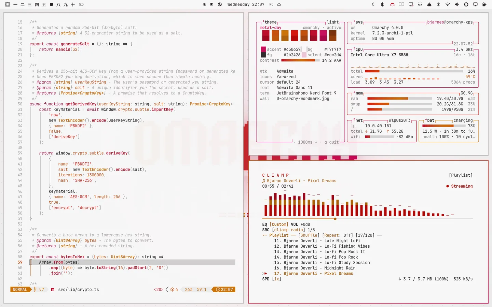](metal-day/preview.png)

`040` · Folder: [`metal-day/`](metal-day/) · [Open in the gallery](https://bjarneo.github.io/100-themes-day/#metal-day) · Night version: [Metal](https://bjarneo.github.io/100-themes/#metal)

Metal Day has a neutral white background and a pink accent. The 6 ANSI hues stay close to red, so the palette reads as one color. The native background shows an LED spectrum analyzer on a light panel.

| Key | Value |
| --- | --- |
| `background` | `#f7f7f7` |
| `foreground` | `#2b2426` |
| `accent` | `#c50657` |
| `selection` | `#ecc2d4` |
| Icon theme | `Yaru-red` |
| Backgrounds | [`0-omarchy-wordmark.jpg`](metal-day/backgrounds/0-omarchy-wordmark.jpg), [`1-equalizer.jpg`](metal-day/backgrounds/1-equalizer.jpg) |

<details>
<summary>All 16 ANSI colors</summary>

| # | Normal | # | Bright |
| --- | --- | --- | --- |
| 0 black | `#e3e3e3` | 8 bright black | `#aaa2a4` |
| 1 red | `#bb061f` | 9 bright red | `#990015` |
| 2 green | `#d41004` | 10 bright green | `#b20300` |
| 3 yellow | `#c96e00` | 11 bright yellow | `#ab5e05` |
| 4 blue | `#ba0426` | 12 bright blue | `#98041e` |
| 5 magenta | `#c50657` | 13 bright magenta | `#a40046` |
| 6 cyan | `#bf4a00` | 14 bright cyan | `#9e3e06` |
| 7 white | `#4d4647` | 15 bright white | `#181214` |

</details>

```bash
curl -fsSL https://bjarneo.github.io/100-themes-day/install.sh | bash -s -- metal-day --set
```

### Goth Day

[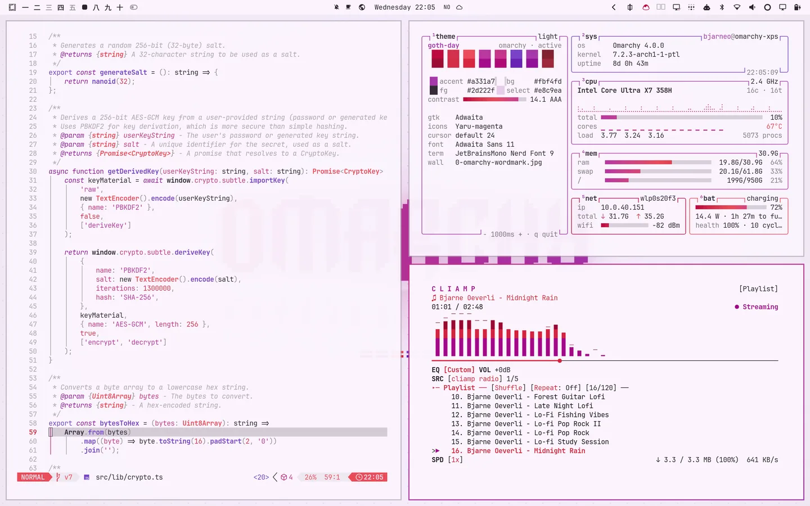](goth-day/preview.png)

`041` · Folder: [`goth-day/`](goth-day/) · [Open in the gallery](https://bjarneo.github.io/100-themes-day/#goth-day) · Night version: [Goth](https://bjarneo.github.io/100-themes/#goth)

Goth Day has a light pink background and a magenta accent. The ANSI colors are saturated. The native background shows layered sound wave ribbons in ink.

| Key | Value |
| --- | --- |
| `background` | `#fbf4fd` |
| `foreground` | `#2d222f` |
| `accent` | `#a331a7` |
| `selection` | `#e8c9ea` |
| Icon theme | `Yaru-magenta` |
| Backgrounds | [`0-omarchy-wordmark.jpg`](goth-day/backgrounds/0-omarchy-wordmark.jpg), [`1-waveform.jpg`](goth-day/backgrounds/1-waveform.jpg) |

<details>
<summary>All 16 ANSI colors</summary>

| # | Normal | # | Bright |
| --- | --- | --- | --- |
| 0 black | `#e8dfea` | 8 bright black | `#aca0af` |
| 1 red | `#ba0037` | 9 bright red | `#97042c` |
| 2 green | `#b5319a` | 10 bright green | `#a00286` |
| 3 yellow | `#e94553` | 11 bright yellow | `#d41f3b` |
| 4 blue | `#743bc3` | 12 bright blue | `#621bb0` |
| 5 magenta | `#a331a7` | 13 bright magenta | `#8e0694` |
| 6 cyan | `#c32e85` | 14 bright cyan | `#ac0070` |
| 7 white | `#4e4350` | 15 bright white | `#19101b` |

</details>

```bash
curl -fsSL https://bjarneo.github.io/100-themes-day/install.sh | bash -s -- goth-day --set
```

### Grunge Day

[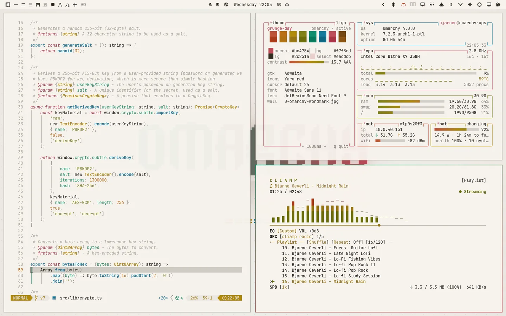](grunge-day/preview.png)

`042` · Folder: [`grunge-day/`](grunge-day/) · [Open in the gallery](https://bjarneo.github.io/100-themes-day/#grunge-day) · Night version: [Grunge](https://bjarneo.github.io/100-themes/#grunge)

Grunge Day has a light peach background and a red accent. The ANSI colors use medium chroma for a calmer look. The native background shows layered sound wave ribbons in ink.

| Key | Value |
| --- | --- |
| `background` | `#f7f3ed` |
| `foreground` | `#2c251a` |
| `accent` | `#bc4754` |
| `selection` | `#eacdcb` |
| Icon theme | `Yaru-red` |
| Backgrounds | [`0-omarchy-wordmark.jpg`](grunge-day/backgrounds/0-omarchy-wordmark.jpg), [`1-waveform.jpg`](grunge-day/backgrounds/1-waveform.jpg) |

<details>
<summary>All 16 ANSI colors</summary>

| # | Normal | # | Bright |
| --- | --- | --- | --- |
| 0 black | `#e4dfd7` | 8 bright black | `#aba397` |
| 1 red | `#bb4c30` | 9 bright red | `#a73311` |
| 2 green | `#7d7d0e` | 10 bright green | `#686803` |
| 3 yellow | `#ae8604` | 11 bright yellow | `#94720f` |
| 4 blue | `#0e7699` | 12 bright blue | `#07617e` |
| 5 magenta | `#bc4754` | 13 bright magenta | `#a72d3f` |
| 6 cyan | `#088c69` | 14 bright cyan | `#007557` |
| 7 white | `#4d473c` | 15 bright white | `#191309` |

</details>

```bash
curl -fsSL https://bjarneo.github.io/100-themes-day/install.sh | bash -s -- grunge-day --set
```

### Shoegaze Day

[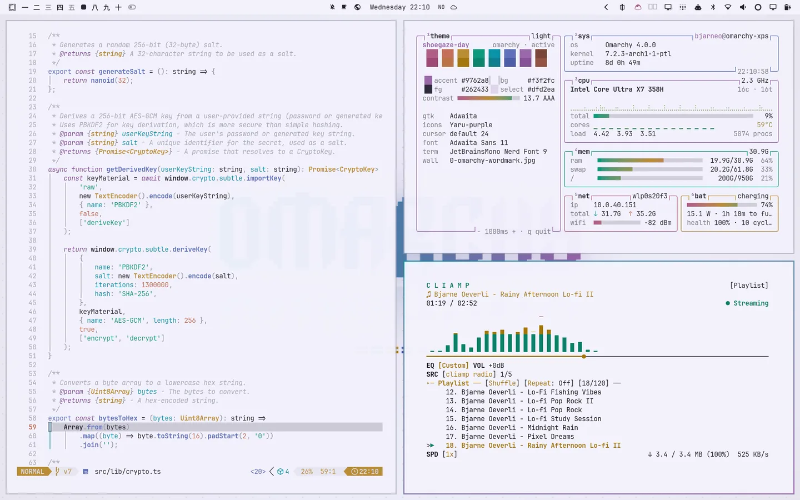](shoegaze-day/preview.png)

`043` · Folder: [`shoegaze-day/`](shoegaze-day/) · [Open in the gallery](https://bjarneo.github.io/100-themes-day/#shoegaze-day) · Night version: [Shoegaze](https://bjarneo.github.io/100-themes/#shoegaze)

Shoegaze Day has a light indigo background and a violet accent. The ANSI colors are soft with low chroma. The native background shows light curtains over a calm mountain lake.

| Key | Value |
| --- | --- |
| `background` | `#f3f2fc` |
| `foreground` | `#262433` |
| `accent` | `#9762a8` |
| `selection` | `#dfd2ea` |
| Icon theme | `Yaru-purple` |
| Backgrounds | [`0-omarchy-wordmark.jpg`](shoegaze-day/backgrounds/0-omarchy-wordmark.jpg), [`1-aurora.jpg`](shoegaze-day/backgrounds/1-aurora.jpg) |

<details>
<summary>All 16 ANSI colors</summary>

| # | Normal | # | Bright |
| --- | --- | --- | --- |
| 0 black | `#dfdeeb` | 8 bright black | `#a4a2b4` |
| 1 red | `#ae5a83` | 9 bright red | `#9a436f` |
| 2 green | `#039679` | 10 bright green | `#057e66` |
| 3 yellow | `#b8892c` | 11 bright yellow | `#a27404` |
| 4 blue | `#5b6bb7` | 12 bright blue | `#4756a4` |
| 5 magenta | `#9762a8` | 13 bright magenta | `#834c94` |
| 6 cyan | `#0090a5` | 14 bright cyan | `#08798b` |
| 7 white | `#474655` | 15 bright white | `#14121e` |

</details>

```bash
curl -fsSL https://bjarneo.github.io/100-themes-day/install.sh | bash -s -- shoegaze-day --set
```

### Jazz Club Day

[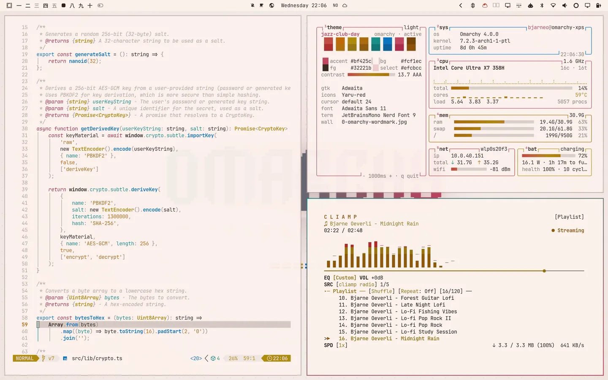](jazz-club-day/preview.png)

`044` · Folder: [`jazz-club-day/`](jazz-club-day/) · [Open in the gallery](https://bjarneo.github.io/100-themes-day/#jazz-club-day) · Night version: [Jazz Club](https://bjarneo.github.io/100-themes/#jazz-club)

Jazz Club Day has a light peach background and a pink accent. The ANSI colors use medium chroma for a calmer look. The native background shows layered sound wave ribbons in ink.

| Key | Value |
| --- | --- |
| `background` | `#fcf1ec` |
| `foreground` | `#32221b` |
| `accent` | `#bf425c` |
| `selection` | `#efcbcc` |
| Icon theme | `Yaru-red` |
| Backgrounds | [`0-omarchy-wordmark.jpg`](jazz-club-day/backgrounds/0-omarchy-wordmark.jpg), [`1-waveform.jpg`](jazz-club-day/backgrounds/1-waveform.jpg) |

<details>
<summary>All 16 ANSI colors</summary>

| # | Normal | # | Bright |
| --- | --- | --- | --- |
| 0 black | `#eadcd6` | 8 bright black | `#b3a098` |
| 1 red | `#c0453c` | 9 bright red | `#ab2924` |
| 2 green | `#a86605` | 10 bright green | `#8c5508` |
| 3 yellow | `#ad8604` | 11 bright yellow | `#93720d` |
| 4 blue | `#016fbb` | 12 bright blue | `#065b99` |
| 5 magenta | `#bf425c` | 13 bright magenta | `#aa2547` |
| 6 cyan | `#118985` | 14 bright cyan | `#0d726f` |
| 7 white | `#54443d` | 15 bright white | `#1d100a` |

</details>

```bash
curl -fsSL https://bjarneo.github.io/100-themes-day/install.sh | bash -s -- jazz-club-day --set
```

### Blues Day

[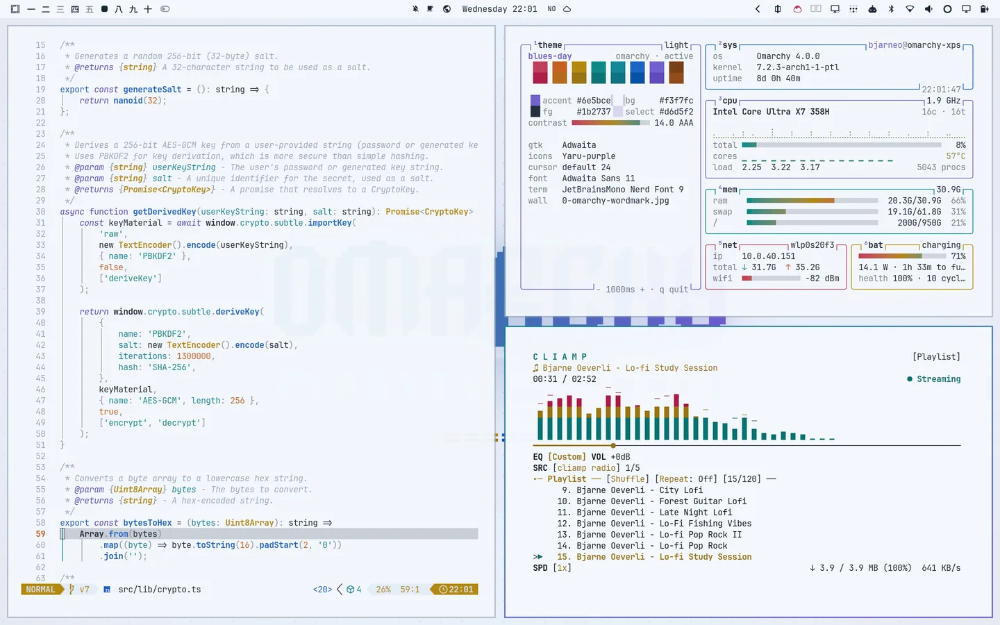](blues-day/preview.png)

`045` · Folder: [`blues-day/`](blues-day/) · [Open in the gallery](https://bjarneo.github.io/100-themes-day/#blues-day) · Night version: [Blues](https://bjarneo.github.io/100-themes/#blues)

Blues Day has a light blue background and a indigo accent. The ANSI colors use medium chroma for a calmer look. The native background shows layered sound wave ribbons in ink.

| Key | Value |
| --- | --- |
| `background` | `#f3f7fc` |
| `foreground` | `#1b2737` |
| `accent` | `#6e5bce` |
| `selection` | `#d6d5f2` |
| Icon theme | `Yaru-purple` |
| Backgrounds | [`0-omarchy-wordmark.jpg`](blues-day/backgrounds/0-omarchy-wordmark.jpg), [`1-waveform.jpg`](blues-day/backgrounds/1-waveform.jpg) |

<details>
<summary>All 16 ANSI colors</summary>

| # | Normal | # | Bright |
| --- | --- | --- | --- |
| 0 black | `#d9e4f3` | 8 bright black | `#98a6b8` |
| 1 red | `#bf3955` | 9 bright red | `#aa1740` |
| 2 green | `#058684` | 10 bright green | `#026f6d` |
| 3 yellow | `#b18406` | 11 bright yellow | `#96710c` |
| 4 blue | `#145fc1` | 12 bright blue | `#004aa4` |
| 5 magenta | `#6e5bce` | 13 bright magenta | `#5b44bb` |
| 6 cyan | `#0d8395` | 14 bright cyan | `#086d7c` |
| 7 white | `#3d4958` | 15 bright white | `#0a1421` |

</details>

```bash
curl -fsSL https://bjarneo.github.io/100-themes-day/install.sh | bash -s -- blues-day --set
```

### Disco Day

[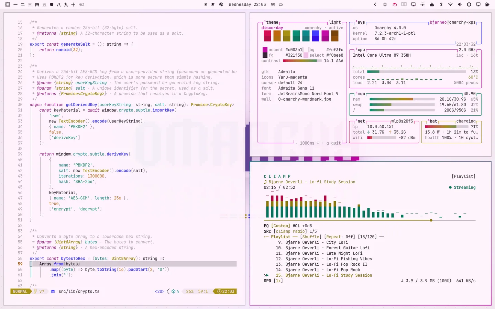](disco-day/preview.png)

`046` · Folder: [`disco-day/`](disco-day/) · [Open in the gallery](https://bjarneo.github.io/100-themes-day/#disco-day) · Night version: [Disco](https://bjarneo.github.io/100-themes/#disco)

Disco Day has a light pink background and a magenta accent. The ANSI colors use very high chroma. The native background shows unlit neon tubes on a plaster wall.

| Key | Value |
| --- | --- |
| `background` | `#fef3fc` |
| `foreground` | `#321f30` |
| `accent` | `#c003a1` |
| `selection` | `#f0bee8` |
| Icon theme | `Yaru-magenta` |
| Backgrounds | [`0-omarchy-wordmark.jpg`](disco-day/backgrounds/0-omarchy-wordmark.jpg), [`1-tubes.jpg`](disco-day/backgrounds/1-tubes.jpg) |

<details>
<summary>All 16 ANSI colors</summary>

| # | Normal | # | Bright |
| --- | --- | --- | --- |
| 0 black | `#efdcec` | 8 bright black | `#b09eae` |
| 1 red | `#d2004a` | 9 bright red | `#ae043d` |
| 2 green | `#00896c` | 10 bright green | `#037159` |
| 3 yellow | `#a28c0a` | 11 bright yellow | `#8a770a` |
| 4 blue | `#3c33fe` | 12 bright blue | `#3005e2` |
| 5 magenta | `#c003a1` | 13 bright magenta | `#a00185` |
| 6 cyan | `#028587` | 14 bright cyan | `#0e6e70` |
| 7 white | `#534151` | 15 bright white | `#1b0f1a` |

</details>

```bash
curl -fsSL https://bjarneo.github.io/100-themes-day/install.sh | bash -s -- disco-day --set
```

### Funk Day

[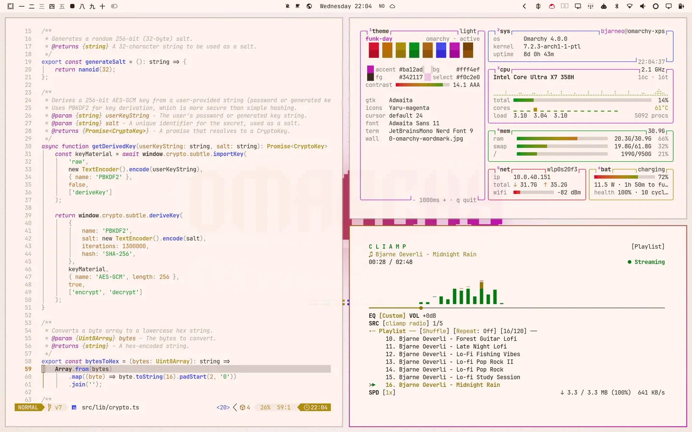](funk-day/preview.png)

`047` · Folder: [`funk-day/`](funk-day/) · [Open in the gallery](https://bjarneo.github.io/100-themes-day/#funk-day) · Night version: [Funk](https://bjarneo.github.io/100-themes/#funk)

Funk Day has a light peach background and a magenta accent. The ANSI colors are saturated. The native background shows layered sound wave ribbons in ink.

| Key | Value |
| --- | --- |
| `background` | `#fff4ef` |
| `foreground` | `#342117` |
| `accent` | `#ba12ad` |
| `selection` | `#f0c2e0` |
| Icon theme | `Yaru-magenta` |
| Backgrounds | [`0-omarchy-wordmark.jpg`](funk-day/backgrounds/0-omarchy-wordmark.jpg), [`1-waveform.jpg`](funk-day/backgrounds/1-waveform.jpg) |

<details>
<summary>All 16 ANSI colors</summary>

| # | Normal | # | Bright |
| --- | --- | --- | --- |
| 0 black | `#f1dfd5` | 8 bright black | `#b5a094` |
| 1 red | `#d40728` | 9 bright red | `#b1051f` |
| 2 green | `#008e14` | 10 bright green | `#00760f` |
| 3 yellow | `#ab8704` | 11 bright yellow | `#927300` |
| 4 blue | `#3d44e8` | 12 bright blue | `#3020d6` |
| 5 magenta | `#ba12ad` | 13 bright magenta | `#9c0091` |
| 6 cyan | `#a7610c` | 14 bright cyan | `#8c4f02` |
| 7 white | `#554339` | 15 bright white | `#1f1007` |

</details>

```bash
curl -fsSL https://bjarneo.github.io/100-themes-day/install.sh | bash -s -- funk-day --set
```

### Soul Day

[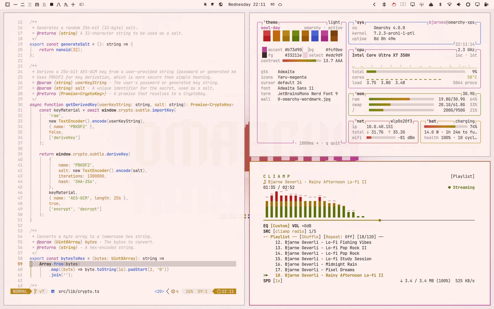](soul-day/preview.png)

`048` · Folder: [`soul-day/`](soul-day/) · [Open in the gallery](https://bjarneo.github.io/100-themes-day/#soul-day) · Night version: [Soul](https://bjarneo.github.io/100-themes/#soul)

Soul Day has a light rose background and a magenta accent. The ANSI colors use medium chroma for a calmer look. The native background shows layered sound wave ribbons in ink.

| Key | Value |
| --- | --- |
| `background` | `#fcf0ee` |
| `foreground` | `#33211e` |
| `accent` | `#b73d90` |
| `selection` | `#edc9d9` |
| Icon theme | `Yaru-magenta` |
| Backgrounds | [`0-omarchy-wordmark.jpg`](soul-day/backgrounds/0-omarchy-wordmark.jpg), [`1-waveform.jpg`](soul-day/backgrounds/1-waveform.jpg) |

<details>
<summary>All 16 ANSI colors</summary>

| # | Normal | # | Bright |
| --- | --- | --- | --- |
| 0 black | `#ebdcd9` | 8 bright black | `#b49f9b` |
| 1 red | `#c83a33` | 9 bright red | `#b31517` |
| 2 green | `#6c8307` | 10 bright green | `#596d03` |
| 3 yellow | `#b6810e` | 11 bright yellow | `#9d6d00` |
| 4 blue | `#465ed2` | 12 bright blue | `#3346bf` |
| 5 magenta | `#b73d90` | 13 bright magenta | `#a21e7c` |
| 6 cyan | `#ac6302` | 14 bright cyan | `#905201` |
| 7 white | `#544340` | 15 bright white | `#1e0f0d` |

</details>

```bash
curl -fsSL https://bjarneo.github.io/100-themes-day/install.sh | bash -s -- soul-day --set
```

### Reggae Day

[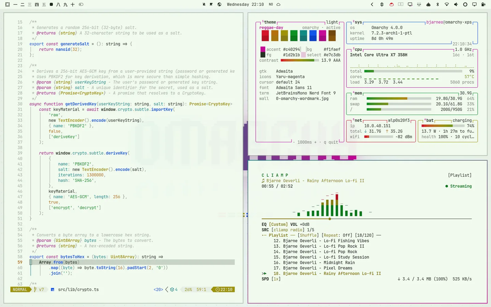](reggae-day/preview.png)

`049` · Folder: [`reggae-day/`](reggae-day/) · [Open in the gallery](https://bjarneo.github.io/100-themes-day/#reggae-day) · Night version: [Reggae](https://bjarneo.github.io/100-themes/#reggae)

Reggae Day has a light green background and a magenta accent. The ANSI colors are saturated. The native background shows layered sound wave ribbons in ink.

| Key | Value |
| --- | --- |
| `background` | `#f1faef` |
| `foreground` | `#1d2b1b` |
| `accent` | `#c40294` |
| `selection` | `#e7c3db` |
| Icon theme | `Yaru-magenta` |
| Backgrounds | [`0-omarchy-wordmark.jpg`](reggae-day/backgrounds/0-omarchy-wordmark.jpg), [`1-waveform.jpg`](reggae-day/backgrounds/1-waveform.jpg) |

<details>
<summary>All 16 ANSI colors</summary>

| # | Normal | # | Bright |
| --- | --- | --- | --- |
| 0 black | `#dbe7d8` | 8 bright black | `#9baa98` |
| 1 red | `#d40a1f` | 9 bright red | `#b10718` |
| 2 green | `#058d1d` | 10 bright green | `#047517` |
| 3 yellow | `#9a8f00` | 11 bright yellow | `#837a0c` |
| 4 blue | `#094ee8` | 12 bright blue | `#003ac6` |
| 5 magenta | `#c40294` | 13 bright magenta | `#a4007b` |
| 6 cyan | `#0a8680` | 14 bright cyan | `#0c6f6a` |
| 7 white | `#3f4c3d` | 15 bright white | `#0c170a` |

</details>

```bash
curl -fsSL https://bjarneo.github.io/100-themes-day/install.sh | bash -s -- reggae-day --set
```

### Ambient Day

[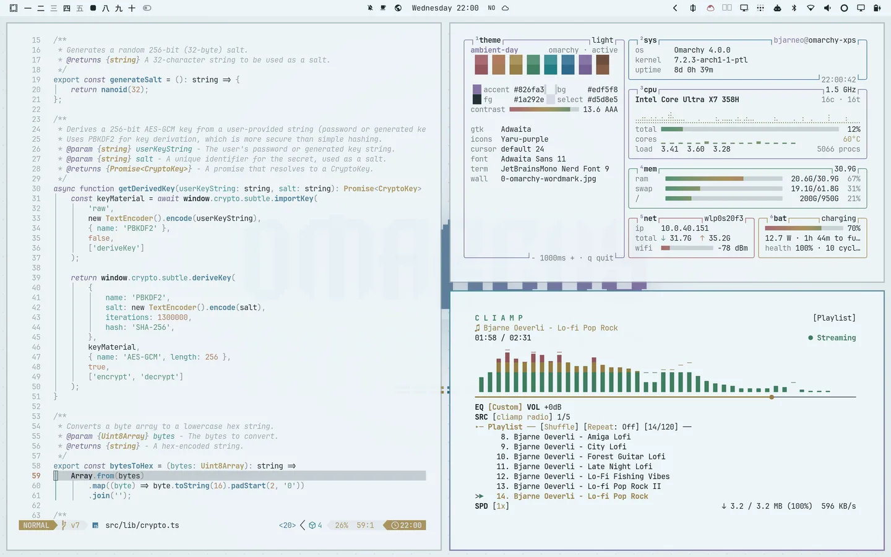](ambient-day/preview.png)

`050` · Folder: [`ambient-day/`](ambient-day/) · [Open in the gallery](https://bjarneo.github.io/100-themes-day/#ambient-day) · Night version: [Ambient](https://bjarneo.github.io/100-themes/#ambient)

Ambient Day has a light blue background and a violet accent. The ANSI colors are soft with low chroma. The native background shows light curtains over a calm mountain lake.

| Key | Value |
| --- | --- |
| `background` | `#edf5f8` |
| `foreground` | `#1a292e` |
| `accent` | `#826fa3` |
| `selection` | `#d5d8e5` |
| Icon theme | `Yaru-purple` |
| Backgrounds | [`0-omarchy-wordmark.jpg`](ambient-day/backgrounds/0-omarchy-wordmark.jpg), [`1-aurora.jpg`](ambient-day/backgrounds/1-aurora.jpg) |

<details>
<summary>All 16 ANSI colors</summary>

| # | Normal | # | Bright |
| --- | --- | --- | --- |
| 0 black | `#d8e2e5` | 8 bright black | `#98a8ad` |
| 1 red | `#a4666c` | 9 bright red | `#905157` |
| 2 green | `#528f70` | 10 bright green | `#3a7b5b` |
| 3 yellow | `#a79057` | 11 bright yellow | `#927a3f` |
| 4 blue | `#3f799a` | 12 bright blue | `#256487` |
| 5 magenta | `#826fa3` | 13 bright magenta | `#6e5a8f` |
| 6 cyan | `#3b8e94` | 14 bright cyan | `#197a80` |
| 7 white | `#3c4a4f` | 15 bright white | `#09161a` |

</details>

```bash
curl -fsSL https://bjarneo.github.io/100-themes-day/install.sh | bash -s -- ambient-day --set
```

### Midnight Day

[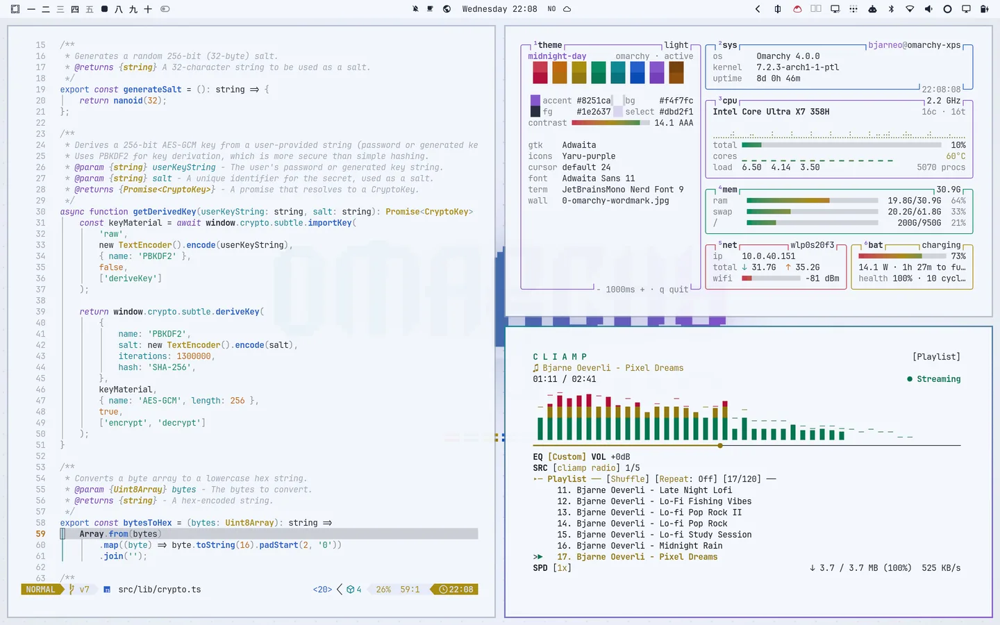](midnight-day/preview.png)

`051` · Folder: [`midnight-day/`](midnight-day/) · [Open in the gallery](https://bjarneo.github.io/100-themes-day/#midnight-day) · Night version: [Midnight](https://bjarneo.github.io/100-themes/#midnight)

Midnight Day has a light blue background and a violet accent. The ANSI colors use medium chroma for a calmer look. The native background shows watercolor clouds on a light sky.

| Key | Value |
| --- | --- |
| `background` | `#f4f7fc` |
| `foreground` | `#1e2637` |
| `accent` | `#8251ca` |
| `selection` | `#dbd2f1` |
| Icon theme | `Yaru-purple` |
| Backgrounds | [`0-omarchy-wordmark.jpg`](midnight-day/backgrounds/0-omarchy-wordmark.jpg), [`1-nebula.jpg`](midnight-day/backgrounds/1-nebula.jpg) |

<details>
<summary>All 16 ANSI colors</summary>

| # | Normal | # | Bright |
| --- | --- | --- | --- |
| 0 black | `#dbe3f3` | 8 bright black | `#9ba5b8` |
| 1 red | `#c43449` | 9 bright red | `#af0733` |
| 2 green | `#008a5c` | 10 bright green | `#00734c` |
| 3 yellow | `#a78905` | 11 bright yellow | `#8e750a` |
| 4 blue | `#1d5bc7` | 12 bright blue | `#0045b2` |
| 5 magenta | `#8251ca` | 13 bright magenta | `#6f38b6` |
| 6 cyan | `#058490` | 14 bright cyan | `#006e78` |
| 7 white | `#404858` | 15 bright white | `#0d1321` |

</details>

```bash
curl -fsSL https://bjarneo.github.io/100-themes-day/install.sh | bash -s -- midnight-day --set
```

### Dawn Day

[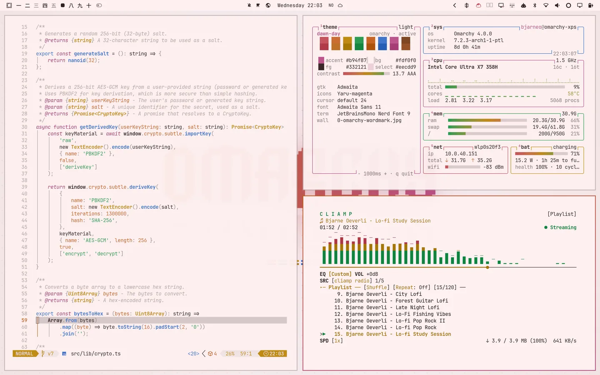](dawn-day/preview.png)

`052` · Folder: [`dawn-day/`](dawn-day/) · [Open in the gallery](https://bjarneo.github.io/100-themes-day/#dawn-day) · Night version: [Dawn](https://bjarneo.github.io/100-themes/#dawn)

Dawn Day has a light rose background and a pink accent. The ANSI colors are soft with low chroma. The native background shows light curtains over a calm mountain lake.

| Key | Value |
| --- | --- |
| `background` | `#fdf0f0` |
| `foreground` | `#332121` |
| `accent` | `#b94f87` |
| `selection` | `#eecdd9` |
| Icon theme | `Yaru-magenta` |
| Backgrounds | [`0-omarchy-wordmark.jpg`](dawn-day/backgrounds/0-omarchy-wordmark.jpg), [`1-aurora.jpg`](dawn-day/backgrounds/1-aurora.jpg) |

<details>
<summary>All 16 ANSI colors</summary>

| # | Normal | # | Bright |
| --- | --- | --- | --- |
| 0 black | `#ebdbdb` | 8 bright black | `#b49f9e` |
| 1 red | `#c34e57` | 9 bright red | `#ae3441` |
| 2 green | `#26984c` | 10 bright green | `#0b813b` |
| 3 yellow | `#be870a` | 11 bright yellow | `#a47300` |
| 4 blue | `#386fc8` | 12 bright blue | `#1e59b4` |
| 5 magenta | `#b94f87` | 13 bright magenta | `#a43673` |
| 6 cyan | `#c55f1b` | 14 bright cyan | `#ab4c01` |
| 7 white | `#554342` | 15 bright white | `#1e0f0f` |

</details>

```bash
curl -fsSL https://bjarneo.github.io/100-themes-day/install.sh | bash -s -- dawn-day --set
```

### Dusk Day

[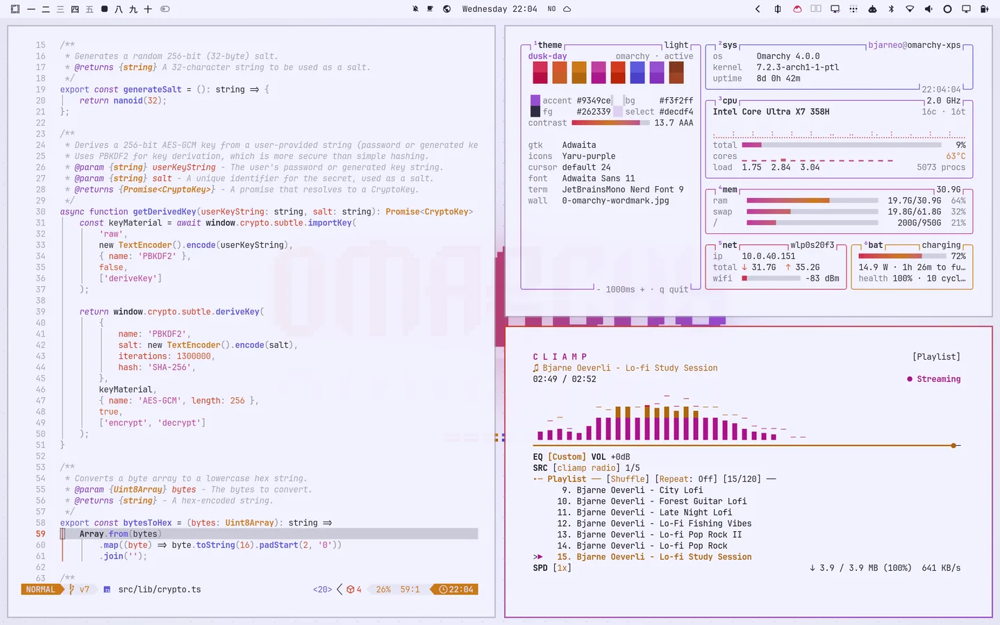](dusk-day/preview.png)

`053` · Folder: [`dusk-day/`](dusk-day/) · [Open in the gallery](https://bjarneo.github.io/100-themes-day/#dusk-day) · Night version: [Dusk](https://bjarneo.github.io/100-themes/#dusk)

Dusk Day has a light indigo background and a violet accent. The ANSI colors are saturated. The native background shows a morning sun over a perspective grid.

| Key | Value |
| --- | --- |
| `background` | `#f3f2ff` |
| `foreground` | `#262339` |
| `accent` | `#9349ce` |
| `selection` | `#decdf4` |
| Icon theme | `Yaru-purple` |
| Backgrounds | [`0-omarchy-wordmark.jpg`](dusk-day/backgrounds/0-omarchy-wordmark.jpg), [`1-sunset-grid.jpg`](dusk-day/backgrounds/1-sunset-grid.jpg) |

<details>
<summary>All 16 ANSI colors</summary>

| # | Normal | # | Bright |
| --- | --- | --- | --- |
| 0 black | `#dfddf2` | 8 bright black | `#a4a2b7` |
| 1 red | `#cf284f` | 9 bright red | `#b4023d` |
| 2 green | `#be379b` | 10 bright green | `#a90e87` |
| 3 yellow | `#c9740d` | 11 bright yellow | `#ad6206` |
| 4 blue | `#5854db` | 12 bright blue | `#463ac8` |
| 5 magenta | `#9349ce` | 13 bright magenta | `#802cbb` |
| 6 cyan | `#d33318` | 14 bright cyan | `#b71d00` |
| 7 white | `#47455a` | 15 bright white | `#141120` |

</details>

```bash
curl -fsSL https://bjarneo.github.io/100-themes-day/install.sh | bash -s -- dusk-day --set
```

### Aurora Day

[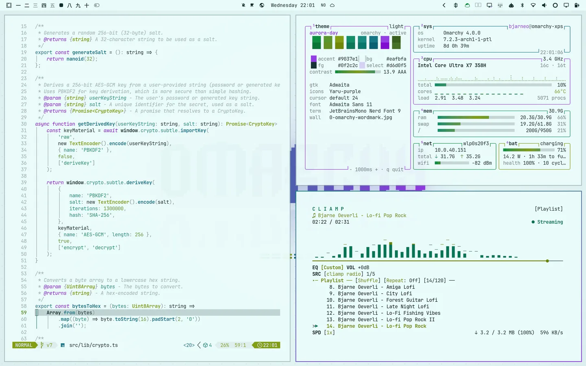](aurora-day/preview.png)

`054` · Folder: [`aurora-day/`](aurora-day/) · [Open in the gallery](https://bjarneo.github.io/100-themes-day/#aurora-day) · Night version: [Aurora](https://bjarneo.github.io/100-themes/#aurora)

Aurora Day has a light cyan background and a violet accent. The ANSI colors are saturated. The native background shows light curtains over a calm mountain lake.

| Key | Value |
| --- | --- |
| `background` | `#eafbfa` |
| `foreground` | `#0f2c2c` |
| `accent` | `#9037e1` |
| `selection` | `#d6d0f5` |
| Icon theme | `Yaru-purple` |
| Backgrounds | [`0-omarchy-wordmark.jpg`](aurora-day/backgrounds/0-omarchy-wordmark.jpg), [`1-aurora.jpg`](aurora-day/backgrounds/1-aurora.jpg) |

<details>
<summary>All 16 ANSI colors</summary>

| # | Normal | # | Bright |
| --- | --- | --- | --- |
| 0 black | `#d2e8e8` | 8 bright black | `#90abaa` |
| 1 red | `#048939` | 9 bright red | `#00712d` |
| 2 green | `#0d8963` | 10 bright green | `#047252` |
| 3 yellow | `#80990b` | 11 bright yellow | `#6d8200` |
| 4 blue | `#0e6f81` | 12 bright blue | `#005a6a` |
| 5 magenta | `#9037e1` | 13 bright magenta | `#7d00ce` |
| 6 cyan | `#12867c` | 14 bright cyan | `#007067` |
| 7 white | `#344d4d` | 15 bright white | `#021818` |

</details>

```bash
curl -fsSL https://bjarneo.github.io/100-themes-day/install.sh | bash -s -- aurora-day --set
```

### Nebula Day

[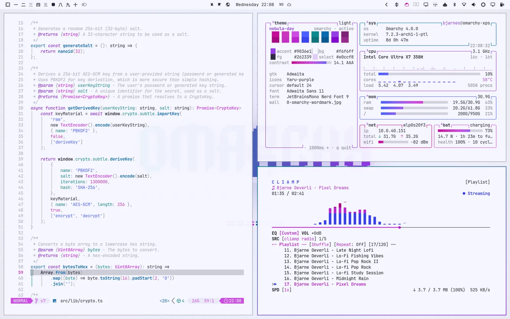](nebula-day/preview.png)

`055` · Folder: [`nebula-day/`](nebula-day/) · [Open in the gallery](https://bjarneo.github.io/100-themes-day/#nebula-day) · Night version: [Nebula](https://bjarneo.github.io/100-themes/#nebula)

Nebula Day has a light indigo background and a violet accent. The ANSI colors are saturated. The native background shows watercolor clouds on a light sky.

| Key | Value |
| --- | --- |
| `background` | `#f6f6ff` |
| `foreground` | `#262339` |
| `accent` | `#9036e1` |
| `selection` | `#e0ccf8` |
| Icon theme | `Yaru-purple` |
| Backgrounds | [`0-omarchy-wordmark.jpg`](nebula-day/backgrounds/0-omarchy-wordmark.jpg), [`1-nebula.jpg`](nebula-day/backgrounds/1-nebula.jpg) |

<details>
<summary>All 16 ANSI colors</summary>

| # | Normal | # | Bright |
| --- | --- | --- | --- |
| 0 black | `#e2e0f5` | 8 bright black | `#a4a2b7` |
| 1 red | `#c40395` | 9 bright red | `#a3007c` |
| 2 green | `#445bfe` | 10 bright green | `#343eeb` |
| 3 yellow | `#cc46df` | 11 bright yellow | `#b720cb` |
| 4 blue | `#0066ab` | 12 bright blue | `#00528c` |
| 5 magenta | `#9036e1` | 13 bright magenta | `#7e00ce` |
| 6 cyan | `#01858c` | 14 bright cyan | `#066e74` |
| 7 white | `#47455a` | 15 bright white | `#141120` |

</details>

```bash
curl -fsSL https://bjarneo.github.io/100-themes-day/install.sh | bash -s -- nebula-day --set
```

### Galaxy Day

[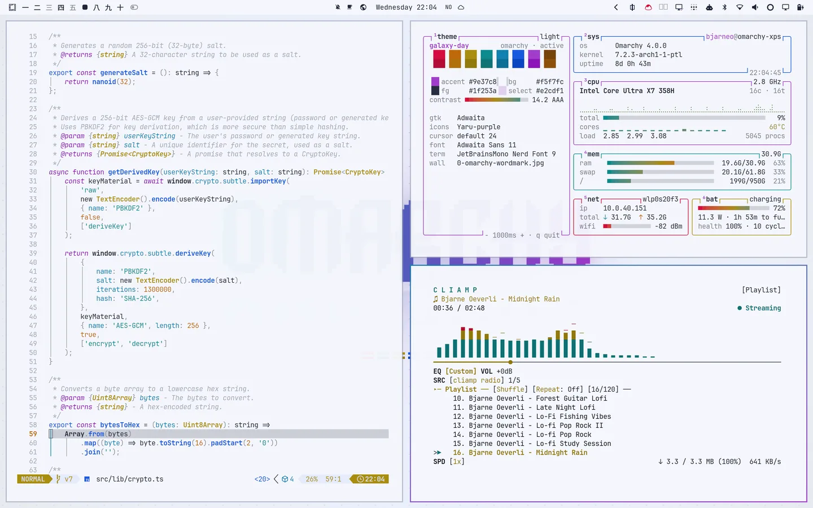](galaxy-day/preview.png)

`056` · Folder: [`galaxy-day/`](galaxy-day/) · [Open in the gallery](https://bjarneo.github.io/100-themes-day/#galaxy-day) · Night version: [Galaxy](https://bjarneo.github.io/100-themes/#galaxy)

Galaxy Day has a light blue background and a violet accent. The ANSI colors are saturated. The native background shows watercolor clouds on a light sky.

| Key | Value |
| --- | --- |
| `background` | `#f5f7fc` |
| `foreground` | `#1f253a` |
| `accent` | `#9e37c8` |
| `selection` | `#e2cdf1` |
| Icon theme | `Yaru-purple` |
| Backgrounds | [`0-omarchy-wordmark.jpg`](galaxy-day/backgrounds/0-omarchy-wordmark.jpg), [`1-nebula.jpg`](galaxy-day/backgrounds/1-nebula.jpg) |

<details>
<summary>All 16 ANSI colors</summary>

| # | Normal | # | Bright |
| --- | --- | --- | --- |
| 0 black | `#dbe3f7` | 8 bright black | `#9da4b8` |
| 1 red | `#d40336` | 9 bright red | `#b0042c` |
| 2 green | `#018589` | 10 bright green | `#0a6e71` |
| 3 yellow | `#a78905` | 11 bright yellow | `#8e7503` |
| 4 blue | `#0e53dd` | 12 bright blue | `#003fbe` |
| 5 magenta | `#9e37c8` | 13 bright magenta | `#8a0db5` |
| 6 cyan | `#097ead` | 14 bright cyan | `#056990` |
| 7 white | `#40475b` | 15 bright white | `#0f1321` |

</details>

```bash
curl -fsSL https://bjarneo.github.io/100-themes-day/install.sh | bash -s -- galaxy-day --set
```

### Supernova Day

[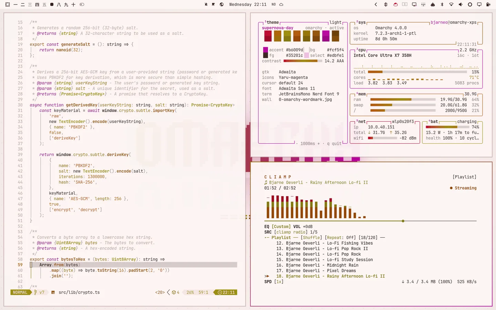](supernova-day/preview.png)

`057` · Folder: [`supernova-day/`](supernova-day/) · [Open in the gallery](https://bjarneo.github.io/100-themes-day/#supernova-day) · Night version: [Supernova](https://bjarneo.github.io/100-themes/#supernova)

Supernova Day has a light rose background and a magenta accent. The ANSI colors use very high chroma. The native background shows watercolor clouds on a light sky.

| Key | Value |
| --- | --- |
| `background` | `#fcf5f4` |
| `foreground` | `#35201c` |
| `accent` | `#b6009d` |
| `selection` | `#edbfe1` |
| Icon theme | `Yaru-magenta` |
| Backgrounds | [`0-omarchy-wordmark.jpg`](supernova-day/backgrounds/0-omarchy-wordmark.jpg), [`1-nebula.jpg`](supernova-day/backgrounds/1-nebula.jpg) |

<details>
<summary>All 16 ANSI colors</summary>

| # | Normal | # | Bright |
| --- | --- | --- | --- |
| 0 black | `#f2deda` | 8 bright black | `#b79e9a` |
| 1 red | `#ba0427` | 9 bright red | `#99001d` |
| 2 green | `#af5408` | 10 bright green | `#924401` |
| 3 yellow | `#998b09` | 11 bright yellow | `#82760c` |
| 4 blue | `#925008` | 12 bright blue | `#774005` |
| 5 magenta | `#b6009d` | 13 bright magenta | `#960081` |
| 6 cyan | `#916f00` | 14 bright cyan | `#785c03` |
| 7 white | `#57423e` | 15 bright white | `#200e0c` |

</details>

```bash
curl -fsSL https://bjarneo.github.io/100-themes-day/install.sh | bash -s -- supernova-day --set
```

### Black Hole Day

[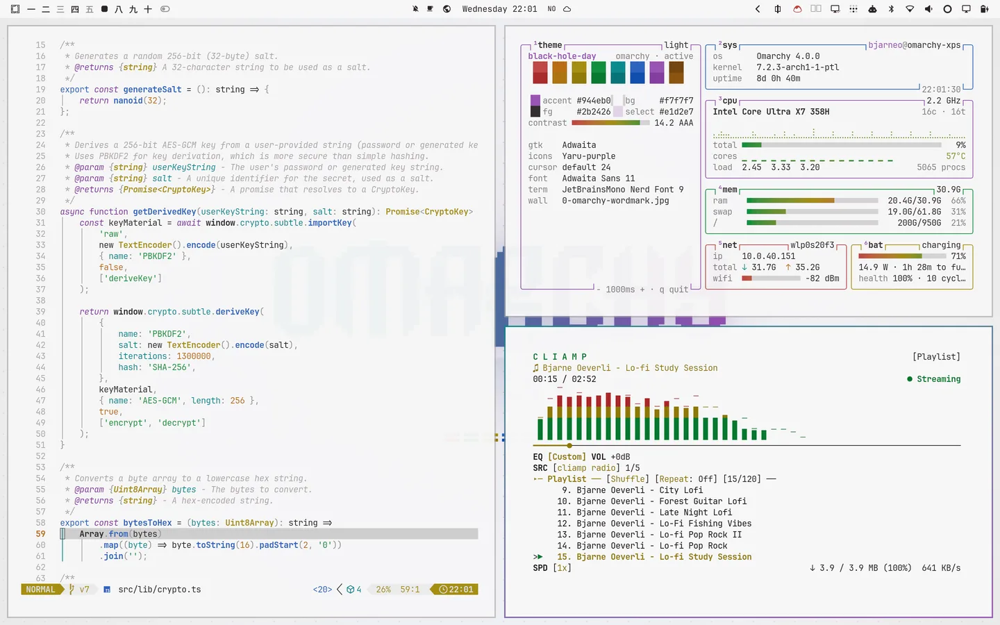](black-hole-day/preview.png)

`058` · Folder: [`black-hole-day/`](black-hole-day/) · [Open in the gallery](https://bjarneo.github.io/100-themes-day/#black-hole-day) · Night version: [Black Hole](https://bjarneo.github.io/100-themes/#black-hole)

Black Hole Day has a neutral white background and a violet accent. The ANSI colors use medium chroma for a calmer look. The native background shows a solar eclipse in the day sky.

| Key | Value |
| --- | --- |
| `background` | `#f7f7f7` |
| `foreground` | `#2b2426` |
| `accent` | `#944eb0` |
| `selection` | `#e1d2e7` |
| Icon theme | `Yaru-purple` |
| Backgrounds | [`0-omarchy-wordmark.jpg`](black-hole-day/backgrounds/0-omarchy-wordmark.jpg), [`1-planet.jpg`](black-hole-day/backgrounds/1-planet.jpg) |

<details>
<summary>All 16 ANSI colors</summary>

| # | Normal | # | Bright |
| --- | --- | --- | --- |
| 0 black | `#e3e3e3` | 8 bright black | `#aaa2a4` |
| 1 red | `#bd423c` | 9 bright red | `#a82424` |
| 2 green | `#0a8c37` | 10 bright green | `#00752b` |
| 3 yellow | `#a38b08` | 11 bright yellow | `#8c7600` |
| 4 blue | `#265ebc` | 12 bright blue | `#0948aa` |
| 5 magenta | `#944eb0` | 13 bright magenta | `#80369c` |
| 6 cyan | `#018589` | 14 bright cyan | `#016e72` |
| 7 white | `#4d4647` | 15 bright white | `#181214` |

</details>

```bash
curl -fsSL https://bjarneo.github.io/100-themes-day/install.sh | bash -s -- black-hole-day --set
```

### Mars Day

[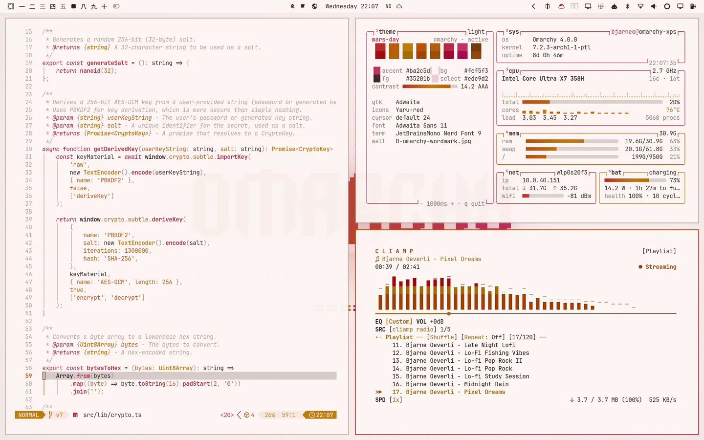](mars-day/preview.png)

`059` · Folder: [`mars-day/`](mars-day/) · [Open in the gallery](https://bjarneo.github.io/100-themes-day/#mars-day) · Night version: [Mars](https://bjarneo.github.io/100-themes/#mars)

Mars Day has a light rose background and a pink accent. The ANSI colors use medium chroma for a calmer look. The native background shows a pale planet in the day sky.

| Key | Value |
| --- | --- |
| `background` | `#fcf5f3` |
| `foreground` | `#35201b` |
| `accent` | `#ba2c5d` |
| `selection` | `#edc9d2` |
| Icon theme | `Yaru-red` |
| Backgrounds | [`0-omarchy-wordmark.jpg`](mars-day/backgrounds/0-omarchy-wordmark.jpg), [`1-planet.jpg`](mars-day/backgrounds/1-planet.jpg) |

<details>
<summary>All 16 ANSI colors</summary>

| # | Normal | # | Bright |
| --- | --- | --- | --- |
| 0 black | `#f2ded9` | 8 bright black | `#b69e98` |
| 1 red | `#b3241f` | 9 bright red | `#990309` |
| 2 green | `#ba4900` | 10 bright green | `#9a3c00` |
| 3 yellow | `#ba7900` | 11 bright yellow | `#9e6702` |
| 4 blue | `#b3203c` | 12 bright blue | `#98002a` |
| 5 magenta | `#ba2c5d` | 13 bright magenta | `#a30149` |
| 6 cyan | `#b15804` | 14 bright cyan | `#954800` |
| 7 white | `#57423d` | 15 bright white | `#1f0f0a` |

</details>

```bash
curl -fsSL https://bjarneo.github.io/100-themes-day/install.sh | bash -s -- mars-day --set
```

### Deep Space Day

[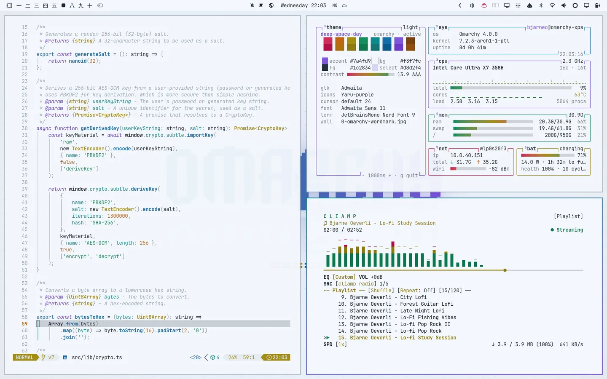](deep-space-day/preview.png)

`060` · Folder: [`deep-space-day/`](deep-space-day/) · [Open in the gallery](https://bjarneo.github.io/100-themes-day/#deep-space-day) · Night version: [Deep Space](https://bjarneo.github.io/100-themes/#deep-space)

Deep Space Day has a light blue background and a violet accent. The ANSI colors are saturated. The native background shows watercolor clouds on a light sky.

| Key | Value |
| --- | --- |
| `background` | `#f3f7fc` |
| `foreground` | `#1c2834` |
| `accent` | `#7a4fd9` |
| `selection` | `#d8d2f4` |
| Icon theme | `Yaru-purple` |
| Backgrounds | [`0-omarchy-wordmark.jpg`](deep-space-day/backgrounds/0-omarchy-wordmark.jpg), [`1-nebula.jpg`](deep-space-day/backgrounds/1-nebula.jpg) |

<details>
<summary>All 16 ANSI colors</summary>

| # | Normal | # | Bright |
| --- | --- | --- | --- |
| 0 black | `#dae4ee` | 8 bright black | `#99a6b4` |
| 1 red | `#cb234f` | 9 bright red | `#ae043d` |
| 2 green | `#0e8a59` | 10 bright green | `#087349` |
| 3 yellow | `#a38b08` | 11 bright yellow | `#8b7609` |
| 4 blue | `#0968a5` | 12 bright blue | `#015388` |
| 5 magenta | `#7a4fd9` | 13 bright magenta | `#6834c6` |
| 6 cyan | `#028587` | 14 bright cyan | `#0e6e6f` |
| 7 white | `#3e4955` | 15 bright white | `#0b151f` |

</details>

```bash
curl -fsSL https://bjarneo.github.io/100-themes-day/install.sh | bash -s -- deep-space-day --set
```

### Lagoon Day

[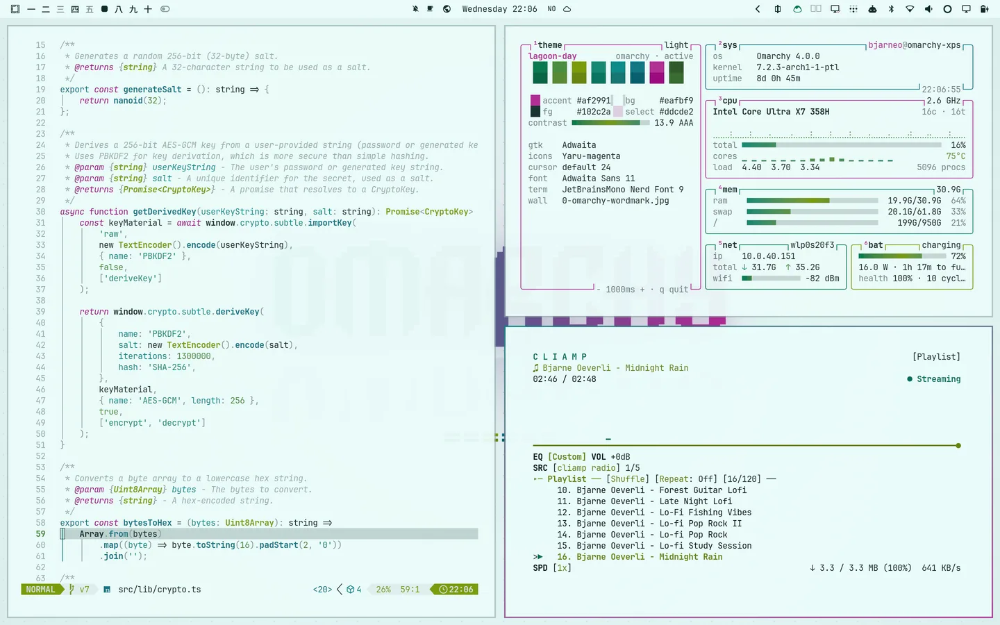](lagoon-day/preview.png)

`061` · Folder: [`lagoon-day/`](lagoon-day/) · [Open in the gallery](https://bjarneo.github.io/100-themes-day/#lagoon-day) · Night version: [Lagoon](https://bjarneo.github.io/100-themes/#lagoon)

Lagoon Day has a light teal background and a magenta accent. The ANSI colors are saturated. The native background shows sunlit shallow water with caustics.

| Key | Value |
| --- | --- |
| `background` | `#eafbf9` |
| `foreground` | `#102c2a` |
| `accent` | `#af2991` |
| `selection` | `#ddcde2` |
| Icon theme | `Yaru-magenta` |
| Backgrounds | [`0-omarchy-wordmark.jpg`](lagoon-day/backgrounds/0-omarchy-wordmark.jpg), [`1-depths.jpg`](lagoon-day/backgrounds/1-depths.jpg) |

<details>
<summary>All 16 ANSI colors</summary>

| # | Normal | # | Bright |
| --- | --- | --- | --- |
| 0 black | `#d2e8e6` | 8 bright black | `#90aba9` |
| 1 red | `#01764a` | 9 bright red | `#00603b` |
| 2 green | `#0f846f` | 10 bright green | `#006e5b` |
| 3 yellow | `#779702` | 11 bright yellow | `#65810a` |
| 4 blue | `#09707f` | 12 bright blue | `#005a68` |
| 5 magenta | `#af2991` | 13 bright magenta | `#98017c` |
| 6 cyan | `#048685` | 14 bright cyan | `#0f6e6e` |
| 7 white | `#354d4b` | 15 bright white | `#021817` |

</details>

```bash
curl -fsSL https://bjarneo.github.io/100-themes-day/install.sh | bash -s -- lagoon-day --set
```

### Coral Reef Day

[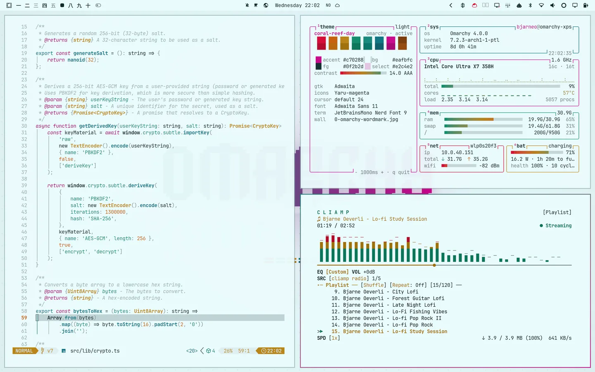](coral-reef-day/preview.png)

`062` · Folder: [`coral-reef-day/`](coral-reef-day/) · [Open in the gallery](https://bjarneo.github.io/100-themes-day/#coral-reef-day) · Night version: [Coral Reef](https://bjarneo.github.io/100-themes/#coral-reef)

Coral Reef Day has a light cyan background and a pink accent. The ANSI colors are saturated. The native background shows sunlit shallow water with caustics.

| Key | Value |
| --- | --- |
| `background` | `#eafbfc` |
| `foreground` | `#0f2b2d` |
| `accent` | `#c70288` |
| `selection` | `#e2c4e2` |
| Icon theme | `Yaru-magenta` |
| Backgrounds | [`0-omarchy-wordmark.jpg`](coral-reef-day/backgrounds/0-omarchy-wordmark.jpg), [`1-depths.jpg`](coral-reef-day/backgrounds/1-depths.jpg) |

<details>
<summary>All 16 ANSI colors</summary>

| # | Normal | # | Bright |
| --- | --- | --- | --- |
| 0 black | `#d2e8e9` | 8 bright black | `#90abac` |
| 1 red | `#d4052d` | 9 bright red | `#b00424` |
| 2 green | `#0d8969` | 10 bright green | `#067256` |
| 3 yellow | `#b78010` | 11 bright yellow | `#9d6d07` |
| 4 blue | `#09707f` | 12 bright blue | `#095a67` |
| 5 magenta | `#c70288` | 13 bright magenta | `#a60070` |
| 6 cyan | `#13867b` | 14 bright cyan | `#007066` |
| 7 white | `#344d4e` | 15 bright white | `#021819` |

</details>

```bash
curl -fsSL https://bjarneo.github.io/100-themes-day/install.sh | bash -s -- coral-reef-day --set
```

### Rainforest Day

[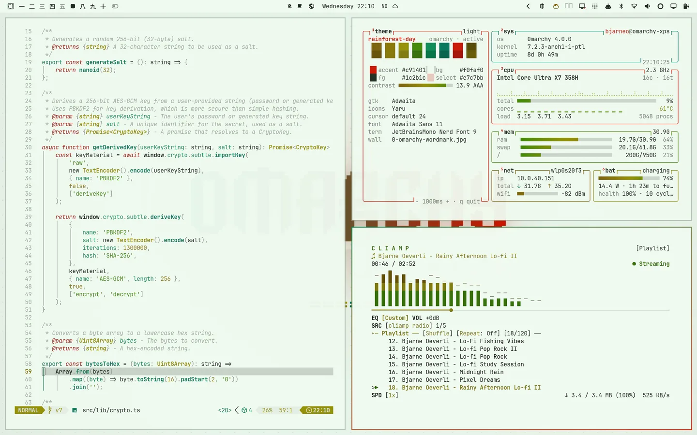](rainforest-day/preview.png)

`063` · Folder: [`rainforest-day/`](rainforest-day/) · [Open in the gallery](https://bjarneo.github.io/100-themes-day/#rainforest-day) · Night version: [Rainforest](https://bjarneo.github.io/100-themes/#rainforest)

Rainforest Day has a light green background and a red accent. The ANSI colors are saturated. The native background shows a topographic map on paper.

| Key | Value |
| --- | --- |
| `background` | `#f0faf0` |
| `foreground` | `#1c2b1c` |
| `accent` | `#c91401` |
| `selection` | `#e7c7bb` |
| Icon theme | `Yaru` |
| Backgrounds | [`0-omarchy-wordmark.jpg`](rainforest-day/backgrounds/0-omarchy-wordmark.jpg), [`1-contours.jpg`](rainforest-day/backgrounds/1-contours.jpg) |

<details>
<summary>All 16 ANSI colors</summary>

| # | Normal | # | Bright |
| --- | --- | --- | --- |
| 0 black | `#dae7da` | 8 bright black | `#99aa99` |
| 1 red | `#7a6006` | 9 bright red | `#624d04` |
| 2 green | `#3d8600` | 10 bright green | `#336e06` |
| 3 yellow | `#938e00` | 11 bright yellow | `#7d780d` |
| 4 blue | `#00755a` | 12 bright blue | `#005f48` |
| 5 magenta | `#c91401` | 13 bright magenta | `#a51002` |
| 6 cyan | `#088b55` | 14 bright cyan | `#007346` |
| 7 white | `#3e4c3e` | 15 bright white | `#0b170b` |

</details>

```bash
curl -fsSL https://bjarneo.github.io/100-themes-day/install.sh | bash -s -- rainforest-day --set
```

### Desert Day

[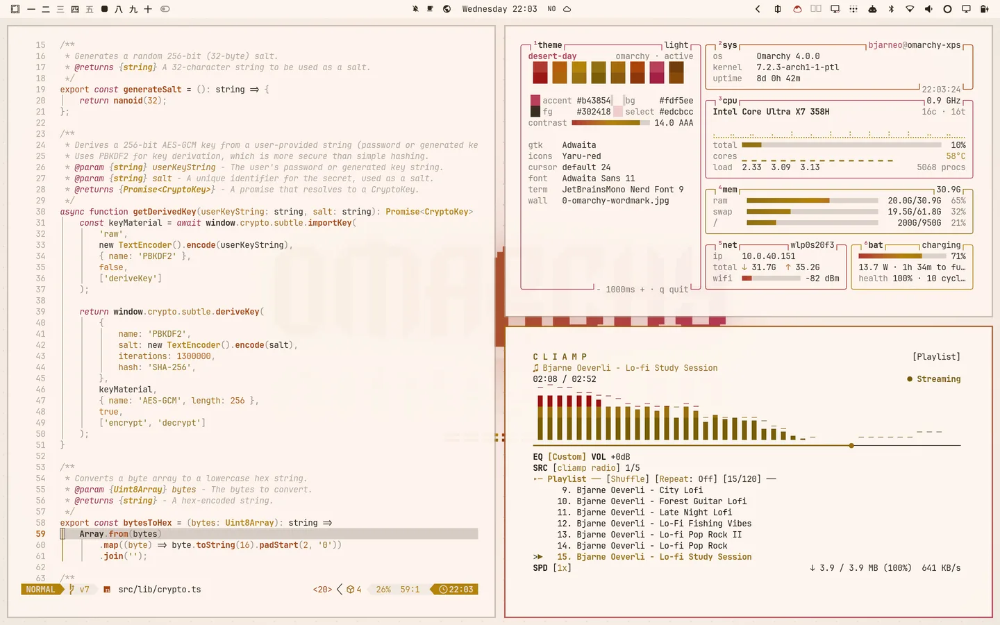](desert-day/preview.png)

`064` · Folder: [`desert-day/`](desert-day/) · [Open in the gallery](https://bjarneo.github.io/100-themes-day/#desert-day) · Night version: [Desert](https://bjarneo.github.io/100-themes/#desert)

Desert Day has a light peach background and a pink accent. The ANSI colors use medium chroma for a calmer look. The native background shows dunes at noon with drifting dust.

| Key | Value |
| --- | --- |
| `background` | `#fdf5ee` |
| `foreground` | `#302418` |
| `accent` | `#b43854` |
| `selection` | `#edcbcc` |
| Icon theme | `Yaru-red` |
| Backgrounds | [`0-omarchy-wordmark.jpg`](desert-day/backgrounds/0-omarchy-wordmark.jpg), [`1-embers.jpg`](desert-day/backgrounds/1-embers.jpg) |

<details>
<summary>All 16 ANSI colors</summary>

| # | Normal | # | Bright |
| --- | --- | --- | --- |
| 0 black | `#ebe1d7` | 8 bright black | `#b0a295` |
| 1 red | `#ac3229` | 9 bright red | `#970e0d` |
| 2 green | `#8e6c09` | 10 bright green | `#765901` |
| 3 yellow | `#b17f00` | 11 bright yellow | `#966c09` |
| 4 blue | `#a63d03` | 12 bright blue | `#863003` |
| 5 magenta | `#b43854` | 13 bright magenta | `#9f1840` |
| 6 cyan | `#a06603` | 14 bright cyan | `#855407` |
| 7 white | `#51453a` | 15 bright white | `#1c1108` |

</details>

```bash
curl -fsSL https://bjarneo.github.io/100-themes-day/install.sh | bash -s -- desert-day --set
```

### Volcano Day

[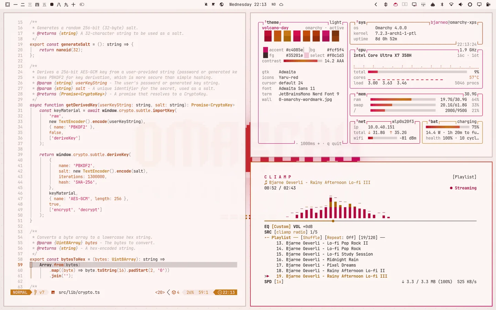](volcano-day/preview.png)

`065` · Folder: [`volcano-day/`](volcano-day/) · [Open in the gallery](https://bjarneo.github.io/100-themes-day/#volcano-day) · Night version: [Volcano](https://bjarneo.github.io/100-themes/#volcano)

Volcano Day has a light rose background and a pink accent. The 6 ANSI hues stay close to pink, so the palette reads as one color. The native background shows dunes at noon with drifting dust.

| Key | Value |
| --- | --- |
| `background` | `#fcf5f4` |
| `foreground` | `#35201e` |
| `accent` | `#c4085e` |
| `selection` | `#f0c1d3` |
| Icon theme | `Yaru-red` |
| Backgrounds | [`0-omarchy-wordmark.jpg`](volcano-day/backgrounds/0-omarchy-wordmark.jpg), [`1-embers.jpg`](volcano-day/backgrounds/1-embers.jpg) |

<details>
<summary>All 16 ANSI colors</summary>

| # | Normal | # | Bright |
| --- | --- | --- | --- |
| 0 black | `#f2dddb` | 8 bright black | `#b79e9b` |
| 1 red | `#ba0428` | 9 bright red | `#98011f` |
| 2 green | `#d20049` | 10 bright green | `#af003b` |
| 3 yellow | `#c3730d` | 11 bright yellow | `#a76100` |
| 4 blue | `#ac3300` | 12 bright blue | `#8d2700` |
| 5 magenta | `#c4085e` | 13 bright magenta | `#a2044c` |
| 6 cyan | `#c24700` | 14 bright cyan | `#a23a00` |
| 7 white | `#574240` | 15 bright white | `#200e0d` |

</details>

```bash
curl -fsSL https://bjarneo.github.io/100-themes-day/install.sh | bash -s -- volcano-day --set
```

### Tundra Day

[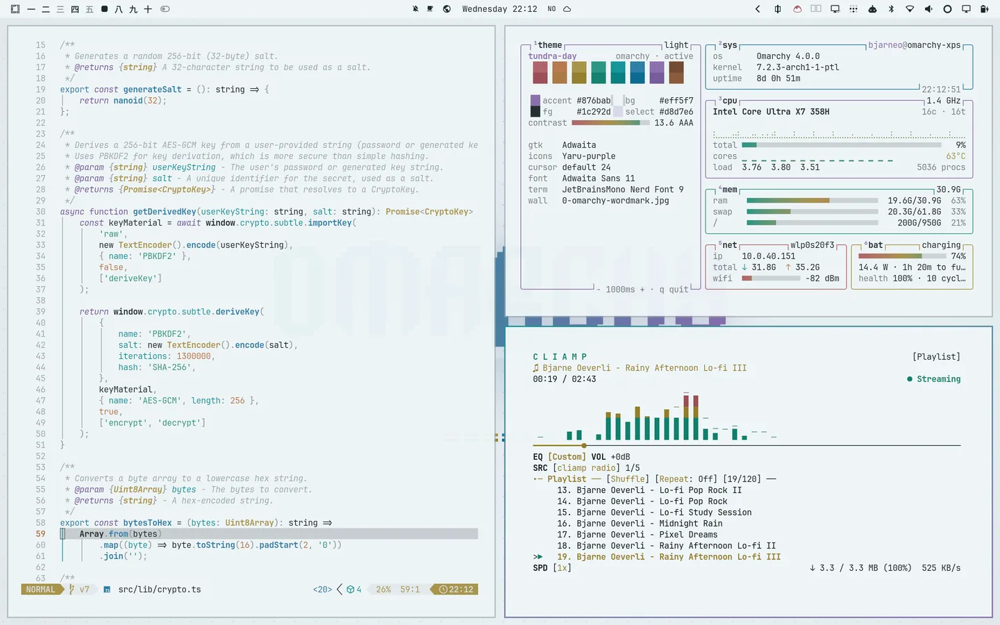](tundra-day/preview.png)

`066` · Folder: [`tundra-day/`](tundra-day/) · [Open in the gallery](https://bjarneo.github.io/100-themes-day/#tundra-day) · Night version: [Tundra](https://bjarneo.github.io/100-themes/#tundra)

Tundra Day has a light cyan background and a violet accent. The ANSI colors are soft with low chroma. The native background shows light curtains over a calm mountain lake.

| Key | Value |
| --- | --- |
| `background` | `#eff5f7` |
| `foreground` | `#1c292d` |
| `accent` | `#876bab` |
| `selection` | `#d8d7e6` |
| Icon theme | `Yaru-purple` |
| Backgrounds | [`0-omarchy-wordmark.jpg`](tundra-day/backgrounds/0-omarchy-wordmark.jpg), [`1-aurora.jpg`](tundra-day/backgrounds/1-aurora.jpg) |

<details>
<summary>All 16 ANSI colors</summary>

| # | Normal | # | Bright |
| --- | --- | --- | --- |
| 0 black | `#dae1e4` | 8 bright black | `#99a7ac` |
| 1 red | `#ad6066` | 9 bright red | `#994a51` |
| 2 green | `#269380` | 10 bright green | `#0d7d6b` |
| 3 yellow | `#a79144` | 11 bright yellow | `#927b27` |
| 4 blue | `#277aa3` | 12 bright blue | `#02668d` |
| 5 magenta | `#876bab` | 13 bright magenta | `#735697` |
| 6 cyan | `#0d9296` | 14 bright cyan | `#017b7e` |
| 7 white | `#3e4a4e` | 15 bright white | `#0b1619` |

</details>

```bash
curl -fsSL https://bjarneo.github.io/100-themes-day/install.sh | bash -s -- tundra-day --set
```

### Swamp Day

[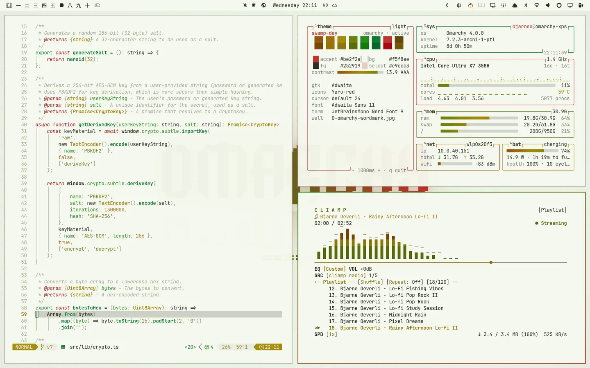](swamp-day/preview.png)

`067` · Folder: [`swamp-day/`](swamp-day/) · [Open in the gallery](https://bjarneo.github.io/100-themes-day/#swamp-day) · Night version: [Swamp](https://bjarneo.github.io/100-themes/#swamp)

Swamp Day has a light pale lime background and a red accent. The ANSI colors use medium chroma for a calmer look. The native background shows a topographic map on paper.

| Key | Value |
| --- | --- |
| `background` | `#f5f8ee` |
| `foreground` | `#252919` |
| `accent` | `#be2f2a` |
| `selection` | `#e9ccc3` |
| Icon theme | `Yaru-red` |
| Backgrounds | [`0-omarchy-wordmark.jpg`](swamp-day/backgrounds/0-omarchy-wordmark.jpg), [`1-contours.jpg`](swamp-day/backgrounds/1-contours.jpg) |

<details>
<summary>All 16 ANSI colors</summary>

| # | Normal | # | Bright |
| --- | --- | --- | --- |
| 0 black | `#e1e5d8` | 8 bright black | `#a2a796` |
| 1 red | `#905200` | 9 bright red | `#754100` |
| 2 green | `#667c07` | 10 bright green | `#546703` |
| 3 yellow | `#a18800` | 11 bright yellow | `#897304` |
| 4 blue | `#00782e` | 12 bright blue | `#006124` |
| 5 magenta | `#be2f2a` | 13 bright magenta | `#a8000b` |
| 6 cyan | `#1b8d13` | 14 bright cyan | `#0a7602` |
| 7 white | `#464a3b` | 15 bright white | `#121508` |

</details>

```bash
curl -fsSL https://bjarneo.github.io/100-themes-day/install.sh | bash -s -- swamp-day --set
```

### Mushroom Day

[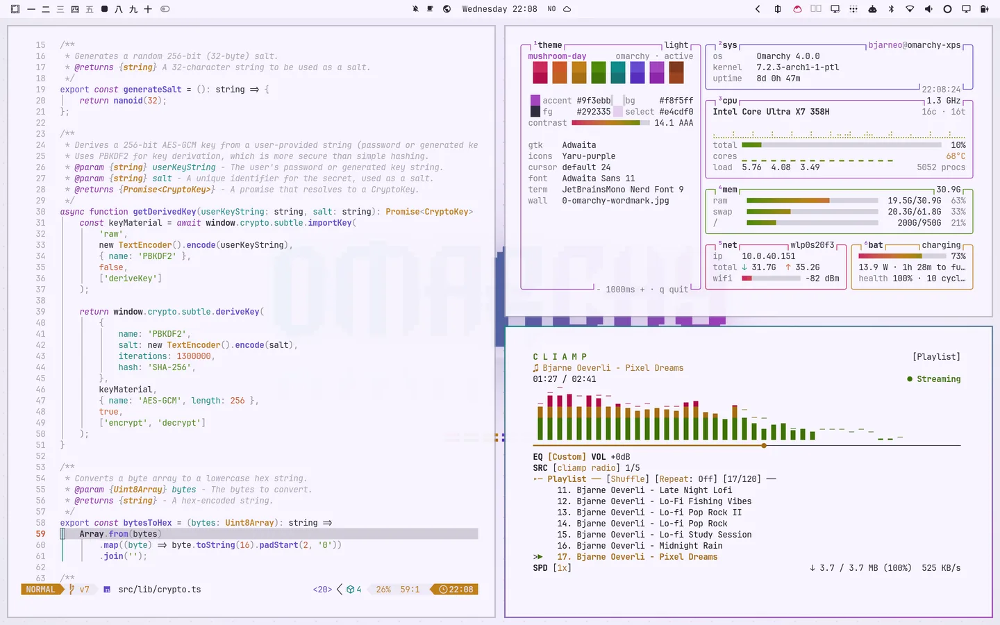](mushroom-day/preview.png)

`068` · Folder: [`mushroom-day/`](mushroom-day/) · [Open in the gallery](https://bjarneo.github.io/100-themes-day/#mushroom-day) · Night version: [Mushroom](https://bjarneo.github.io/100-themes/#mushroom)

Mushroom Day has a light violet background and a violet accent. The ANSI colors are saturated. The native background shows a topographic map on paper.

| Key | Value |
| --- | --- |
| `background` | `#f8f5ff` |
| `foreground` | `#292335` |
| `accent` | `#9f3ebb` |
| `selection` | `#e4cdf0` |
| Icon theme | `Yaru-purple` |
| Backgrounds | [`0-omarchy-wordmark.jpg`](mushroom-day/backgrounds/0-omarchy-wordmark.jpg), [`1-contours.jpg`](mushroom-day/backgrounds/1-contours.jpg) |

<details>
<summary>All 16 ANSI colors</summary>

| # | Normal | # | Bright |
| --- | --- | --- | --- |
| 0 black | `#e5e0f1` | 8 bright black | `#a7a1b5` |
| 1 red | `#ca2355` | 9 bright red | `#ae0444` |
| 2 green | `#4a8701` | 10 bright green | `#3c7001` |
| 3 yellow | `#bf7b0e` | 11 bright yellow | `#a3690b` |
| 4 blue | `#6144cc` | 12 bright blue | `#5027ba` |
| 5 magenta | `#9f3ebb` | 13 bright magenta | `#8b1ea8` |
| 6 cyan | `#058684` | 14 bright cyan | `#106e6d` |
| 7 white | `#4a4456` | 15 bright white | `#16111f` |

</details>

```bash
curl -fsSL https://bjarneo.github.io/100-themes-day/install.sh | bash -s -- mushroom-day --set
```

### Firefly Day

[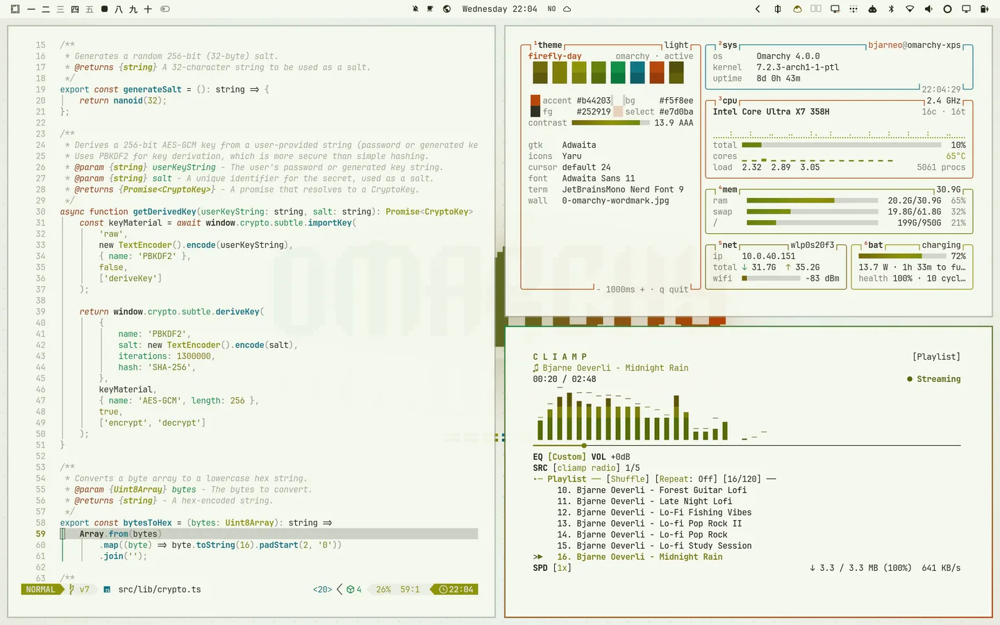](firefly-day/preview.png)

`069` · Folder: [`firefly-day/`](firefly-day/) · [Open in the gallery](https://bjarneo.github.io/100-themes-day/#firefly-day) · Night version: [Firefly](https://bjarneo.github.io/100-themes/#firefly)

Firefly Day has a light pale lime background and a red accent. The ANSI colors are saturated. The native background shows a topographic map on paper.

| Key | Value |
| --- | --- |
| `background` | `#f5f8ee` |
| `foreground` | `#252919` |
| `accent` | `#b44203` |
| `selection` | `#e7d0ba` |
| Icon theme | `Yaru` |
| Backgrounds | [`0-omarchy-wordmark.jpg`](firefly-day/backgrounds/0-omarchy-wordmark.jpg), [`1-contours.jpg`](firefly-day/backgrounds/1-contours.jpg) |

<details>
<summary>All 16 ANSI colors</summary>

| # | Normal | # | Bright |
| --- | --- | --- | --- |
| 0 black | `#e1e5d8` | 8 bright black | `#a2a796` |
| 1 red | `#6e6501` | 9 bright red | `#595106` |
| 2 green | `#617e05` | 10 bright green | `#506804` |
| 3 yellow | `#8b9100` | 11 bright yellow | `#767b06` |
| 4 blue | `#06707e` | 12 bright blue | `#065a65` |
| 5 magenta | `#b44203` | 13 bright magenta | `#943504` |
| 6 cyan | `#0a8c42` | 14 bright cyan | `#037435` |
| 7 white | `#464a3b` | 15 bright white | `#121508` |

</details>

```bash
curl -fsSL https://bjarneo.github.io/100-themes-day/install.sh | bash -s -- firefly-day --set
```

### Jellyfish Day

[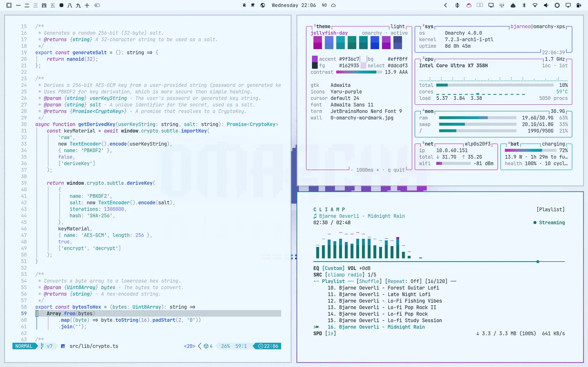](jellyfish-day/preview.png)

`070` · Folder: [`jellyfish-day/`](jellyfish-day/) · [Open in the gallery](https://bjarneo.github.io/100-themes-day/#jellyfish-day) · Night version: [Jellyfish](https://bjarneo.github.io/100-themes/#jellyfish)

Jellyfish Day has a light blue background and a violet accent. The ANSI colors are saturated. The native background shows sunlit shallow water with caustics.

| Key | Value |
| --- | --- |
| `background` | `#eff8ff` |
| `foreground` | `#162935` |
| `accent` | `#9f36c7` |
| `selection` | `#ddcdf3` |
| Icon theme | `Yaru-purple` |
| Backgrounds | [`0-omarchy-wordmark.jpg`](jellyfish-day/backgrounds/0-omarchy-wordmark.jpg), [`1-depths.jpg`](jellyfish-day/backgrounds/1-depths.jpg) |

<details>
<summary>All 16 ANSI colors</summary>

| # | Normal | # | Bright |
| --- | --- | --- | --- |
| 0 black | `#d6e5f1` | 8 bright black | `#94a8b6` |
| 1 red | `#b329ab` | 9 bright red | `#9b0494` |
| 2 green | `#0c867f` | 10 bright green | `#106f69` |
| 3 yellow | `#109db5` | 11 bright yellow | `#14859a` |
| 4 blue | `#2351de` | 12 bright blue | `#0f35cb` |
| 5 magenta | `#9f36c7` | 13 bright magenta | `#8b0ab3` |
| 6 cyan | `#02848d` | 14 bright cyan | `#0a6e74` |
| 7 white | `#394a56` | 15 bright white | `#061520` |

</details>

```bash
curl -fsSL https://bjarneo.github.io/100-themes-day/install.sh | bash -s -- jellyfish-day --set
```

### Candy Day

[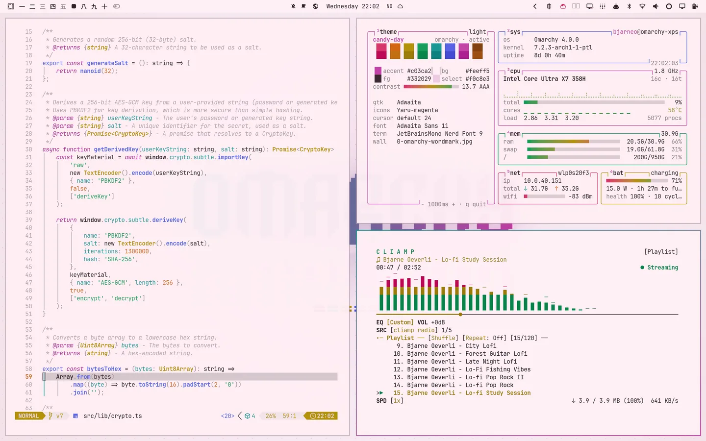](candy-day/preview.png)

`071` · Folder: [`candy-day/`](candy-day/) · [Open in the gallery](https://bjarneo.github.io/100-themes-day/#candy-day) · Night version: [Candy](https://bjarneo.github.io/100-themes/#candy)

Candy Day has a light blush background and a magenta accent. The ANSI colors are soft with low chroma. The native background shows pastel light spots with bokeh.

| Key | Value |
| --- | --- |
| `background` | `#feeff5` |
| `foreground` | `#332029` |
| `accent` | `#c03ca2` |
| `selection` | `#f0c8e3` |
| Icon theme | `Yaru-magenta` |
| Backgrounds | [`0-omarchy-wordmark.jpg`](candy-day/backgrounds/0-omarchy-wordmark.jpg), [`1-blobs.jpg`](candy-day/backgrounds/1-blobs.jpg) |

<details>
<summary>All 16 ANSI colors</summary>

| # | Normal | # | Bright |
| --- | --- | --- | --- |
| 0 black | `#eddae2` | 8 bright black | `#b49da7` |
| 1 red | `#d33066` | 9 bright red | `#bc0052` |
| 2 green | `#0d9953` | 10 bright green | `#018145` |
| 3 yellow | `#b18e00` | 11 bright yellow | `#987902` |
| 4 blue | `#515ee3` | 12 bright blue | `#3f45d1` |
| 5 magenta | `#c03ca2` | 13 bright magenta | `#aa178e` |
| 6 cyan | `#109392` | 14 bright cyan | `#037c7b` |
| 7 white | `#55414a` | 15 bright white | `#1e0e16` |

</details>

```bash
curl -fsSL https://bjarneo.github.io/100-themes-day/install.sh | bash -s -- candy-day --set
```

### Bubblegum Day

[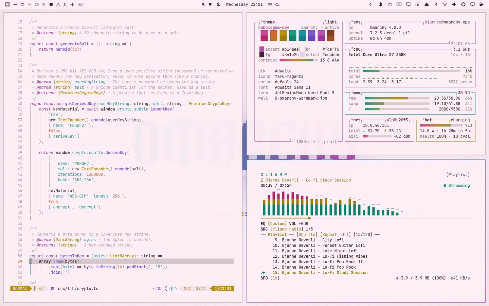](bubblegum-day/preview.png)

`072` · Folder: [`bubblegum-day/`](bubblegum-day/) · [Open in the gallery](https://bjarneo.github.io/100-themes-day/#bubblegum-day) · Night version: [Bubblegum](https://bjarneo.github.io/100-themes/#bubblegum)

Bubblegum Day has a light blush background and a magenta accent. The ANSI colors are soft with low chroma. The native background shows pastel light spots with bokeh.

| Key | Value |
| --- | --- |
| `background` | `#fdeff6` |
| `foreground` | `#341e2b` |
| `accent` | `#b14aae` |
| `selection` | `#eccbe6` |
| Icon theme | `Yaru-magenta` |
| Backgrounds | [`0-omarchy-wordmark.jpg`](bubblegum-day/backgrounds/0-omarchy-wordmark.jpg), [`1-blobs.jpg`](bubblegum-day/backgrounds/1-blobs.jpg) |

<details>
<summary>All 16 ANSI colors</summary>

| # | Normal | # | Bright |
| --- | --- | --- | --- |
| 0 black | `#efd8e4` | 8 bright black | `#b39da9` |
| 1 red | `#c64080` | 9 bright red | `#b11f6c` |
| 2 green | `#13957c` | 10 bright green | `#067e68` |
| 3 yellow | `#b08e00` | 11 bright yellow | `#977a07` |
| 4 blue | `#7855cf` | 12 bright blue | `#653cbc` |
| 5 magenta | `#b14aae` | 13 bright magenta | `#9c2f9a` |
| 6 cyan | `#1490a1` | 14 bright cyan | `#0c7988` |
| 7 white | `#56404c` | 15 bright white | `#1d0e17` |

</details>

```bash
curl -fsSL https://bjarneo.github.io/100-themes-day/install.sh | bash -s -- bubblegum-day --set
```

### Lemonade Day

[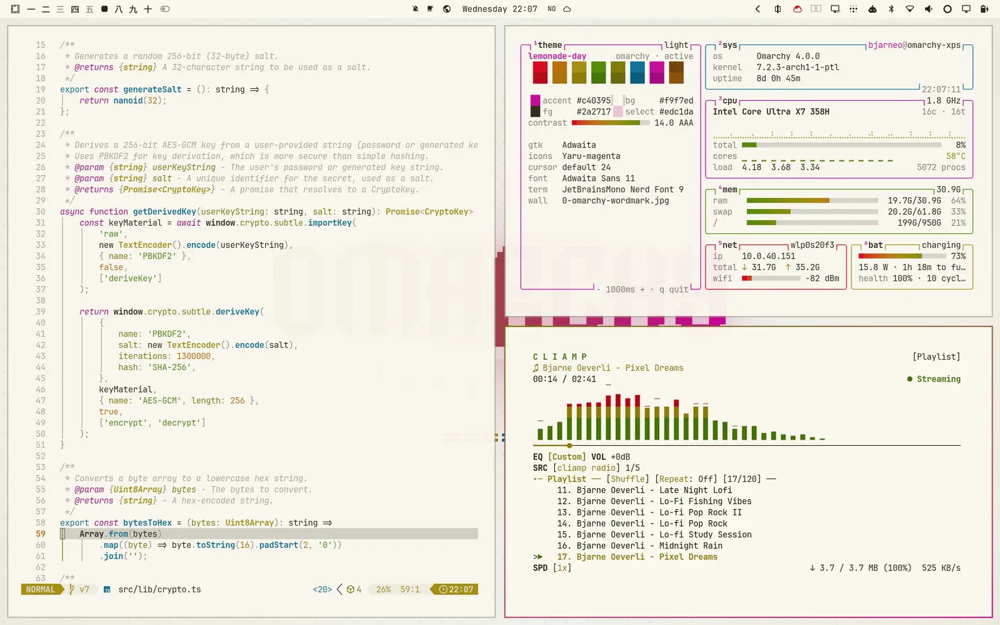](lemonade-day/preview.png)

`073` · Folder: [`lemonade-day/`](lemonade-day/) · [Open in the gallery](https://bjarneo.github.io/100-themes-day/#lemonade-day) · Night version: [Lemonade](https://bjarneo.github.io/100-themes/#lemonade)

Lemonade Day has a light cream background and a magenta accent. The ANSI colors are saturated. The native background shows pastel light spots with bokeh.

| Key | Value |
| --- | --- |
| `background` | `#f9f7ed` |
| `foreground` | `#2a2717` |
| `accent` | `#c40395` |
| `selection` | `#edc1da` |
| Icon theme | `Yaru-magenta` |
| Backgrounds | [`0-omarchy-wordmark.jpg`](lemonade-day/backgrounds/0-omarchy-wordmark.jpg), [`1-blobs.jpg`](lemonade-day/backgrounds/1-blobs.jpg) |

<details>
<summary>All 16 ANSI colors</summary>

| # | Normal | # | Bright |
| --- | --- | --- | --- |
| 0 black | `#e5e3d6` | 8 bright black | `#a8a594` |
| 1 red | `#d60017` | 9 bright red | `#b20011` |
| 2 green | `#508601` | 10 bright green | `#416f00` |
| 3 yellow | `#a28c0a` | 11 bright yellow | `#8b7702` |
| 4 blue | `#076c92` | 12 bright blue | `#025777` |
| 5 magenta | `#c40395` | 13 bright magenta | `#a3007c` |
| 6 cyan | `#7d7801` | 14 bright cyan | `#676408` |
| 7 white | `#4b4839` | 15 bright white | `#161407` |

</details>

```bash
curl -fsSL https://bjarneo.github.io/100-themes-day/install.sh | bash -s -- lemonade-day --set
```

### Mint Day

[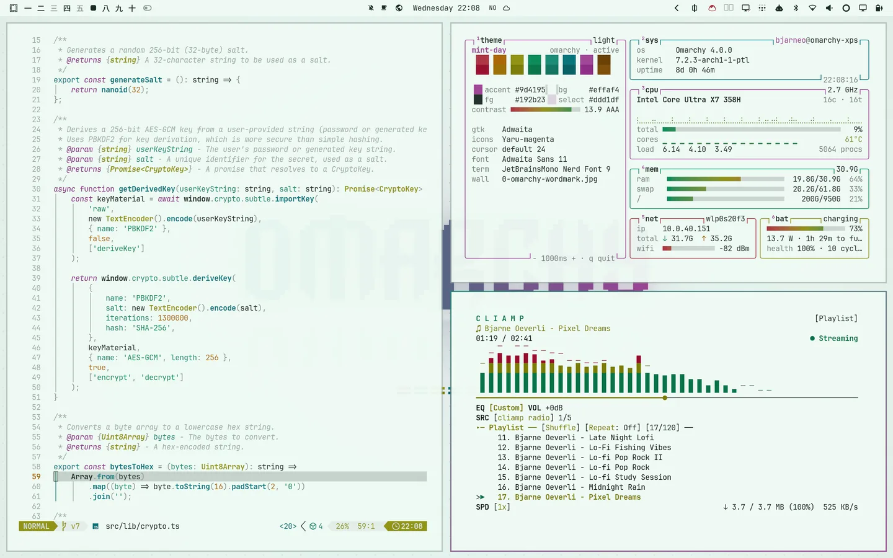](mint-day/preview.png)

`074` · Folder: [`mint-day/`](mint-day/) · [Open in the gallery](https://bjarneo.github.io/100-themes-day/#mint-day) · Night version: [Mint](https://bjarneo.github.io/100-themes/#mint)

Mint Day has a light teal background and a magenta accent. The ANSI colors use medium chroma for a calmer look. The native background shows pastel light spots with bokeh.

| Key | Value |
| --- | --- |
| `background` | `#effaf4` |
| `foreground` | `#192b23` |
| `accent` | `#9d4195` |
| `selection` | `#ddd1df` |
| Icon theme | `Yaru-magenta` |
| Backgrounds | [`0-omarchy-wordmark.jpg`](mint-day/backgrounds/0-omarchy-wordmark.jpg), [`1-blobs.jpg`](mint-day/backgrounds/1-blobs.jpg) |

<details>
<summary>All 16 ANSI colors</summary>

| # | Normal | # | Bright |
| --- | --- | --- | --- |
| 0 black | `#d9e7e0` | 8 bright black | `#97aaa1` |
| 1 red | `#ab2f3d` | 9 bright red | `#960828` |
| 2 green | `#028752` | 10 bright green | `#027043` |
| 3 yellow | `#8e900d` | 11 bright yellow | `#797a00` |
| 4 blue | `#007178` | 12 bright blue | `#005b61` |
| 5 magenta | `#9d4195` | 13 bright magenta | `#892782` |
| 6 cyan | `#148773` | 14 bright cyan | `#0d705f` |
| 7 white | `#3b4c44` | 15 bright white | `#081711` |

</details>

```bash
curl -fsSL https://bjarneo.github.io/100-themes-day/install.sh | bash -s -- mint-day --set
```

### Grape Day

[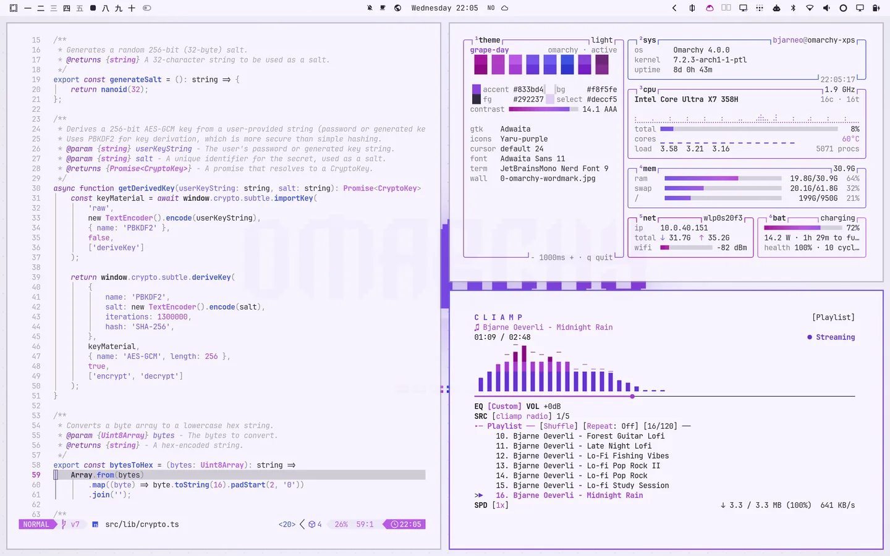](grape-day/preview.png)

`075` · Folder: [`grape-day/`](grape-day/) · [Open in the gallery](https://bjarneo.github.io/100-themes-day/#grape-day) · Night version: [Grape](https://bjarneo.github.io/100-themes/#grape)

Grape Day has a light violet background and a violet accent. The ANSI colors are saturated. The native background shows pastel light spots with bokeh.

| Key | Value |
| --- | --- |
| `background` | `#f8f5fe` |
| `foreground` | `#292237` |
| `accent` | `#833bd4` |
| `selection` | `#deccf5` |
| Icon theme | `Yaru-purple` |
| Backgrounds | [`0-omarchy-wordmark.jpg`](grape-day/backgrounds/0-omarchy-wordmark.jpg), [`1-blobs.jpg`](grape-day/backgrounds/1-blobs.jpg) |

<details>
<summary>All 16 ANSI colors</summary>

| # | Normal | # | Bright |
| --- | --- | --- | --- |
| 0 black | `#e5dff4` | 8 bright black | `#a7a1b5` |
| 1 red | `#a40b99` | 9 bright red | `#87007e` |
| 2 green | `#734de7` | 10 bright green | `#612ed4` |
| 3 yellow | `#b753e4` | 11 bright yellow | `#a335d0` |
| 4 blue | `#384cde` | 12 bright blue | `#282fcb` |
| 5 magenta | `#833bd4` | 13 bright magenta | `#7016c1` |
| 6 cyan | `#6855ee` | 14 bright cyan | `#5739dc` |
| 7 white | `#4a4458` | 15 bright white | `#16111f` |

</details>

```bash
curl -fsSL https://bjarneo.github.io/100-themes-day/install.sh | bash -s -- grape-day --set
```

### Watermelon Day

[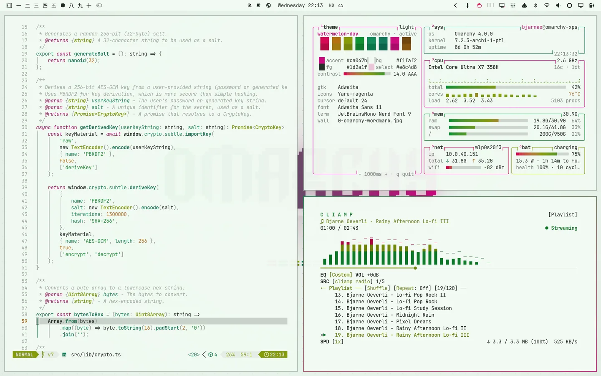](watermelon-day/preview.png)

`076` · Folder: [`watermelon-day/`](watermelon-day/) · [Open in the gallery](https://bjarneo.github.io/100-themes-day/#watermelon-day) · Night version: [Watermelon](https://bjarneo.github.io/100-themes/#watermelon)

Watermelon Day has a light green background and a pink accent. The ANSI colors are saturated. The native background shows pastel light spots with bokeh.

| Key | Value |
| --- | --- |
| `background` | `#f1faf2` |
| `foreground` | `#1d2a1f` |
| `accent` | `#ca047b` |
| `selection` | `#e8c4d8` |
| Icon theme | `Yaru-magenta` |
| Backgrounds | [`0-omarchy-wordmark.jpg`](watermelon-day/backgrounds/0-omarchy-wordmark.jpg), [`1-blobs.jpg`](watermelon-day/backgrounds/1-blobs.jpg) |

<details>
<summary>All 16 ANSI colors</summary>

| # | Normal | # | Bright |
| --- | --- | --- | --- |
| 0 black | `#dbe6dd` | 8 bright black | `#9aa99c` |
| 1 red | `#d2004d` | 9 bright red | `#af003f` |
| 2 green | `#058d2c` | 10 bright green | `#077524` |
| 3 yellow | `#839801` | 11 bright yellow | `#708106` |
| 4 blue | `#0c7556` | 12 bright blue | `#055f45` |
| 5 magenta | `#ca047b` | 13 bright magenta | `#a80265` |
| 6 cyan | `#0c8a55` | 14 bright cyan | `#007345` |
| 7 white | `#3e4c41` | 15 bright white | `#0b170e` |

</details>

```bash
curl -fsSL https://bjarneo.github.io/100-themes-day/install.sh | bash -s -- watermelon-day --set
```

### Espresso Day

[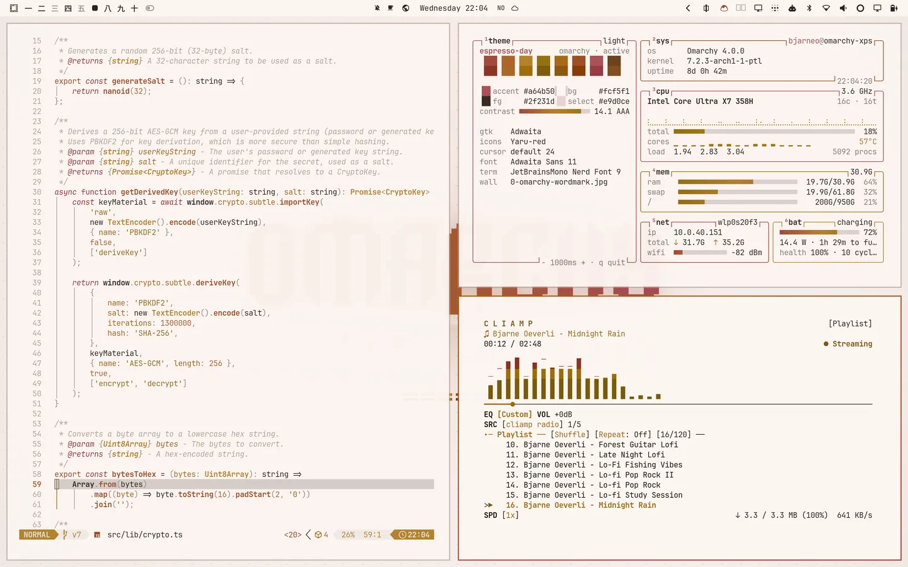](espresso-day/preview.png)

`077` · Folder: [`espresso-day/`](espresso-day/) · [Open in the gallery](https://bjarneo.github.io/100-themes-day/#espresso-day) · Night version: [Espresso](https://bjarneo.github.io/100-themes/#espresso)

Espresso Day has a light peach background and a red accent. The ANSI colors use low chroma for a muted look. The native background shows pastel light spots with bokeh.

| Key | Value |
| --- | --- |
| `background` | `#fcf5f1` |
| `foreground` | `#2f231d` |
| `accent` | `#a64b50` |
| `selection` | `#e9d0ce` |
| Icon theme | `Yaru-red` |
| Backgrounds | [`0-omarchy-wordmark.jpg`](espresso-day/backgrounds/0-omarchy-wordmark.jpg), [`1-blobs.jpg`](espresso-day/backgrounds/1-blobs.jpg) |

<details>
<summary>All 16 ANSI colors</summary>

| # | Normal | # | Bright |
| --- | --- | --- | --- |
| 0 black | `#eae1dc` | 8 bright black | `#b0a19a` |
| 1 red | `#9c4534` | 9 bright red | `#872e1d` |
| 2 green | `#8f6b0a` | 10 bright green | `#775806` |
| 3 yellow | `#b17e22` | 11 bright yellow | `#9a6a04` |
| 4 blue | `#99491e` | 12 bright blue | `#833500` |
| 5 magenta | `#a64b50` | 13 bright magenta | `#91343c` |
| 6 cyan | `#a3640f` | 14 bright cyan | `#885208` |
| 7 white | `#51453e` | 15 bright white | `#1b110c` |

</details>

```bash
curl -fsSL https://bjarneo.github.io/100-themes-day/install.sh | bash -s -- espresso-day --set
```

### Matcha Day

[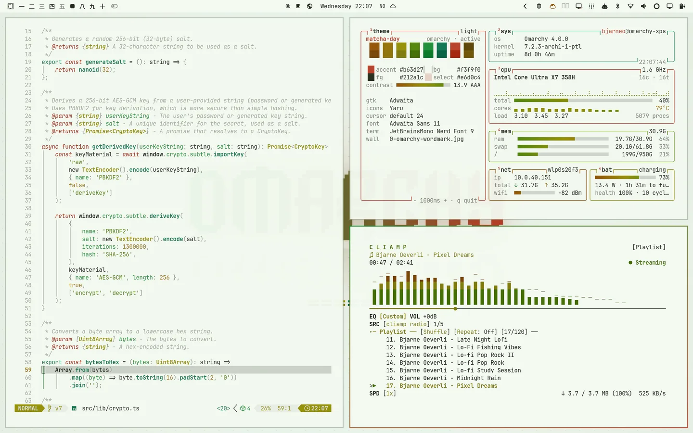](matcha-day/preview.png)

`078` · Folder: [`matcha-day/`](matcha-day/) · [Open in the gallery](https://bjarneo.github.io/100-themes-day/#matcha-day) · Night version: [Matcha](https://bjarneo.github.io/100-themes/#matcha)

Matcha Day has a light pale lime background and a red accent. The ANSI colors use medium chroma for a calmer look. The native background shows pastel light spots with bokeh.

| Key | Value |
| --- | --- |
| `background` | `#f3f9f0` |
| `foreground` | `#212a1c` |
| `accent` | `#b63d27` |
| `selection` | `#e6d0c4` |
| Icon theme | `Yaru` |
| Backgrounds | [`0-omarchy-wordmark.jpg`](matcha-day/backgrounds/0-omarchy-wordmark.jpg), [`1-blobs.jpg`](matcha-day/backgrounds/1-blobs.jpg) |

<details>
<summary>All 16 ANSI colors</summary>

| # | Normal | # | Bright |
| --- | --- | --- | --- |
| 0 black | `#dee6da` | 8 bright black | `#9ea899` |
| 1 red | `#905100` | 9 bright red | `#754102` |
| 2 green | `#4f8205` | 10 bright green | `#406c00` |
| 3 yellow | `#938e01` | 11 bright yellow | `#7d7808` |
| 4 blue | `#0c7551` | 12 bright blue | `#015f40` |
| 5 magenta | `#b63d27` | 13 bright magenta | `#a11f04` |
| 6 cyan | `#1a8c33` | 14 bright cyan | `#037524` |
| 7 white | `#424b3d` | 15 bright white | `#0f160b` |

</details>

```bash
curl -fsSL https://bjarneo.github.io/100-themes-day/install.sh | bash -s -- matcha-day --set
```

### Cotton Candy Day

[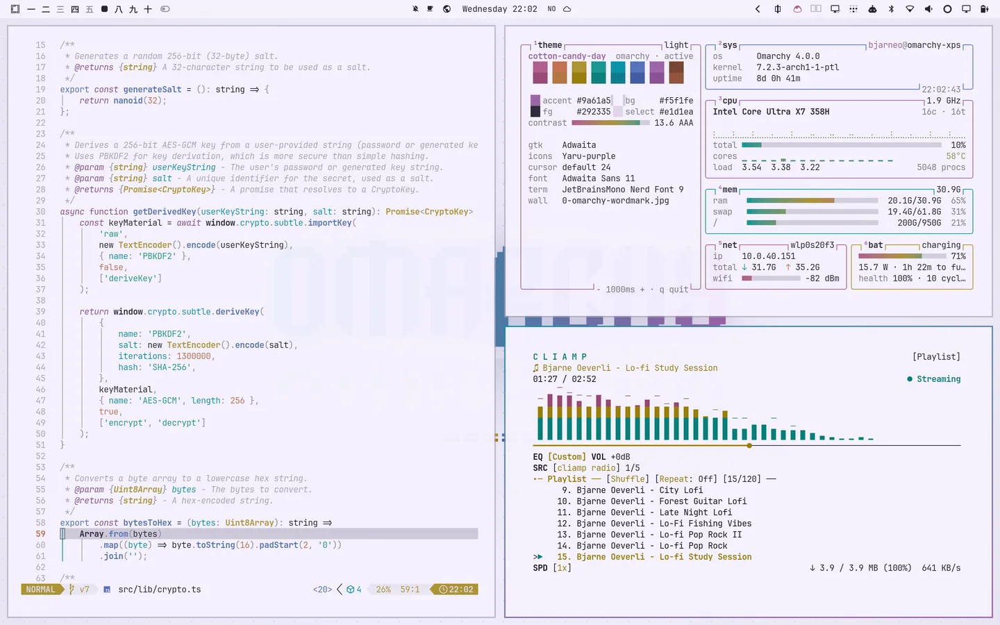](cotton-candy-day/preview.png)

`079` · Folder: [`cotton-candy-day/`](cotton-candy-day/) · [Open in the gallery](https://bjarneo.github.io/100-themes-day/#cotton-candy-day) · Night version: [Cotton Candy](https://bjarneo.github.io/100-themes/#cotton-candy)

Cotton Candy Day has a light violet background and a magenta accent. The ANSI colors are soft with low chroma. The native background shows pastel light spots with bokeh.

| Key | Value |
| --- | --- |
| `background` | `#f5f1fe` |
| `foreground` | `#292335` |
| `accent` | `#9a61a5` |
| `selection` | `#e1d1ea` |
| Icon theme | `Yaru-purple` |
| Backgrounds | [`0-omarchy-wordmark.jpg`](cotton-candy-day/backgrounds/0-omarchy-wordmark.jpg), [`1-blobs.jpg`](cotton-candy-day/backgrounds/1-blobs.jpg) |

<details>
<summary>All 16 ANSI colors</summary>

| # | Normal | # | Bright |
| --- | --- | --- | --- |
| 0 black | `#e2dced` | 8 bright black | `#a7a1b5` |
| 1 red | `#ad5a87` | 9 bright red | `#984473` |
| 2 green | `#14938e` | 10 bright green | `#027c78` |
| 3 yellow | `#ab902b` | 11 bright yellow | `#967b00` |
| 4 blue | `#516eb7` | 12 bright blue | `#3c58a4` |
| 5 magenta | `#9a61a5` | 13 bright magenta | `#864b91` |
| 6 cyan | `#0090a5` | 14 bright cyan | `#07798a` |
| 7 white | `#4a4456` | 15 bright white | `#16111f` |

</details>

```bash
curl -fsSL https://bjarneo.github.io/100-themes-day/install.sh | bash -s -- cotton-candy-day --set
```

### Blood Moon Day

[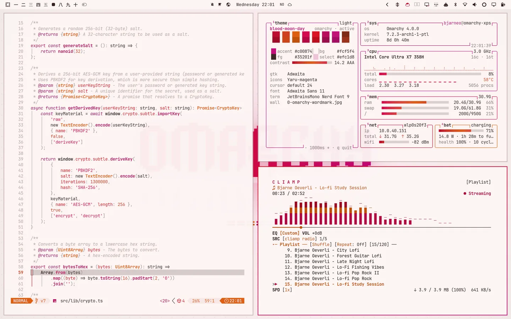](blood-moon-day/preview.png)

`080` · Folder: [`blood-moon-day/`](blood-moon-day/) · [Open in the gallery](https://bjarneo.github.io/100-themes-day/#blood-moon-day) · Night version: [Blood Moon](https://bjarneo.github.io/100-themes/#blood-moon)

Blood Moon Day has a light rose background and a pink accent. The 6 ANSI hues stay close to pink, so the palette reads as one color. The native background shows a pale planet in the day sky.

| Key | Value |
| --- | --- |
| `background` | `#fcf5f4` |
| `foreground` | `#35201f` |
| `accent` | `#c00874` |
| `selection` | `#efc1d8` |
| Icon theme | `Yaru-magenta` |
| Backgrounds | [`0-omarchy-wordmark.jpg`](blood-moon-day/backgrounds/0-omarchy-wordmark.jpg), [`1-planet.jpg`](blood-moon-day/backgrounds/1-planet.jpg) |

<details>
<summary>All 16 ANSI colors</summary>

| # | Normal | # | Bright |
| --- | --- | --- | --- |
| 0 black | `#f2dddc` | 8 bright black | `#b79e9d` |
| 1 red | `#ba0426` | 9 bright red | `#98031d` |
| 2 green | `#d2004a` | 10 bright green | `#af003d` |
| 3 yellow | `#dd5b0b` | 11 bright yellow | `#be4c03` |
| 4 blue | `#b50357` | 12 bright blue | `#940246` |
| 5 magenta | `#c00874` | 13 bright magenta | `#9e045f` |
| 6 cyan | `#d9091b` | 14 bright cyan | `#b60615` |
| 7 white | `#574141` | 15 bright white | `#200e0e` |

</details>

```bash
curl -fsSL https://bjarneo.github.io/100-themes-day/install.sh | bash -s -- blood-moon-day --set
```

### Poison Day

[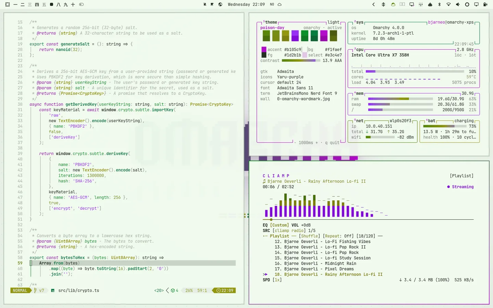](poison-day/preview.png)

`081` · Folder: [`poison-day/`](poison-day/) · [Open in the gallery](https://bjarneo.github.io/100-themes-day/#poison-day) · Night version: [Poison](https://bjarneo.github.io/100-themes/#poison)

Poison Day has a light green background and a magenta accent. The ANSI colors use very high chroma. The native background shows a topographic map on paper.

| Key | Value |
| --- | --- |
| `background` | `#f1faef` |
| `foreground` | `#1d2b1b` |
| `accent` | `#b105c9` |
| `selection` | `#e3c4e7` |
| Icon theme | `Yaru-purple` |
| Backgrounds | [`0-omarchy-wordmark.jpg`](poison-day/backgrounds/0-omarchy-wordmark.jpg), [`1-contours.jpg`](poison-day/backgrounds/1-contours.jpg) |

<details>
<summary>All 16 ANSI colors</summary>

| # | Normal | # | Bright |
| --- | --- | --- | --- |
| 0 black | `#dbe7d8` | 8 bright black | `#9baa98` |
| 1 red | `#518200` | 9 bright red | `#436b05` |
| 2 green | `#9429f4` | 10 bright green | `#7e02d6` |
| 3 yellow | `#909305` | 11 bright yellow | `#7b7d07` |
| 4 blue | `#007838` | 12 bright blue | `#05602d` |
| 5 magenta | `#b105c9` | 13 bright magenta | `#9300a8` |
| 6 cyan | `#008e1f` | 14 bright cyan | `#07751b` |
| 7 white | `#3f4c3d` | 15 bright white | `#0c170a` |

</details>

```bash
curl -fsSL https://bjarneo.github.io/100-themes-day/install.sh | bash -s -- poison-day --set
```

### Hazard Day

[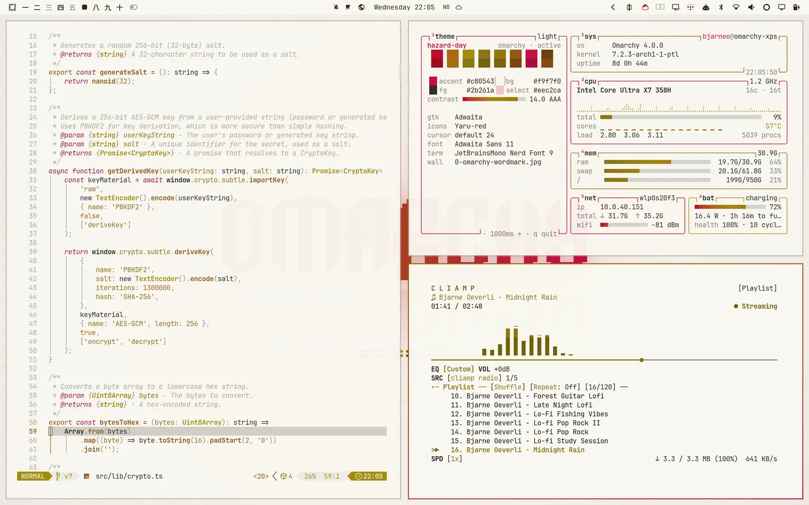](hazard-day/preview.png)

`082` · Folder: [`hazard-day/`](hazard-day/) · [Open in the gallery](https://bjarneo.github.io/100-themes-day/#hazard-day) · Night version: [Hazard](https://bjarneo.github.io/100-themes/#hazard)

Hazard Day has a light cream background and a pink accent. The ANSI colors are saturated. The native background shows dunes at noon with drifting dust.

| Key | Value |
| --- | --- |
| `background` | `#f9f7f0` |
| `foreground` | `#2b261a` |
| `accent` | `#c80543` |
| `selection` | `#eec2ca` |
| Icon theme | `Yaru-red` |
| Backgrounds | [`0-omarchy-wordmark.jpg`](hazard-day/backgrounds/0-omarchy-wordmark.jpg), [`1-embers.jpg`](hazard-day/backgrounds/1-embers.jpg) |

<details>
<summary>All 16 ANSI colors</summary>

| # | Normal | # | Bright |
| --- | --- | --- | --- |
| 0 black | `#e6e3da` | 8 bright black | `#a9a497` |
| 1 red | `#bb0621` | 9 bright red | `#980419` |
| 2 green | `#84710b` | 10 bright green | `#6e5d05` |
| 3 yellow | `#a08800` | 11 bright yellow | `#87740c` |
| 4 blue | `#8e5309` | 12 bright blue | `#744201` |
| 5 magenta | `#c80543` | 13 bright magenta | `#a50436` |
| 6 cyan | `#916f00` | 14 bright cyan | `#785c09` |
| 7 white | `#4c473c` | 15 bright white | `#171309` |

</details>

```bash
curl -fsSL https://bjarneo.github.io/100-themes-day/install.sh | bash -s -- hazard-day --set
```

### Radioactive Day

[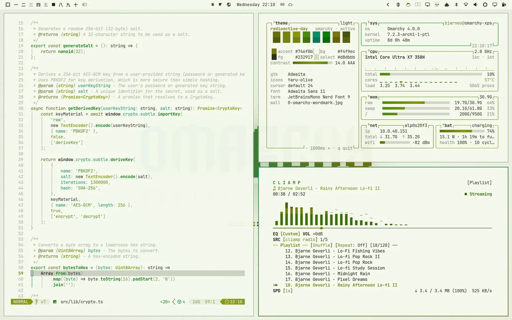](radioactive-day/preview.png)

`083` · Folder: [`radioactive-day/`](radioactive-day/) · [Open in the gallery](https://bjarneo.github.io/100-themes-day/#radioactive-day) · Night version: [Radioactive](https://bjarneo.github.io/100-themes/#radioactive)

Radioactive Day has a light pale lime background and a yellow accent. The 6 ANSI hues stay close to lime, so the palette reads as one color. The native background shows a topographic map on paper.

| Key | Value |
| --- | --- |
| `background` | `#f4f9ec` |
| `foreground` | `#232917` |
| `accent` | `#746f0b` |
| `selection` | `#d8dbbb` |
| Icon theme | `Yaru-olive` |
| Backgrounds | [`0-omarchy-wordmark.jpg`](radioactive-day/backgrounds/0-omarchy-wordmark.jpg), [`1-contours.jpg`](radioactive-day/backgrounds/1-contours.jpg) |

<details>
<summary>All 16 ANSI colors</summary>

| # | Normal | # | Bright |
| --- | --- | --- | --- |
| 0 black | `#dfe6d5` | 8 bright black | `#a0a894` |
| 1 red | `#5e6b04` | 9 bright red | `#4b5703` |
| 2 green | `#488407` | 10 bright green | `#3a6d00` |
| 3 yellow | `#839405` | 11 bright yellow | `#6f7e03` |
| 4 blue | `#027900` | 12 bright blue | `#056202` |
| 5 magenta | `#746f0b` | 13 bright magenta | `#5f5b00` |
| 6 cyan | `#018a60` | 14 bright cyan | `#047250` |
| 7 white | `#444b39` | 15 bright white | `#111607` |

</details>

```bash
curl -fsSL https://bjarneo.github.io/100-themes-day/install.sh | bash -s -- radioactive-day --set
```

### Plasma Arc Day

[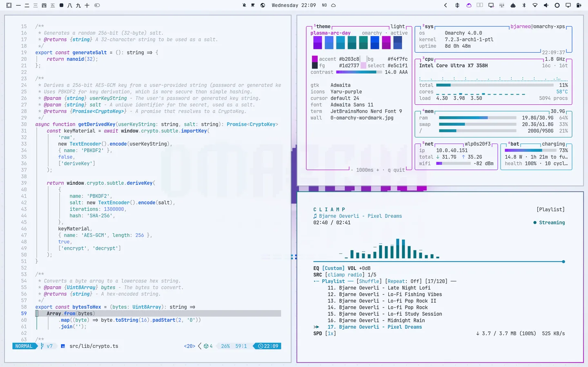](plasma-arc-day/preview.png)

`084` · Folder: [`plasma-arc-day/`](plasma-arc-day/) · [Open in the gallery](https://bjarneo.github.io/100-themes-day/#plasma-arc-day) · Night version: [Plasma Arc](https://bjarneo.github.io/100-themes/#plasma-arc)

Plasma Arc Day has a light blue background and a magenta accent. The ANSI colors use very high chroma. The native background shows unlit neon tubes on a plaster wall.

| Key | Value |
| --- | --- |
| `background` | `#f4f7fc` |
| `foreground` | `#1d2737` |
| `accent` | `#b203c8` |
| `selection` | `#e5c1f1` |
| Icon theme | `Yaru-purple` |
| Backgrounds | [`0-omarchy-wordmark.jpg`](plasma-arc-day/backgrounds/0-omarchy-wordmark.jpg), [`1-tubes.jpg`](plasma-arc-day/backgrounds/1-tubes.jpg) |

<details>
<summary>All 16 ANSI colors</summary>

| # | Normal | # | Bright |
| --- | --- | --- | --- |
| 0 black | `#dae4f3` | 8 bright black | `#9aa5b8` |
| 1 red | `#8b1cfe` | 9 bright red | `#7401d9` |
| 2 green | `#0e8395` | 10 bright green | `#026d7d` |
| 3 yellow | `#0c98ce` | 11 bright yellow | `#0c82b0` |
| 4 blue | `#004deb` | 12 bright blue | `#003cc3` |
| 5 magenta | `#b203c8` | 13 bright magenta | `#9305a6` |
| 6 cyan | `#068683` | 14 bright cyan | `#116f6c` |
| 7 white | `#3e4858` | 15 bright white | `#0c1421` |

</details>

```bash
curl -fsSL https://bjarneo.github.io/100-themes-day/install.sh | bash -s -- plasma-arc-day --set
```

### Laser Tag Day

[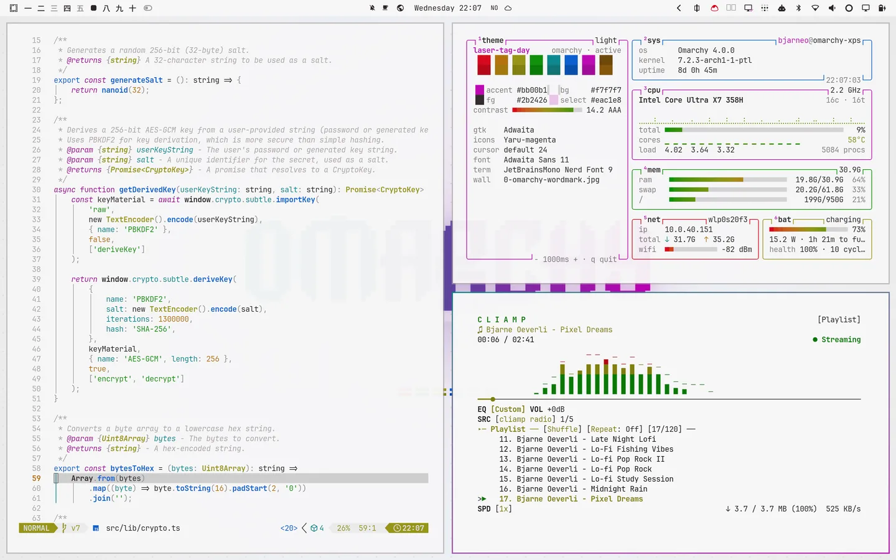](laser-tag-day/preview.png)

`085` · Folder: [`laser-tag-day/`](laser-tag-day/) · [Open in the gallery](https://bjarneo.github.io/100-themes-day/#laser-tag-day) · Night version: [Laser Tag](https://bjarneo.github.io/100-themes/#laser-tag)

Laser Tag Day has a neutral white background and a magenta accent. The ANSI colors use very high chroma. The native background shows unlit neon tubes on a plaster wall.

| Key | Value |
| --- | --- |
| `background` | `#f7f7f7` |
| `foreground` | `#2b2426` |
| `accent` | `#bb00b1` |
| `selection` | `#eac1e8` |
| Icon theme | `Yaru-magenta` |
| Backgrounds | [`0-omarchy-wordmark.jpg`](laser-tag-day/backgrounds/0-omarchy-wordmark.jpg), [`1-tubes.jpg`](laser-tag-day/backgrounds/1-tubes.jpg) |

<details>
<summary>All 16 ANSI colors</summary>

| # | Normal | # | Bright |
| --- | --- | --- | --- |
| 0 black | `#e3e3e3` | 8 bright black | `#aaa2a4` |
| 1 red | `#d60015` | 9 bright red | `#b20010` |
| 2 green | `#078e00` | 10 bright green | `#057600` |
| 3 yellow | `#94920f` | 11 bright yellow | `#7e7c09` |
| 4 blue | `#025bcc` | 12 bright blue | `#0049a8` |
| 5 magenta | `#bb00b1` | 13 bright magenta | `#9b0293` |
| 6 cyan | `#018589` | 14 bright cyan | `#0a6e72` |
| 7 white | `#4d4647` | 15 bright white | `#181214` |

</details>

```bash
curl -fsSL https://bjarneo.github.io/100-themes-day/install.sh | bash -s -- laser-tag-day --set
```

### Stealth Day

[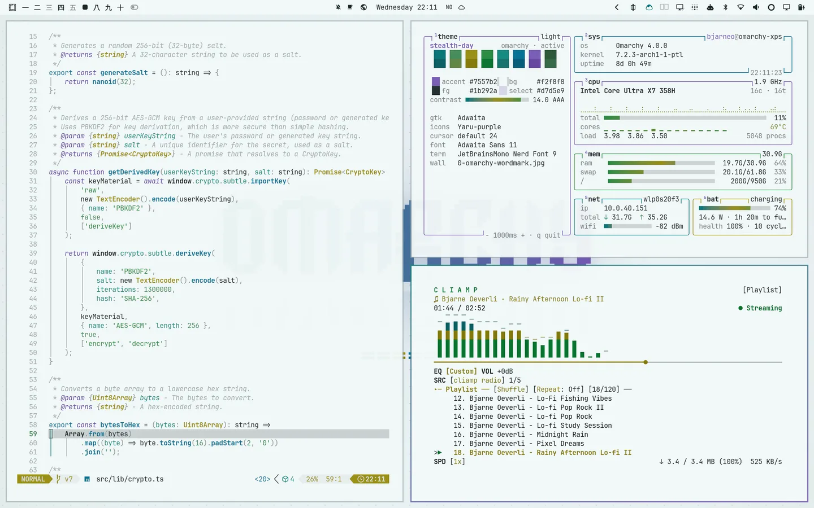](stealth-day/preview.png)

`086` · Folder: [`stealth-day/`](stealth-day/) · [Open in the gallery](https://bjarneo.github.io/100-themes-day/#stealth-day) · Night version: [Stealth](https://bjarneo.github.io/100-themes/#stealth)

Stealth Day has a light cyan background and a violet accent. The ANSI colors use medium chroma for a calmer look. The native background shows columns of code glyphs on paper.

| Key | Value |
| --- | --- |
| `background` | `#f2f8f8` |
| `foreground` | `#1b292a` |
| `accent` | `#7557b2` |
| `selection` | `#d7d5e9` |
| Icon theme | `Yaru-purple` |
| Backgrounds | [`0-omarchy-wordmark.jpg`](stealth-day/backgrounds/0-omarchy-wordmark.jpg), [`1-code-rain.jpg`](stealth-day/backgrounds/1-code-rain.jpg) |

<details>
<summary>All 16 ANSI colors</summary>

| # | Normal | # | Bright |
| --- | --- | --- | --- |
| 0 black | `#dde5e5` | 8 bright black | `#99a8a9` |
| 1 red | `#007275` | 9 bright red | `#045c5e` |
| 2 green | `#24873f` | 10 bright green | `#02712c` |
| 3 yellow | `#978c0c` | 11 bright yellow | `#817703` |
| 4 blue | `#006d91` | 12 bright blue | `#005876` |
| 5 magenta | `#7557b2` | 13 bright magenta | `#62409e` |
| 6 cyan | `#10867d` | 14 bright cyan | `#0f6f68` |
| 7 white | `#3d4b4b` | 15 bright white | `#0a1617` |

</details>

```bash
curl -fsSL https://bjarneo.github.io/100-themes-day/install.sh | bash -s -- stealth-day --set
```

### Mainframe Day

[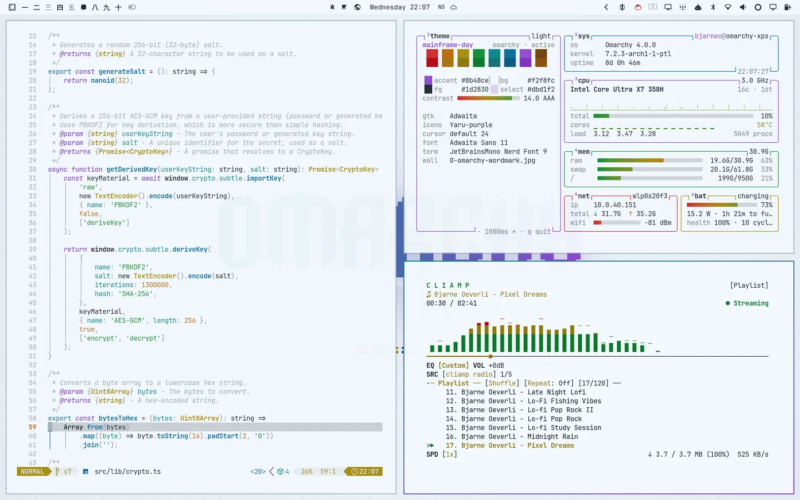](mainframe-day/preview.png)

`087` · Folder: [`mainframe-day/`](mainframe-day/) · [Open in the gallery](https://bjarneo.github.io/100-themes-day/#mainframe-day) · Night version: [Mainframe](https://bjarneo.github.io/100-themes/#mainframe)

Mainframe Day has a light blue background and a violet accent. The ANSI colors are saturated. The native background shows columns of code glyphs on paper.

| Key | Value |
| --- | --- |
| `background` | `#f2f8fc` |
| `foreground` | `#1d2830` |
| `accent` | `#8b48ce` |
| `selection` | `#dbd1f2` |
| Icon theme | `Yaru-purple` |
| Backgrounds | [`0-omarchy-wordmark.jpg`](mainframe-day/backgrounds/0-omarchy-wordmark.jpg), [`1-code-rain.jpg`](mainframe-day/backgrounds/1-code-rain.jpg) |

<details>
<summary>All 16 ANSI colors</summary>

| # | Normal | # | Bright |
| --- | --- | --- | --- |
| 0 black | `#dce4ea` | 8 bright black | `#9aa7b0` |
| 1 red | `#cc2828` | 9 bright red | `#b20113` |
| 2 green | `#0a8d31` | 10 bright green | `#057527` |
| 3 yellow | `#a48b08` | 11 bright yellow | `#8c7609` |
| 4 blue | `#056b9a` | 12 bright blue | `#02567e` |
| 5 magenta | `#8b48ce` | 13 bright magenta | `#782bbb` |
| 6 cyan | `#028587` | 14 bright cyan | `#0e6e70` |
| 7 white | `#3e4952` | 15 bright white | `#0b151c` |

</details>

```bash
curl -fsSL https://bjarneo.github.io/100-themes-day/install.sh | bash -s -- mainframe-day --set
```

### Terminal Green Day

[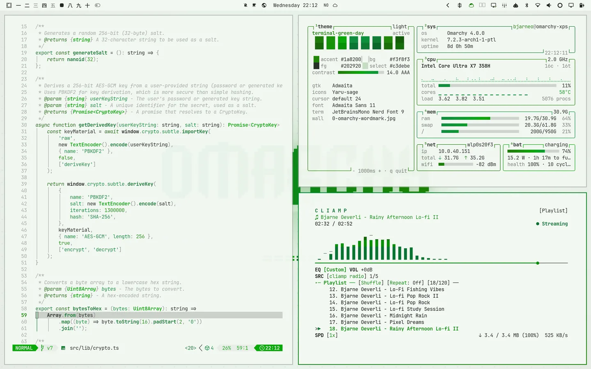](terminal-green-day/preview.png)

`088` · Folder: [`terminal-green-day/`](terminal-green-day/) · [Open in the gallery](https://bjarneo.github.io/100-themes-day/#terminal-green-day) · Night version: [Terminal Green](https://bjarneo.github.io/100-themes/#terminal-green)

Terminal Green Day has a light green background and a green accent. The 6 ANSI hues stay close to green, so the palette reads as one color. The native background shows columns of code glyphs on paper.

| Key | Value |
| --- | --- |
| `background` | `#f3f8f3` |
| `foreground` | `#202920` |
| `accent` | `#1a8200` |
| `selection` | `#c3debe` |
| Icon theme | `Yaru-sage` |
| Backgrounds | [`0-omarchy-wordmark.jpg`](terminal-green-day/backgrounds/0-omarchy-wordmark.jpg), [`1-code-rain.jpg`](terminal-green-day/backgrounds/1-code-rain.jpg) |

<details>
<summary>All 16 ANSI colors</summary>

| # | Normal | # | Bright |
| --- | --- | --- | --- |
| 0 black | `#dee5de` | 8 bright black | `#9da89d` |
| 1 red | `#177801` | 9 bright red | `#116102` |
| 2 green | `#078938` | 10 bright green | `#03712d` |
| 3 yellow | `#00a700` | 11 bright yellow | `#008e00` |
| 4 blue | `#09782b` | 12 bright blue | `#036121` |
| 5 magenta | `#1a8200` | 13 bright magenta | `#156b01` |
| 6 cyan | `#008d33` | 14 bright cyan | `#08752b` |
| 7 white | `#414b41` | 15 bright white | `#0e160e` |

</details>

```bash
curl -fsSL https://bjarneo.github.io/100-themes-day/install.sh | bash -s -- terminal-green-day --set
```

### Terminal Blue Day

[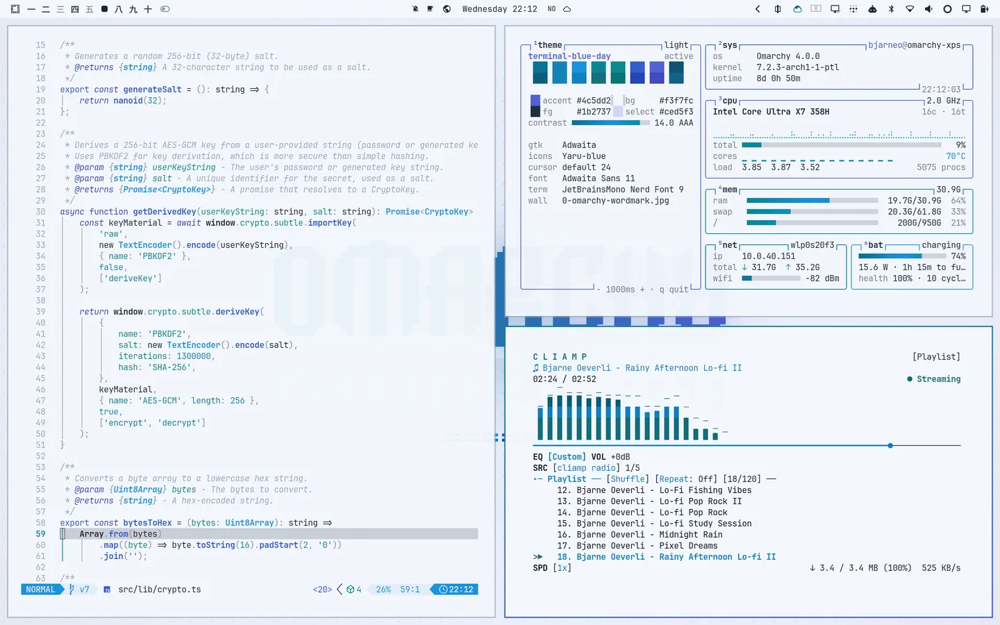](terminal-blue-day/preview.png)

`089` · Folder: [`terminal-blue-day/`](terminal-blue-day/) · [Open in the gallery](https://bjarneo.github.io/100-themes-day/#terminal-blue-day) · Night version: [Terminal Blue](https://bjarneo.github.io/100-themes/#terminal-blue)

Terminal Blue Day has a light blue background and a indigo accent. The ANSI colors use medium chroma for a calmer look. The native background shows columns of code glyphs on paper.

| Key | Value |
| --- | --- |
| `background` | `#f3f7fc` |
| `foreground` | `#1b2737` |
| `accent` | `#4c5dd2` |
| `selection` | `#ced5f3` |
| Icon theme | `Yaru-blue` |
| Backgrounds | [`0-omarchy-wordmark.jpg`](terminal-blue-day/backgrounds/0-omarchy-wordmark.jpg), [`1-code-rain.jpg`](terminal-blue-day/backgrounds/1-code-rain.jpg) |

<details>
<summary>All 16 ANSI colors</summary>

| # | Normal | # | Bright |
| --- | --- | --- | --- |
| 0 black | `#d9e4f3` | 8 bright black | `#98a6b8` |
| 1 red | `#016d91` | 9 bright red | `#065775` |
| 2 green | `#018090` | 10 bright green | `#106976` |
| 3 yellow | `#1190dc` | 11 bright yellow | `#0a7bbc` |
| 4 blue | `#2f58c8` | 12 bright blue | `#1b40b5` |
| 5 magenta | `#4c5dd2` | 13 bright magenta | `#3a44bf` |
| 6 cyan | `#018589` | 14 bright cyan | `#006f72` |
| 7 white | `#3d4958` | 15 bright white | `#0a1421` |

</details>

```bash
curl -fsSL https://bjarneo.github.io/100-themes-day/install.sh | bash -s -- terminal-blue-day --set
```

### Neon Tokyo Day

[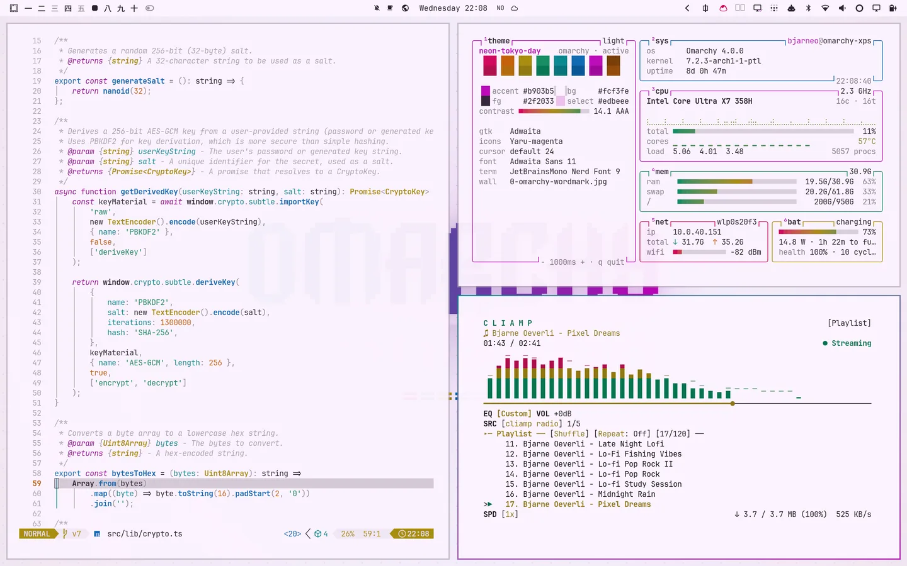](neon-tokyo-day/preview.png)

`090` · Folder: [`neon-tokyo-day/`](neon-tokyo-day/) · [Open in the gallery](https://bjarneo.github.io/100-themes-day/#neon-tokyo-day) · Night version: [Neon Tokyo](https://bjarneo.github.io/100-themes/#neon-tokyo)

Neon Tokyo Day has a light pink background and a magenta accent. The ANSI colors use very high chroma. The native background shows a city skyline in daylight.

| Key | Value |
| --- | --- |
| `background` | `#fcf3fe` |
| `foreground` | `#2f2033` |
| `accent` | `#b903b5` |
| `selection` | `#edbeee` |
| Icon theme | `Yaru-magenta` |
| Backgrounds | [`0-omarchy-wordmark.jpg`](neon-tokyo-day/backgrounds/0-omarchy-wordmark.jpg), [`1-skyline.jpg`](neon-tokyo-day/backgrounds/1-skyline.jpg) |

<details>
<summary>All 16 ANSI colors</summary>

| # | Normal | # | Bright |
| --- | --- | --- | --- |
| 0 black | `#ecddef` | 8 bright black | `#ad9fb1` |
| 1 red | `#d00158` | 9 bright red | `#ad0748` |
| 2 green | `#108a5d` | 10 bright green | `#00734c` |
| 3 yellow | `#a68a06` | 11 bright yellow | `#8e750b` |
| 4 blue | `#0765af` | 12 bright blue | `#005190` |
| 5 magenta | `#b903b5` | 13 bright magenta | `#9a0096` |
| 6 cyan | `#02848d` | 14 bright cyan | `#006e76` |
| 7 white | `#504254` | 15 bright white | `#1a0f1c` |

</details>

```bash
curl -fsSL https://bjarneo.github.io/100-themes-day/install.sh | bash -s -- neon-tokyo-day --set
```

### Neon Vegas Day

[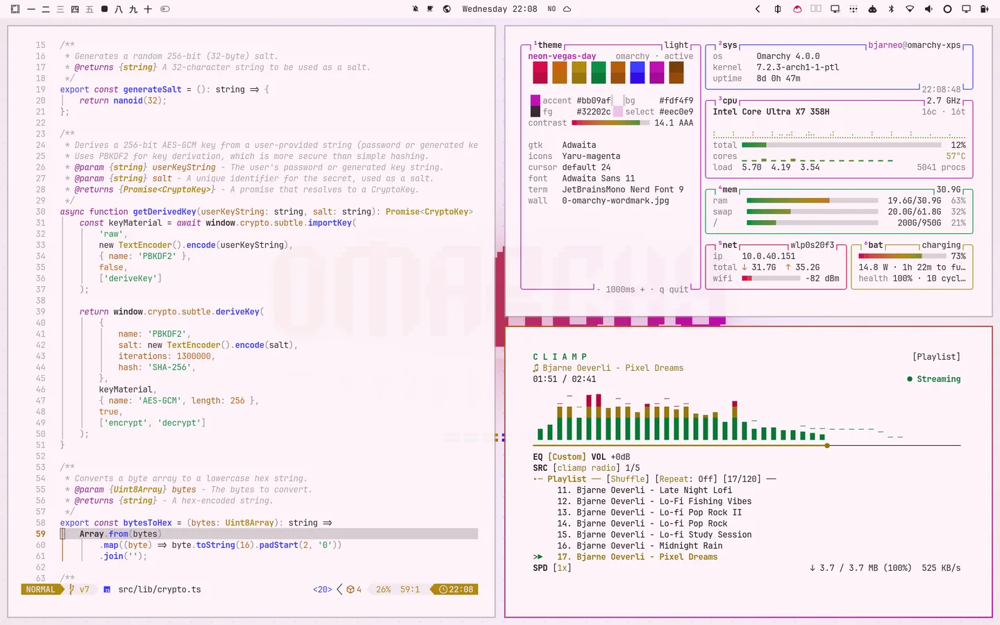](neon-vegas-day/preview.png)

`091` · Folder: [`neon-vegas-day/`](neon-vegas-day/) · [Open in the gallery](https://bjarneo.github.io/100-themes-day/#neon-vegas-day) · Night version: [Neon Vegas](https://bjarneo.github.io/100-themes/#neon-vegas)

Neon Vegas Day has a light pink background and a magenta accent. The ANSI colors use very high chroma. The native background shows a city skyline in daylight.

| Key | Value |
| --- | --- |
| `background` | `#fdf4f9` |
| `foreground` | `#32202c` |
| `accent` | `#bb09af` |
| `selection` | `#eec0e9` |
| Icon theme | `Yaru-magenta` |
| Backgrounds | [`0-omarchy-wordmark.jpg`](neon-vegas-day/backgrounds/0-omarchy-wordmark.jpg), [`1-skyline.jpg`](neon-vegas-day/backgrounds/1-skyline.jpg) |

<details>
<summary>All 16 ANSI colors</summary>

| # | Normal | # | Bright |
| --- | --- | --- | --- |
| 0 black | `#eedde8` | 8 bright black | `#b29eab` |
| 1 red | `#d20047` | 9 bright red | `#af043a` |
| 2 green | `#048c3d` | 10 bright green | `#047432` |
| 3 yellow | `#ae8504` | 11 bright yellow | `#957206` |
| 4 blue | `#3734fe` | 12 bright blue | `#2d00e5` |
| 5 magenta | `#bb09af` | 13 bright magenta | `#9c0492` |
| 6 cyan | `#b15901` | 14 bright cyan | `#934a06` |
| 7 white | `#53424d` | 15 bright white | `#1d0e18` |

</details>

```bash
curl -fsSL https://bjarneo.github.io/100-themes-day/install.sh | bash -s -- neon-vegas-day --set
```

### Miami Night Day

[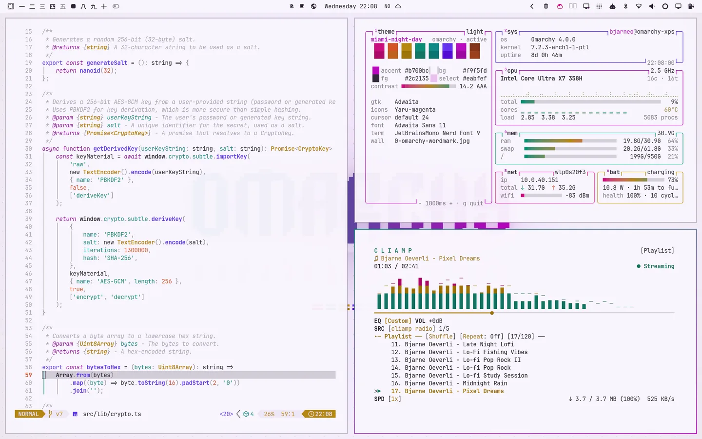](miami-night-day/preview.png)

`092` · Folder: [`miami-night-day/`](miami-night-day/) · [Open in the gallery](https://bjarneo.github.io/100-themes-day/#miami-night-day) · Night version: [Miami Night](https://bjarneo.github.io/100-themes/#miami-night)

Miami Night Day has a light violet background and a magenta accent. The ANSI colors are saturated. The native background shows a morning sun over a perspective grid.

| Key | Value |
| --- | --- |
| `background` | `#f9f5fd` |
| `foreground` | `#2c2135` |
| `accent` | `#b700bc` |
| `selection` | `#eabfef` |
| Icon theme | `Yaru-magenta` |
| Backgrounds | [`0-omarchy-wordmark.jpg`](miami-night-day/backgrounds/0-omarchy-wordmark.jpg), [`1-sunset-grid.jpg`](miami-night-day/backgrounds/1-sunset-grid.jpg) |

<details>
<summary>All 16 ANSI colors</summary>

| # | Normal | # | Bright |
| --- | --- | --- | --- |
| 0 black | `#e9def2` | 8 bright black | `#aaa0b3` |
| 1 red | `#ca047a` | 9 bright red | `#a90065` |
| 2 green | `#008872` | 10 bright green | `#0e705e` |
| 3 yellow | `#b38309` | 11 bright yellow | `#9a6f00` |
| 4 blue | `#5e2ced` | 12 bright blue | `#4e01d1` |
| 5 magenta | `#b700bc` | 13 bright magenta | `#98009c` |
| 6 cyan | `#078682` | 14 bright cyan | `#056f6c` |
| 7 white | `#4d4356` | 15 bright white | `#18101e` |

</details>

```bash
curl -fsSL https://bjarneo.github.io/100-themes-day/install.sh | bash -s -- miami-night-day --set
```

### Hong Kong Rain Day

[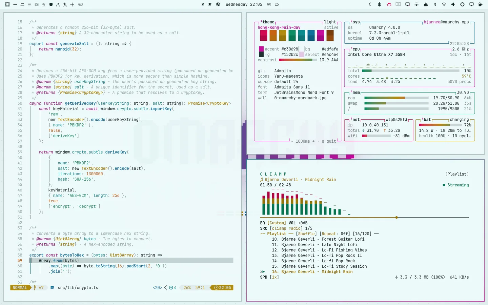](hong-kong-rain-day/preview.png)

`093` · Folder: [`hong-kong-rain-day/`](hong-kong-rain-day/) · [Open in the gallery](https://bjarneo.github.io/100-themes-day/#hong-kong-rain-day) · Night version: [Hong Kong Rain](https://bjarneo.github.io/100-themes/#hong-kong-rain)

Hong Kong Rain Day has a light cyan background and a magenta accent. The ANSI colors are saturated. The native background shows a city skyline in daylight.

| Key | Value |
| --- | --- |
| `background` | `#edfafa` |
| `foreground` | `#152b2c` |
| `accent` | `#c30698` |
| `selection` | `#e4c4e4` |
| Icon theme | `Yaru-magenta` |
| Backgrounds | [`0-omarchy-wordmark.jpg`](hong-kong-rain-day/backgrounds/0-omarchy-wordmark.jpg), [`1-skyline.jpg`](hong-kong-rain-day/backgrounds/1-skyline.jpg) |

<details>
<summary>All 16 ANSI colors</summary>

| # | Normal | # | Bright |
| --- | --- | --- | --- |
| 0 black | `#d6e7e7` | 8 bright black | `#93aaab` |
| 1 red | `#d2004c` | 9 bright red | `#af003e` |
| 2 green | `#068a60` | 10 bright green | `#00734e` |
| 3 yellow | `#ad8604` | 11 bright yellow | `#947200` |
| 4 blue | `#066b96` | 12 bright blue | `#00577b` |
| 5 magenta | `#c30698` | 13 bright magenta | `#a3007e` |
| 6 cyan | `#018589` | 14 bright cyan | `#066e72` |
| 7 white | `#384c4d` | 15 bright white | `#051718` |

</details>

```bash
curl -fsSL https://bjarneo.github.io/100-themes-day/install.sh | bash -s -- hong-kong-rain-day --set
```

### Berlin Club Day

[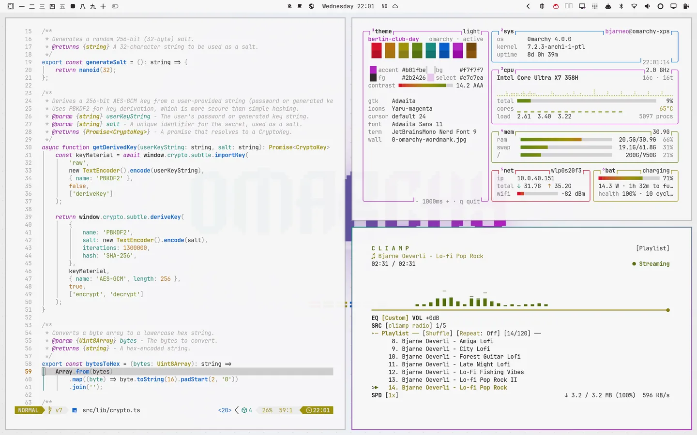](berlin-club-day/preview.png)

`094` · Folder: [`berlin-club-day/`](berlin-club-day/) · [Open in the gallery](https://bjarneo.github.io/100-themes-day/#berlin-club-day) · Night version: [Berlin Club](https://bjarneo.github.io/100-themes/#berlin-club)

Berlin Club Day has a neutral white background and a magenta accent. The ANSI colors are saturated. The native background shows unlit neon tubes on a plaster wall.

| Key | Value |
| --- | --- |
| `background` | `#f7f7f7` |
| `foreground` | `#2b2426` |
| `accent` | `#b01fbe` |
| `selection` | `#e7c7ea` |
| Icon theme | `Yaru-magenta` |
| Backgrounds | [`0-omarchy-wordmark.jpg`](berlin-club-day/backgrounds/0-omarchy-wordmark.jpg), [`1-tubes.jpg`](berlin-club-day/backgrounds/1-tubes.jpg) |

<details>
<summary>All 16 ANSI colors</summary>

| # | Normal | # | Bright |
| --- | --- | --- | --- |
| 0 black | `#e3e3e3` | 8 bright black | `#aaa2a4` |
| 1 red | `#d40922` | 9 bright red | `#b1061b` |
| 2 green | `#5f8209` | 10 bright green | `#4f6c07` |
| 3 yellow | `#9b8f00` | 11 bright yellow | `#847a0c` |
| 4 blue | `#005ccc` | 12 bright blue | `#004aa6` |
| 5 magenta | `#b01fbe` | 13 bright magenta | `#9600a3` |
| 6 cyan | `#10867d` | 14 bright cyan | `#0f6f68` |
| 7 white | `#4d4647` | 15 bright white | `#181214` |

</details>

```bash
curl -fsSL https://bjarneo.github.io/100-themes-day/install.sh | bash -s -- berlin-club-day --set
```

### Arcade Carpet Day

[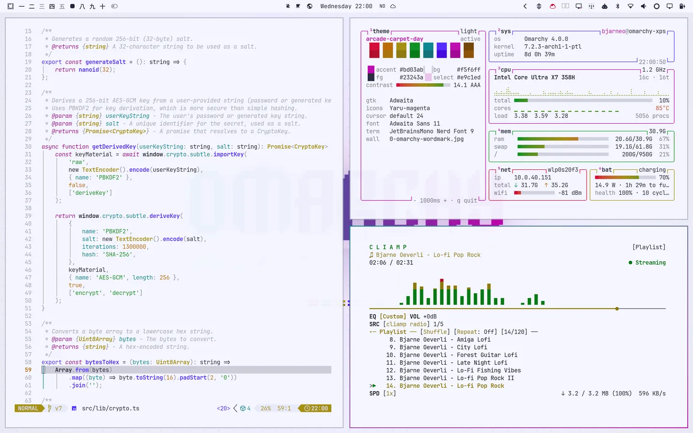](arcade-carpet-day/preview.png)

`095` · Folder: [`arcade-carpet-day/`](arcade-carpet-day/) · [Open in the gallery](https://bjarneo.github.io/100-themes-day/#arcade-carpet-day) · Night version: [Arcade Carpet](https://bjarneo.github.io/100-themes/#arcade-carpet)

Arcade Carpet Day has a light indigo background and a magenta accent. The ANSI colors use very high chroma. The native background shows a pixel art landscape at noon.

| Key | Value |
| --- | --- |
| `background` | `#f5f6ff` |
| `foreground` | `#23243a` |
| `accent` | `#bd03ab` |
| `selection` | `#e9c1ed` |
| Icon theme | `Yaru-magenta` |
| Backgrounds | [`0-omarchy-wordmark.jpg`](arcade-carpet-day/backgrounds/0-omarchy-wordmark.jpg), [`1-pixels.jpg`](arcade-carpet-day/backgrounds/1-pixels.jpg) |

<details>
<summary>All 16 ANSI colors</summary>

| # | Normal | # | Bright |
| --- | --- | --- | --- |
| 0 black | `#dfe1f6` | 8 bright black | `#a0a3b8` |
| 1 red | `#d40530` | 9 bright red | `#b00727` |
| 2 green | `#088d1c` | 10 bright green | `#007612` |
| 3 yellow | `#a28c0a` | 11 bright yellow | `#8a770a` |
| 4 blue | `#4f25ff` | 12 bright blue | `#4001db` |
| 5 magenta | `#bd03ab` | 13 bright magenta | `#9d008e` |
| 6 cyan | `#03848e` | 14 bright cyan | `#0f6d75` |
| 7 white | `#44465b` | 15 bright white | `#111221` |

</details>

```bash
curl -fsSL https://bjarneo.github.io/100-themes-day/install.sh | bash -s -- arcade-carpet-day --set
```

### Pinball Day

[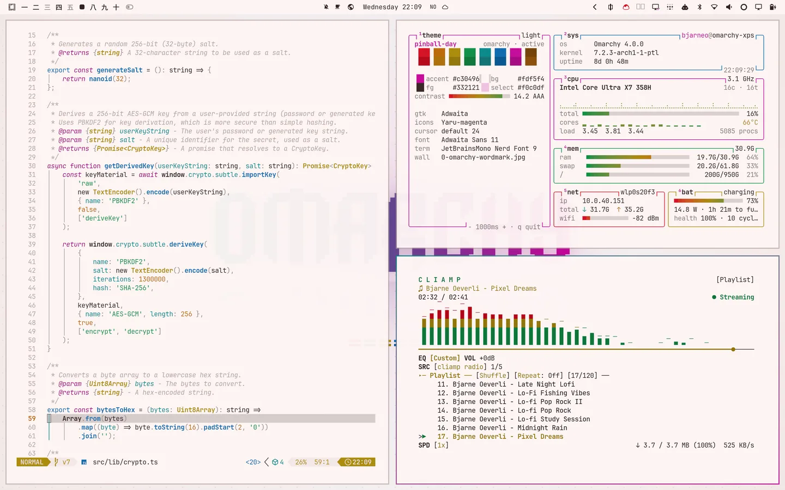](pinball-day/preview.png)

`096` · Folder: [`pinball-day/`](pinball-day/) · [Open in the gallery](https://bjarneo.github.io/100-themes-day/#pinball-day) · Night version: [Pinball](https://bjarneo.github.io/100-themes/#pinball)

Pinball Day has a light rose background and a magenta accent. The ANSI colors use very high chroma. The native background shows a pixel art landscape at noon.

| Key | Value |
| --- | --- |
| `background` | `#fdf5f4` |
| `foreground` | `#332121` |
| `accent` | `#c30496` |
| `selection` | `#f0c0df` |
| Icon theme | `Yaru-magenta` |
| Backgrounds | [`0-omarchy-wordmark.jpg`](pinball-day/backgrounds/0-omarchy-wordmark.jpg), [`1-pixels.jpg`](pinball-day/backgrounds/1-pixels.jpg) |

<details>
<summary>All 16 ANSI colors</summary>

| # | Normal | # | Bright |
| --- | --- | --- | --- |
| 0 black | `#efdfde` | 8 bright black | `#b49f9e` |
| 1 red | `#d40b1d` | 9 bright red | `#b20114` |
| 2 green | `#088c42` | 10 bright green | `#097436` |
| 3 yellow | `#a98804` | 11 bright yellow | `#907406` |
| 4 blue | `#0766ac` | 12 bright blue | `#00528e` |
| 5 magenta | `#c30496` | 13 bright magenta | `#a2037d` |
| 6 cyan | `#028587` | 14 bright cyan | `#0f6e6f` |
| 7 white | `#554342` | 15 bright white | `#1e0f0f` |

</details>

```bash
curl -fsSL https://bjarneo.github.io/100-themes-day/install.sh | bash -s -- pinball-day --set
```

### Racing Day

[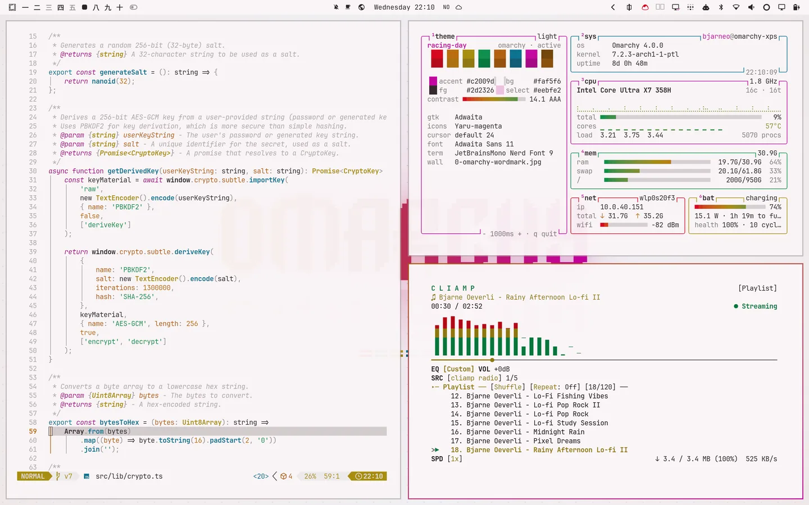](racing-day/preview.png)

`097` · Folder: [`racing-day/`](racing-day/) · [Open in the gallery](https://bjarneo.github.io/100-themes-day/#racing-day) · Night version: [Racing](https://bjarneo.github.io/100-themes/#racing)

Racing Day has a neutral white background and a magenta accent. The ANSI colors use very high chroma. The native background shows a morning sun over a perspective grid.

| Key | Value |
| --- | --- |
| `background` | `#faf5f6` |
| `foreground` | `#2d2326` |
| `accent` | `#c2009d` |
| `selection` | `#eebfe2` |
| Icon theme | `Yaru-magenta` |
| Backgrounds | [`0-omarchy-wordmark.jpg`](racing-day/backgrounds/0-omarchy-wordmark.jpg), [`1-sunset-grid.jpg`](racing-day/backgrounds/1-sunset-grid.jpg) |

<details>
<summary>All 16 ANSI colors</summary>

| # | Normal | # | Bright |
| --- | --- | --- | --- |
| 0 black | `#e6e1e3` | 8 bright black | `#ada1a4` |
| 1 red | `#d60018` | 9 bright red | `#b10314` |
| 2 green | `#078c47` | 10 bright green | `#007439` |
| 3 yellow | `#a68a06` | 11 bright yellow | `#8d750b` |
| 4 blue | `#036d8d` | 12 bright blue | `#0a5871` |
| 5 magenta | `#c2009d` | 13 bright magenta | `#a10082` |
| 6 cyan | `#af5b09` | 14 bright cyan | `#924b04` |
| 7 white | `#4f4447` | 15 bright white | `#1a1113` |

</details>

```bash
curl -fsSL https://bjarneo.github.io/100-themes-day/install.sh | bash -s -- racing-day --set
```

### VHS Day

[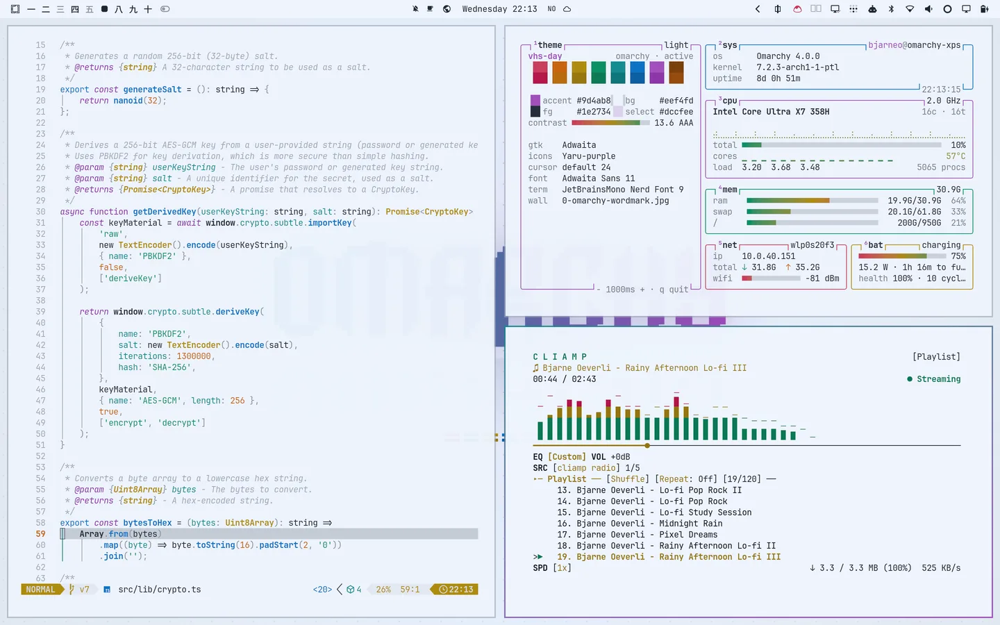](vhs-day/preview.png)

`098` · Folder: [`vhs-day/`](vhs-day/) · [Open in the gallery](https://bjarneo.github.io/100-themes-day/#vhs-day) · Night version: [VHS](https://bjarneo.github.io/100-themes/#vhs)

VHS Day has a light blue background and a violet accent. The ANSI colors use medium chroma for a calmer look. The native background shows a faded VHS still with tracking noise.

| Key | Value |
| --- | --- |
| `background` | `#eef4fd` |
| `foreground` | `#1e2734` |
| `accent` | `#9d4ab8` |
| `selection` | `#dccfee` |
| Icon theme | `Yaru-purple` |
| Backgrounds | [`0-omarchy-wordmark.jpg`](vhs-day/backgrounds/0-omarchy-wordmark.jpg), [`1-scanlines.jpg`](vhs-day/backgrounds/1-scanlines.jpg) |

<details>
<summary>All 16 ANSI colors</summary>

| # | Normal | # | Bright |
| --- | --- | --- | --- |
| 0 black | `#d9e0ec` | 8 bright black | `#9ca5b5` |
| 1 red | `#c73756` | 9 bright red | `#b10f42` |
| 2 green | `#028d60` | 10 bright green | `#04764f` |
| 3 yellow | `#ac8704` | 11 bright yellow | `#937309` |
| 4 blue | `#046dc1` | 12 bright blue | `#04599f` |
| 5 magenta | `#9d4ab8` | 13 bright magenta | `#892fa5` |
| 6 cyan | `#0b888c` | 14 bright cyan | `#057175` |
| 7 white | `#404855` | 15 bright white | `#0d141f` |

</details>

```bash
curl -fsSL https://bjarneo.github.io/100-themes-day/install.sh | bash -s -- vhs-day --set
```

### Polaroid Day

[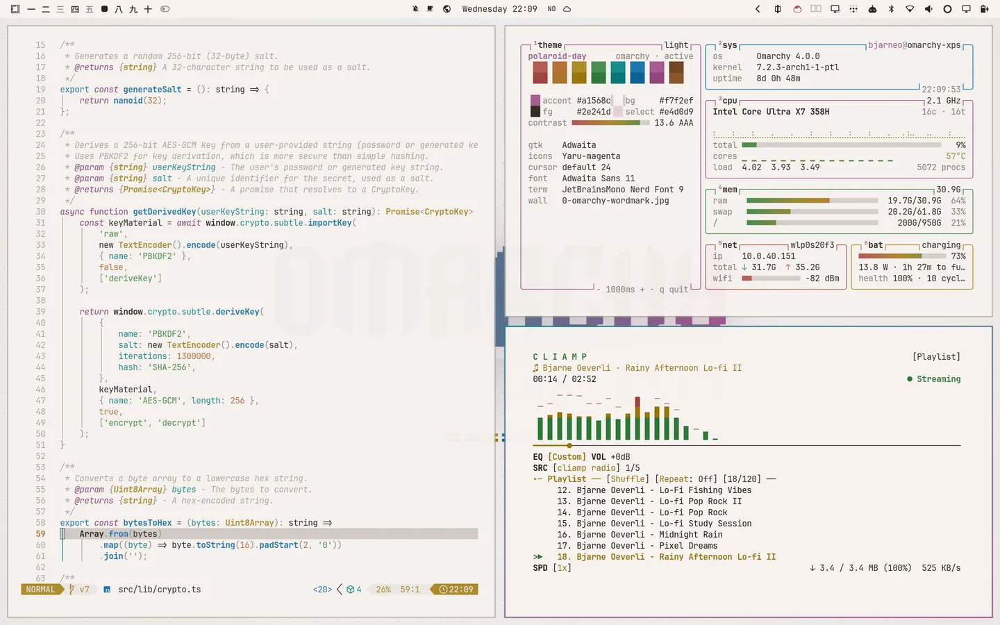](polaroid-day/preview.png)

`099` · Folder: [`polaroid-day/`](polaroid-day/) · [Open in the gallery](https://bjarneo.github.io/100-themes-day/#polaroid-day) · Night version: [Polaroid](https://bjarneo.github.io/100-themes/#polaroid)

Polaroid Day has a light peach background and a magenta accent. The ANSI colors use low chroma for a muted look. The native background shows pastel light spots with bokeh.

| Key | Value |
| --- | --- |
| `background` | `#f7f2ef` |
| `foreground` | `#2e241d` |
| `accent` | `#a1568c` |
| `selection` | `#e4d0d9` |
| Icon theme | `Yaru-magenta` |
| Backgrounds | [`0-omarchy-wordmark.jpg`](polaroid-day/backgrounds/0-omarchy-wordmark.jpg), [`1-blobs.jpg`](polaroid-day/backgrounds/1-blobs.jpg) |

<details>
<summary>All 16 ANSI colors</summary>

| # | Normal | # | Bright |
| --- | --- | --- | --- |
| 0 black | `#e4deda` | 8 bright black | `#ada29a` |
| 1 red | `#b0554f` | 9 bright red | `#9b3e39` |
| 2 green | `#448a49` | 10 bright green | `#297532` |
| 3 yellow | `#ab8722` | 11 bright yellow | `#957202` |
| 4 blue | `#1472ab` | 12 bright blue | `#005d90` |
| 5 magenta | `#a1568c` | 13 bright magenta | `#8d4078` |
| 6 cyan | `#0d8888` | 14 bright cyan | `#007272` |
| 7 white | `#4f463e` | 15 bright white | `#1a120c` |

</details>

```bash
curl -fsSL https://bjarneo.github.io/100-themes-day/install.sh | bash -s -- polaroid-day --set
```

### Cathode Day

[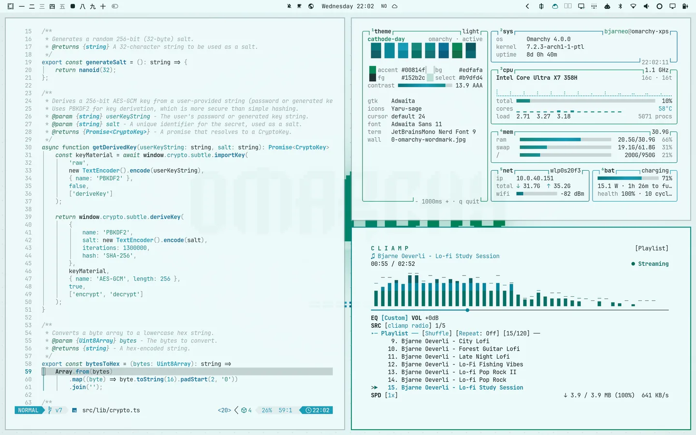](cathode-day/preview.png)

`100` · Folder: [`cathode-day/`](cathode-day/) · [Open in the gallery](https://bjarneo.github.io/100-themes-day/#cathode-day) · Night version: [Cathode](https://bjarneo.github.io/100-themes/#cathode)

Cathode Day has a light cyan background and a green accent. The ANSI colors are saturated. The native background shows a faded VHS still with tracking noise.

| Key | Value |
| --- | --- |
| `background` | `#edfafa` |
| `foreground` | `#152b2c` |
| `accent` | `#00814f` |
| `selection` | `#b9dfd4` |
| Icon theme | `Yaru-sage` |
| Backgrounds | [`0-omarchy-wordmark.jpg`](cathode-day/backgrounds/0-omarchy-wordmark.jpg), [`1-scanlines.jpg`](cathode-day/backgrounds/1-scanlines.jpg) |

<details>
<summary>All 16 ANSI colors</summary>

| # | Normal | # | Bright |
| --- | --- | --- | --- |
| 0 black | `#d6e7e7` | 8 bright black | `#93aaab` |
| 1 red | `#007178` | 9 bright red | `#0a5b60` |
| 2 green | `#0f8377` | 10 bright green | `#026d62` |
| 3 yellow | `#1199b5` | 11 bright yellow | `#01829b` |
| 4 blue | `#026c96` | 12 bright blue | `#02577a` |
| 5 magenta | `#00814f` | 13 bright magenta | `#086941` |
| 6 cyan | `#028588` | 14 bright cyan | `#0e6e70` |
| 7 white | `#384c4d` | 15 bright white | `#051718` |

</details>

```bash
curl -fsSL https://bjarneo.github.io/100-themes-day/install.sh | bash -s -- cathode-day --set
```
